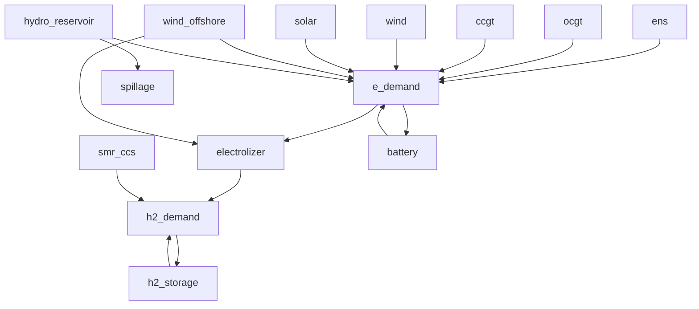

# Two-Stage Stochastic Optimization

## Introduction

Stochastic programming is often used to represent the uncertainty in medium- and long-term optimization problems in energy systems, based on the basis that the *uncertainty can be represented by a known probability distribution*. In the context of energy systems, this **uncertainty can be related to the availability of renewable energy sources, demand fluctuations, or hydro inflows**. Stochastic programming allows for the incorporation of uncertainty by sampling the uncertainty space and creating multiple scenarios that represent different possible future outcomes. This approach enables decision-makers to make informed choices that are prepared against a range of possible future conditions.

A **two-stage stochastic** setting is when there are first stage decisions that are unique for each scenario and there are second stage decisions that are made after the uncertainty is realized. In the context of energy systems, the first stage decisions could be related to investment decisions, such as the capacity of new renewable energy sources to be built, while the second stage decisions could be related to operational decisions, such as how to dispatch the available generation resources to meet demand.


## Two-Stage Stochastic Optimization with TulipaEnergyModel.jl

TulipaEnergyModel.jl approach to two-stage stochastic optimization is based on the concept of Representative Periods (RPs). RPs are a way to reduce the size of the problem by clustering similar time periods together, see tutorial [Blended Representative Periods with Tulipa Clustering](@ref blended-representative-periods). This is particularly useful in the context of energy systems, where there can be a large number of time periods to consider. By clustering similar time periods together, we can reduce the number of variables and constraints in the optimization problem, making it more tractable.

In the stochastic setting, RPs can be clustered Per or Cross the stochastic scenarios. In that case, the representative periods mapping matrix will relate original periods to representative periods either per scenario (diagonal block structure) or across scenarios (full matrix structure). Here is the concept documentation for more detail: [Clustering per or Cross](https://tulipaenergy.github.io/TulipaClustering.jl/stable/20-concepts/#Clustering-Per-or-Cross)

Let's see how to implement two-stage stochastic optimization with TulipaEnergyModel.jl and TulipaClustering.jl.

## Loading the basic input data

We import the necessary packages, and load the data in the DuckDB.

!!! tip "Remember!"
    1. Activate your local enviroment and instantiate the project, if you haven't already.
    2. Adjust the path to where you have the data stored.

```@example stochastic
import TulipaIO as TIO
import TulipaEnergyModel as TEM
import TulipaClustering as TC
import CSV
import Distances
using DuckDB
using DataFrames
using Plots
using Statistics

connection = DBInterface.connect(DuckDB.DB)
input_dir = "my-awesome-energy-system/tutorial-9"
TIO.read_csv_folder(connection, input_dir)
```

Here is a schematic of the energy system we are modeling:



## Profiles Depending on the Scenario

So far the profiles have been for a single scenario. Now, we have profiles for multiple scenarios, which represent different weather years. Each scenario has 8760 time steps (1 year of hourly data) and profiles for solar, wind offshore, wind onshore, demand, and hydro inflow.
Let's have a look at the profiles in the table `profiles_wide` and a summary of the information in it by grouping by `milestone_year` and `scenario`.

```@example stochastic
profiles = TIO.get_table(connection, "profiles_wide")
gdf = groupby(profiles, [:milestone_year, :scenario])
selected_columns = [:solar, :wind_offshore, :wind_onshore, :demand, :hydro_inflow]
result_df = combine(gdf, selected_columns .=> mean)
```

Here we can see that there are 3 different weather years (i.e., scenarios 1995, 2008, 2009) and you see the difference in the average capacities of the availability of the renewable sources and demand in different scenarios.

## Clustering Per Scenario

To obtain representative periods for each scenario, we first transform the data from wide to long format, notice that we exclude the `scenario`, `milestone_year`, and `timestep` columns since we want the profiles to be grouped by scenario as well.

```@example stochastic
TC.transform_wide_to_long!(
    connection,
    "profiles_wide",
    "profiles";
    exclude_columns=["scenario", "milestone_year", "timestep"],
)
```

To cluster per scenario and year, we define the profiles layout using TulipaClustering. The rest of the parameters are the same as in the previous tutorial on clustering. In this case, we want to cluster into 16 representative periods of 24 hours each.

```@example stochastic
layout = TC.ProfilesTableLayout(; year = :milestone_year, cols_to_groupby = [:milestone_year, :scenario])
num_rps = 16
period_duration = 24
clusters = TC.cluster!(
    connection,
    period_duration,
    num_rps;
    method = :convex_hull,
    distance = Distances.CosineDist(),
    weight_type = :convex,
    layout = layout,
)
```

### Heat Map Visualization Per Scenario

After the clustering, we can have a look at the `rep_periods_mapping` table and visualize it.

How do we want to visualize the mapping? A heat map is a tool that plots large matrices in a scaled manner.

```@example stochastic
rp_mapping = TIO.get_table(connection, "rep_periods_mapping")
rp_mapping_wide = unstack(rp_mapping, :rep_period, :weight; fill = 0.0)
M = Matrix(rp_mapping_wide[:, Not([:scenario, :milestone_year, :period])])
heatmap(
    M;
    xlabel = "Representative period per scenario",
    ylabel = "Original periods x scenarios",
    xticks = (0:num_rps:size(M, 2)),
    yticks = (0:(8760/period_duration):size(M, 1)),
    colorbar_title = "Weight",
    title = "Representative period mapping",
    color = :GnBu,
)
```

Observe that since we define 16 representative periods per year and per scenario, we have `16 rps * 1 year * 3 scenarios = 48` representative periods in total.

The y-axis represents an aggregation of scenarios, years, and original periods (365 days per scenario, since the representative periods duration is 24h). Each block of 8760/24=365 rows corresponds to the original periods that are mapped to each representative period for each scenario.

The mapping matrix has a diagonal block structure, which means that the representative periods are not shared across scenarios (i.e., each scenario has its own set of representative periods).

## Clustering Cross Scenario

TulipaClustering allows you to cluster across scenarios, which means that the representative periods can be shared across scenarios. This is useful when you want to capture common patterns across scenarios and reduce the number of representative periods even further. In that case, we need to define the layout differently, since we want to group by years and cross by scenarios. The rest of the parameters are the same as in the previous case.

```@example stochastic
layout = TC.ProfilesTableLayout(; year = :milestone_year, cols_to_groupby = [:milestone_year], cols_to_crossby = [:scenario])
num_rps = 16
period_duration = 24
clusters = TC.cluster!(
    connection,
    period_duration,
    num_rps;
    method = :convex_hull,
    distance = Distances.CosineDist(),
    weight_type = :convex,
    layout = layout,
)
```

### Heat Map visualization Cross Scenario

Let's visualize the mapping matrix again with a heat map.

```@example stochastic
rp_mapping = TIO.get_table(connection, "rep_periods_mapping")
rp_mapping_wide = unstack(rp_mapping, :rep_period, :weight; fill = 0.0)
M = Matrix(rp_mapping_wide[:, Not([:scenario, :milestone_year, :period])])
heatmap(
    M;
    xlabel = "Representative period across scenarios",
    ylabel = "Original periods x scenarios",
    xticks = (0:num_rps:size(M, 2)),
    yticks = (0:(8760/period_duration):size(M, 1)),
    colorbar_title = "Weight",
    title = "Representative period mapping",
    color = :GnBu,
)
```

Observe that since we define 16 representative per year but across scenarios, we have `16 rps * 1 year = 16` representative periods in total.

The y-axis represents an aggregation of scenarios, years, and original periods (365 days per scenario, since the representative periods duration is 24h), just as before.

The mapping matrix has a full matrix structure, which means that the representative periods can be shared across scenarios (i.e., each scenario can have the same set of representative periods).

!!! tip "Making the comparison fair"
    To make the comparison between per and cross scenario clustering fair, we need to have the same number of representative periods in both cases. This way, we can compare the level of detail and performance of both approaches. In this example, we can increase the number of representative periods in the cross scenario case to 24, which is the same as in the per scenario case 😉

## Implications in Tulipa Energy Model Formulation

This modelling approach has consequences in the formulation of the optimization problem, in particular in the formulation of the inter-temporal constraints. For instance, seasonal storage balance is scenario dependent to track seasonality within each scenario, while daily storage balance can be scenario independent if the representative periods are shared across scenarios. In general, the implications of clustering per or cross scenario are:

1. Intra-period constraints are **scenario independent** and remain the same whether using cross-scenario or per-scenario approaches. Without inter-period constraints, cross vs per-scenario makes no difference
1. Inter-period constraints are **always scenario dependent**, regardless of cross or per-scenario approach

## Solving the Stochastic Optimization Problem

After this small detour to understand how to cluster the stochastic scenarios using the representative periods approach, we can now solve the optimization problem with the same code as before, since the clustering is already done and the representative periods mapping is available in the database.

```@example stochastic
TEM.populate_with_defaults!(connection)
energy_problem = TEM.run_scenario(connection)
```

### Exploring the Results

Let's explore first the investement results.

```@example stochastic
investments = TIO.get_table(connection, "var_assets_investment")
investments.total_capacity = investments.capacity .* investments.solution.* 1000
sort!(investments, :total_capacity, rev = true)
selected_columns = [:asset, :total_capacity]
investments[!, selected_columns]
```

!!! tip "Notice"
    The investement results are scenario independent. They are the first stage decisions, which are made before the uncertainty is realized. Therefore, they are the same across scenarios.

Now, let's have a look at the operational results, which are scenario dependent. For instance, let's look at the storage level of the seasonal storage for the different scenarios.

```@example stochastic
seasonal_storage_levels = TIO.get_table(connection, "var_storage_level_over_clustered_year")
gdf = groupby(seasonal_storage_levels, [:asset])
n_subplots = length(gdf)
p = plot(; layout=grid(n_subplots, 1))
for (i, group) in enumerate(gdf)
    plot!(
        p[i],
        group.period_block_end,
        group.solution;
        group=group.scenario,
        title=string(unique(group.asset)),
        xlabel="Day",
        ylabel="[GWh]",
        xticks=0:30:365,
        dpi=600,
    )
end
p
```

Here we can see the seasonal storage level for the different scenarios. We can see that the storage level is different across scenarios, which is expected since they are second stage decisions, which are made after the uncertainty is realized. We can also see that the storage level follows a seasonal pattern, which is captured by the representative periods.

**But, wait! We didn't define any probability, so what happened?**

The answer is that if there are no probabilities defined, TulipaEnergyModel.jl assumes that all scenarios are equally likely. Let's check the table `stochastic_scenario` to see the probabilities of the scenarios.

```@example stochastic
TIO.get_table(connection, "stochastic_scenario")
```

Let's play around with the probabilities and see how it affects the results. For instance, let's say that we want to assign a higher probability to the scenario 2008, which has a lower average renewable availability and hydro inflows, to see how the model reacts to that.

### Modifying the probabilities in the database

If you want to define different probabilities for the scenarios, you can add the file `stochastic-scenario.csv` to your input directory (or create a table with the name `stochastic_scenario` in your database), check the [table schemas](@ref table-schemas) for further information. Another option is to modify the table in the database directly by using SQL or by using the `DBInterface.execute!` function in Julia.

```@example stochastic
DBInterface.execute(
    connection,
    """
    UPDATE stochastic_scenario
    SET probability = CASE
        WHEN scenario = '1995' THEN 0.1
        WHEN scenario = '2008' THEN 0.8
        WHEN scenario = '2009' THEN 0.1
        ELSE probability
    END;
    """,
)
TIO.get_table(connection, "stochastic_scenario")
```

!!! tip "Probabilities should sum up to 1"
    Bear in  mind that the probabilities should sum up to 1. This way, the optimization problem will take into account the different probabilities of the scenarios when making decisions.

Let's solve the optimization problem again with the new probabilities and see how it affects the results.

```@example stochastic
TEM.populate_with_defaults!(connection)
energy_problem = TEM.run_scenario(connection)
```

In this case, the investments change to invest less in wind and more in solar and ccgt, which is expected since the scenario with lower renewable availability (2008) has a higher probability. The model is trying to hedge against the possibility of having a year with low renewable availability by investing more in solar, which has a more stable availability compared to wind. The ccgt investment also increases to provide more flexibility to the system in case of low renewable availability.:

```@example stochastic
investments = TIO.get_table(connection, "var_assets_investment")
investments.total_capacity = investments.capacity .* investments.solution.* 1000
sort!(investments, :total_capacity, rev = true)
selected_columns = [:asset, :total_capacity]
investments[!, selected_columns]
```

The seasonal pattern of the storage level is still captured for each scenario as before accounting for the second stage decisions given the new investments.

```@example stochastic
seasonal_storage_levels = TIO.get_table(connection, "var_storage_level_over_clustered_year")
gdf = groupby(seasonal_storage_levels, [:asset])
n_subplots = length(gdf)
p = plot(; layout=grid(n_subplots, 1))
for (i, group) in enumerate(gdf)
    plot!(
        p[i],
        group.period_block_end,
        group.solution;
        group=group.scenario,
        title=string(unique(group.asset)),
        xlabel="Day",
        ylabel="[GWh]",
        xticks=0:30:365,
        dpi=600,
    )
end
p
```

### Conclusion

In this tutorial, we have seen how to implement two-stage stochastic optimization with TulipaEnergyModel.jl and TulipaClustering.jl. We have seen how to cluster the scenarios per or cross scenario, and how to visualize the representative periods mapping with a heat map. We have also seen how to solve the optimization problem and explore the results, and how to modify the probabilities of the scenarios to see how it affects the results. This approach allows us to capture the uncertainty in the renewable availability and demand, and make informed decisions that are feasible against different possible future conditions.
