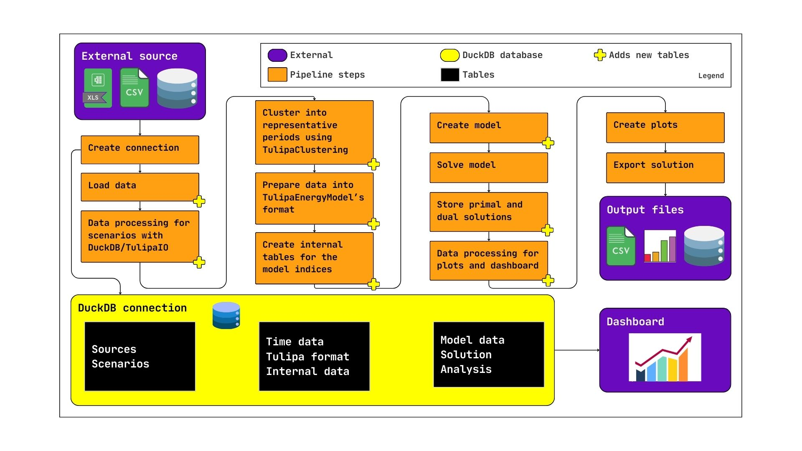

# Tutorial 7: Workflow

In previous tutorials you have learned how to work with TulipaEnergyModel and related tools such as TulipaClustering and TulipaIO. However, we have not yet considered data requirements and processing to get to these steps. How do we work with 'raw' data and convert it to the format needed for running the optimization model? How are results stored? How do we compare scenarios with different assumptions for input data? This tutorial will be about teaching you the basics in the workflow that are currently supported.

Please note:  there are many ways to go about processing data, depending on your preferences. The work below is simply an example! For reference, see the workflow structure below



## 1. Set up

Like previous tutorials we will start with working in our 'workflow.jl' file. There are a couple of new packages we will add first.

```julia
# Guarantee to run in the current directory
using Pkg: Pkg
Pkg.activate(".")

# Add new packages specific for this tutorial
Pkg.add("CSV")          # For working with CSV files
Pkg.add("Chain")        # For handling data transformation
Pkg.add("Tables")       # For manipulating the data tables
Pkg.add("DBInterface")  # For conducting queries
Pkg.add("ODBC")         # For working with Microsoft Access database files
Pkg.add("DataFrames")
Pkg.add("Plots")

# Load the packages
import TulipaIO as TIO
import TulipaEnergyModel as TEM
using DuckDB
using DBInterface
using DataFrames
using Plots
using CSV
using Chain
using Tables
using ODBC

# Check what TulipaEnergyModel version you are on
Pkg.status()
# or in console type ] followed by 'status TulipaEnergyModel'
# if necessary run the following:
# Pkg.add(name="TulipaEnergyModel", version="0.18.2")
```

## 2. Context and input data

We are interested in investigating the electricity prices in our future system, in moments where both solar PV and wind make up a large share of our electricity production. This will help us understand the role that dispatchable/storage technologies play within the system.

All input data required for this tutorial can be found here: <https://zenodo.org/records/17454936>

Download the data and place them in a directory similar to the previous tutorials (within your VS project), for example `my-awesome-energy-system/tutorial-7`. As can be seen in this folder, the data is comprised of different file types. We have .csv files for our hourly profiles, .xlsx files for our asset and technology data, and a .accdb file for storage metadata.

The first thing we should do is transforming and cleaning the data. As you know by now, TulipaEnergyModel requires input data to be in a specific format following the schemas as explained in the documentation.

## 3. Transforming and cleaning the data

Let's start with the hourly profiles for demand and variable renewable energy production. These are respectively named `electricity_demand.csv`, `ninja-pv-country-NL-national-merra2` and `ninja-wind-country-NL-future_total-merra2`. The demand profiles are extracted from the ETM, which provides data on several scenario studies concerning the future electricity (and hydrogen and gas) system of the Netherlands. The original source can be found here <https://my.energytransitionmodel.com/saved_scenarios/19919>. The production profiles are sourced from Renewables.ninja, which can be found here <https://www.renewables.ninja/>. We will start with the demand data.

```julia
# Create a DuckDB file to store the input data
db_file = joinpath("my-awesome-energy-system", "tutorial-7", "data.db")

# We will continue to make a connection
connection = DuckDB.DB(db_file)            # Create a connection to the database file

# You should see a "data.db" file in your repository now

# Let's import our input data into the DuckDB file
# First, define a default directory for DuckDB to conduct queries
script_dir = @__DIR__  # this gives the directory of the current script

DBInterface.execute(connection, "SET FILE_SEARCH_PATH='$(script_dir)'")

DBInterface.execute(connection, """
    CREATE TABLE electricity_demand AS
    SELECT * FROM read_csv_auto('my-awesome-energy-system/tutorial-7/electricity_demand.csv')
""")

#DBInterface.execute(connection, "DROP TABLE IF EXISTS electricity_demand")

elec_demand = DBInterface.execute(connection, "SELECT * FROM electricity_demand") |> DataFrame

# You should see that a 8760x285 DataFrame is present, showing electricity output and input for various sectors across the year
# Now let's remove columns we do not need. We are only interested in the time (Time) and any column mentioning electricity input (demand)

cols_to_keep = filter(c -> c == "Time" || occursin("input", c), names(elec_demand))
elec_demand = elec_demand[:, cols_to_keep]

cols_to_sum = filter(c -> c != "Time", names(elec_demand))
elec_demand.value = sum.(eachrow(elec_demand[:, cols_to_sum]))

elec_demand = elec_demand[:, ["Time", "value"]]

# change Datetime to timestep
elec_demand.Time = 1:nrow(elec_demand)

# rename Time to timestep
rename!(elec_demand, :Time => :timestep)

# normalize data

max_demand = maximum(elec_demand.value)
max_demand
elec_demand.value .= elec_demand.value ./ max_demand

```

The demand dataframe has now been properly constructed in our database file. We will now continue with the production profiles for variable renewable energy. As mentioned before, we will be working with data generated through Renewables.ninja for both solar PV and wind.

```julia

# Solar production

DBInterface.execute(connection, """
    CREATE TABLE solar_production AS
    SELECT * FROM read_csv_auto('my-awesome-energy-system/tutorial-7/ninja-pv-country-NL-national-merra2.csv')
""")

solar_prod = DBInterface.execute(connection, "SELECT * FROM solar_production") |> DataFrame
solar_prod = solar_prod[4:end, :]
rename!(solar_prod, [:timestep, :value])

solar_prod.value = parse.(Float64, solar_prod.value)

solar_prod = solar_prod[occursin.("2015", solar_prod.timestep), :]

solar_prod.timestep = 1:nrow(solar_prod)

# Wind production

DBInterface.execute(connection, """
    CREATE TABLE wind_production AS
    SELECT * FROM read_csv_auto('my-awesome-energy-system/tutorial-7/ninja-wind-country-NL-future_total-merra2.csv')
""")

wind_prod = DBInterface.execute(connection, "SELECT * FROM wind_production") |> DataFrame
wind_prod = wind_prod[4:end, 1:2]

rename!(wind_prod, [:timestep, :value])
wind_prod.value = parse.(Float64, wind_prod.value)


wind_prod = wind_prod[occursin.("2015", wind_prod.timestep), :]

wind_prod.timestep = 1:nrow(wind_prod)

```

Now that we have transformed and cleaned our original data, we will structure it in a way that matches the required input format to run TulipaEnergyModel.

```julia

# Consider the three dataframes from before: electricity demand, solar production and wind production. Now add columns to match schemas.

insertcols!(elec_demand, 1, :profile_name => fill("demand-demand", nrow(elec_demand)))
insertcols!(elec_demand, 2, :year => fill("2050", nrow(elec_demand)))
insertcols!(elec_demand, 3, :rep_period => fill("1", nrow(elec_demand)))

insertcols!(solar_prod, 1, :profile_name => fill("availability-solar", nrow(solar_prod)))
insertcols!(solar_prod, 2, :year => fill("2050", nrow(solar_prod)))
insertcols!(solar_prod, 3, :rep_period => fill("1", nrow(solar_prod)))

insertcols!(wind_prod, 1, :profile_name => fill("availability-wind", nrow(wind_prod)))
insertcols!(wind_prod, 2, :year => fill("2050", nrow(wind_prod)))
insertcols!(wind_prod, 3, :rep_period => fill("1", nrow(wind_prod)))
```

All profile-dependent data is now transformed and cleaned, and has what we need to structure it into one profiles-periods file according to the schema.

```julia

# We can vertically concatenate the data into one dataframe

profiles_rep_periods = vcat(elec_demand, solar_prod, wind_prod)

# Write back to DuckDB file using the connection we established earlier

DuckDB.register_data_frame(connection, profiles_rep_periods, "profiles_rep_periods_temp")
DBInterface.execute(connection, "CREATE TABLE profiles_rep_periods AS SELECT * FROM profiles_rep_periods_temp")

# Check using TIO

TIO.show_tables(connection)  # View all the table names in the DuckDB connection

# ALTERNATIVELY (see how TIO simplifies this query?)

tables = DBInterface.execute(connection, """
    SELECT table_name
    FROM information_schema.tables
    WHERE table_schema = 'main'
""") |> DataFrame

println(tables)


```

Since we are creating this energy system from scratch, we will need to construct some dataframes ourselves to meet the minimum input criteria for running the model. In particular, we need to establish some information related to the assets, flows and other timeframe related parameters.

We will first establish the assets we want to have in our simplified energy system. Since we are interested in the impact of variable renewable energy technologies, we will consider both variable and dispatchable energy technologies. The underlying assumption is we are considering 2050 in a (largely) decarbonized system

```julia

# Create the dataframe
asset = DataFrame(
    asset = String[],
    type  = String[],
    capacity = Float64[],
    investment_method = String[],
    investment_integer = Bool[],
    technical_lifetime = Int[],
    discount_rate = Float64[]
)

# Add rows
push!(asset, ("ccgt_ccs", "producer", 84600.0, "simple", true, 15, 0.05))
push!(asset, ("solar", "producer", 550000.0, "simple", true, 15, 0.05))
push!(asset, ("wind", "producer", 134000.0, "simple", true, 15, 0.05))
push!(asset, ("e_demand", "consumer", 0.0, "none", false, 15, 0.05))
push!(asset, ("ens", "producer", 1000000.0, "none", false, 15, 0.05))

# The dataframe 'asset_both' is based on the assets chosen above and can be constructed as follows

asset_both = DataFrame(
    asset = asset.asset,                        # reuse the 'asset' column
    milestone_year = fill(2050, nrow(asset)),             # constant 2050
    commission_year = fill(2050, nrow(asset)),            # constant 2050
    initial_units = fill(1.0, nrow(asset))                # constant 1.0
)

# The dataframes 'asset_commission' and 'asset_milestone' are based off of 'asset' and 'asset_both' and can be constructed as follows

asset_commission = DataFrame(
    asset = asset.asset,                         # reuse 'asset' column
    commission_year = asset_both.commission_year, # reuse 'commission_year'
    investment_cost = fill(0.0, nrow(asset)),             # all zeros
    investment_limit = Vector{Union{Missing, Float64}}(missing, nrow(asset)),  # empty entries, can either contain missing or float64 values (to prevent type errors later)
    fixed_cost_storage_energy = fill(5.0, nrow(asset))    # all 5.0
)


asset_milestone = DataFrame(
    asset = asset.asset,                         # reuse 'asset' column
    milestone_year = asset_both.milestone_year, # reuse 'commission_year'
    investable = fill("false", nrow(asset)),             # all zeros
    peak_demand = fill(0.0, nrow(asset)),  # empty entries (remember, we will need to define peak demand by our variable 'max_demand' later)
    commodity_price = fill(0.0, nrow(asset))    # all 5.0
)

asset_milestone.peak_demand[asset_milestone.asset .== "e_demand"] .= max_demand

# The dataframe assets_profiles is manually constructed for a few assets to later link them to the production/demand profiles

assets_profiles = DataFrame(
    asset = String[],
    commission_year = Int[],
    profile_type = String[],
    profile_name = String[]
)

# Add rows
push!(assets_profiles, ("wind", 2050, "availability", "availability-wind"))
push!(assets_profiles, ("solar", 2050, "availability", "availability-solar"))
push!(assets_profiles, ("e_demand", 2050, "demand", "demand-demand"))

# Add all asset dataframes to DuckDB file

DuckDB.register_data_frame(connection, asset, "asset_temp")
DBInterface.execute(connection, "CREATE TABLE asset AS SELECT * FROM asset_temp")

DuckDB.register_data_frame(connection, asset_both, "asset_both_temp")
DBInterface.execute(connection, "CREATE TABLE asset_both AS SELECT * FROM asset_both_temp")

DuckDB.register_data_frame(connection, asset_commission, "asset_commission_temp")
DBInterface.execute(connection, "CREATE TABLE asset_commission AS SELECT * FROM asset_commission_temp")

DuckDB.register_data_frame(connection, asset_milestone, "asset_milestone_temp")
DBInterface.execute(connection, "CREATE TABLE asset_milestone AS SELECT * FROM asset_milestone_temp")

DuckDB.register_data_frame(connection, assets_profiles, "assets_profiles_temp")
DBInterface.execute(connection, "CREATE TABLE assets_profiles AS SELECT * FROM assets_profiles_temp")


# Use TIO again to view how many tables we have in our database

TIO.show_tables(connection)

```

After constructing the asset-related datafiles and writing them to our DuckDB file, we will now do the same for the tables related to flows.

```julia

flow = DataFrame(
    from_asset = String[],
    to_asset = String[],
    technical_lifetime = Int[],
    discount_rate = Float64[]
)

push!(flow, ("ens", "e_demand", 10, 0.02))
push!(flow, ("ccgt_ccs", "e_demand", 10, 0.02))
push!(flow, ("wind", "e_demand", 10, 0.02))
push!(flow, ("solar", "e_demand", 10, 0.02))

# We will also construct flow_both and keep it empty (for now)

flow_both = DataFrame(
    from_asset = String[],
    to_asset = String[],
    milestone_year = Int[],
    commission_year = Int[],
    decommissionable = Bool[]
)

# The dataframes flow_commission and flow_milestone are based off of the flow database and can be constructed as follows

flow_commission = DataFrame(
    from_asset = flow.from_asset,                 # reuse column
    to_asset   = flow.to_asset,                   # reuse column
    commission_year = fill(2050, nrow(flow)),             # constant 2050
    conversion_coefficient = fill(1.0, nrow(flow))        # constant 1.0
)

flow_milestone = DataFrame(
    from_asset = String[],
    to_asset = String[],
    milestone_year = Int[],
    operational_cost = Float64[]
)

push!(flow_milestone, ("ens", "e_demand", 2050, 180))
push!(flow_milestone, ("ccgt_ccs", "e_demand", 2050, 90))
push!(flow_milestone, ("wind", "e_demand", 2050, 5))
push!(flow_milestone, ("solar", "e_demand", 2050, 5))

# flow = nothing  # used for resetting table after pushing rows

# Finally, write flow dataframes to DuckDB file

DuckDB.register_data_frame(connection, flow, "flow_temp")
DBInterface.execute(connection, "CREATE TABLE flow AS SELECT * FROM flow_temp")

DuckDB.register_data_frame(connection, flow_both, "flow_both_temp")
DBInterface.execute(connection, "CREATE TABLE flow_both AS SELECT * FROM flow_both_temp")

DuckDB.register_data_frame(connection, flow_commission, "flow_commission_temp")
DBInterface.execute(connection, "CREATE TABLE flow_commission AS SELECT * FROM flow_commission_temp")

DuckDB.register_data_frame(connection, flow_milestone, "flow_milestone_temp")
DBInterface.execute(connection, "CREATE TABLE flow_milestone AS SELECT * FROM flow_milestone_temp")


# Check and confirm your dataframes have been added to the database

TIO.show_tables(connection)

```

Finally, we need to add the dataframes related to the timeframe of the model and how it should consider representative periods

```julia

# We will construct the remaining dataframes needed to run the model as follows

# rep-periods-data, we can use representative periods to simplify our energy problem further


rep_periods_data = DataFrame(
    year = Int[],
    rep_period = Int[],
    num_timesteps = Int[],
    resolution = Float64[]
)

push!(rep_periods_data, (2050, 1, 8760, 1.0))


rep_periods_mapping = DataFrame(
    year = Int[],
    period = Int[],
    rep_period = Int[],
    weight = Float64[]
)

push!(rep_periods_mapping, (2050, 1, 1, 1.0))

timeframe_data = DataFrame(
    year = Int[],
    period = Int[],
    num_timesteps = Int[]
)

push!(timeframe_data, (2050, 1, 8760))

year_data = DataFrame(
    year = Int[],
    length = Int[],
    is_milestone = Bool[]
)

push!(year_data, (2050, 8760, true))

# Add dataframes to DuckDB file

DuckDB.register_data_frame(connection, rep_periods_data, "rep_periods_data_temp")
DBInterface.execute(connection, "CREATE TABLE rep_periods_data AS SELECT * FROM rep_periods_data_temp")

DuckDB.register_data_frame(connection, rep_periods_mapping, "rep_periods_mapping_temp")
DBInterface.execute(connection, "CREATE TABLE rep_periods_mapping AS SELECT * FROM rep_periods_mapping_temp")

DuckDB.register_data_frame(connection, timeframe_data, "timeframe_data_temp")
DBInterface.execute(connection, "CREATE TABLE timeframe_data AS SELECT * FROM timeframe_data_temp")

DuckDB.register_data_frame(connection, year_data, "year_data_temp")
DBInterface.execute(connection, "CREATE TABLE year_data AS SELECT * FROM year_data_temp")


# Finally, check to see if you have added the dataframes to the database properly

TIO.show_tables(connection)

```

We now should have everything we need to be able to run the model. Before we continue, a wise intermediate step to take would be to save the data you have processed so far in a separate backup DuckDB file.
This way, if anything goes wrong with any further data manipulation, you will always be able to go back to this point. To make a backup, follow the following steps

```julia

backup_file = joinpath("my-awesome-energy-system", "tutorial-7", "data_backup.db")

# Close connection before copying (or it will give you an error)

GC.gc()
connection = nothing
GC.gc()
connection = nothing

# Check to see if it prints nothing
connection


# Copy the data from your working file 'data.db' into your new backup file 'data_backup.db' (we defined db_file earlier on in the tutorial)
cp(db_file, backup_file; force=true)
println("Backup created at: $backup_file")

# reconnect

connection = DuckDB.DB(db_file)

# alternatively, if you want to load in your backup
# connection = DuckDB.DB(backup_file)

```

## 4. Running the model

At this point, we have a connection to our main database file, as well as a backup should anything get lost for whatever reason.

To run the model, we first populate with defaults as we did in previous tutorials. Next up; run!

```julia

TEM.populate_with_defaults!(connection)

#remember to create a results folder before running
mkpath("my-awesome-energy-system/tutorial-7/results")

output_dir = "my-awesome-energy-system/tutorial-7/results"

energy_problem =
    TEM.run_scenario(connection; output_folder=output_dir)

```

## 5. Inspect the results

Plot the electricity prices

What do you see?

```julia
TIO.get_table(connection, "cons_balance_consumer")

# plot the prices

balance = TIO.get_table(connection, "cons_balance_consumer")

asset = "e_demand"
year = 2050
rep_period = 1

filtered_asset = filter(
    row ->
        row.asset == asset &&
            row.year == year &&
            row.rep_period == rep_period,
    balance,
)

plot(
    filtered_asset.time_block_start,
    filtered_asset.dual_balance_consumer;
    #label=string(from_asset, " -> ", to_asset),
    xlabel="Hour",
    ylabel="[Euro/MWh]",
    ylims=(0,200),
    xlims=(0, 768),
    dpi=600,
)

```

Relatively high prices, even some energy not served! High variability of prices. Feel free to play around with the plot range to consider different moments in the year, it is currently only displaying from timestep 0 to 768.
Notice the size of the problem, construction time, solving time. Keep this in mind for the next steps.

## 6. Construct the second scenario

As can be seen from the electricity prices, the system seems to struggle with delivering enough electricity to satisfy demand, causing ENS pricing to activate. We will now add storage to the model to see how this alleviates this problem in our second scenario.

We have some storage information saved in a Microsoft Access database named `electricity_storage.accdb`

Before loading in the data, remember we have both inputs and outputs for our original scenario currently in table format in our connection.

```julia

TIO.show_tables(connection)


tables = DBInterface.execute(connection, """
    SELECT table_name
    FROM information_schema.tables
    WHERE table_schema = 'main'
""") |> DataFrame

println(tables)
```

Depending on how extensively you would like to compare the results from both scenarios you could do a couple of things. Firstly, you can make a copy of the dataframes currently stored in our connection and load them in later to compare with the second scenario results. In our case, since we are only interested in comparing electricity prices between the two scenarios, we will rename the price results for our first scenario stored as dual variables in `cons_balance_consumer` so that it does not get overwritten in our next model run. This allows us to compare the price results later.

The first step in establishing the new scenario is to load in the Access database and see what we are working with.

```julia

db_file = raw"my-awesome-energy-system/tutorial-7/electricity_storage.accdb"
conn = ODBC.Connection("Driver={Microsoft Access Driver (*.mdb, *.accdb)};DBQ=$db_file;")

electricity_storage = DBInterface.execute(conn, "SELECT * FROM Storage") |> DataFrame

# Write the dataframe into DuckDB as a permanent table
DuckDB.register_data_frame(connection, electricity_storage, "electricity_storage_tmp")
DBInterface.execute(connection, "CREATE OR REPLACE TABLE electricity_storage AS SELECT * FROM electricity_storage_tmp")

# Note that our original 'connection' still exists, and we can see the new electricity_storage dataframe like so:
TIO.get_table(connection, "electricity_storage")

```

As you can see, we have some installed capacity figures for battery and hydro pumped storage options. We can now include them in the input files through some processing.

```julia

# Manually add the new rows (one for battery storage, one of pumped hydro storage) into the dataframes in our DuckDB file
# We have learned in tutorial 5 that our new storage technologies (battery and pumped hydro) should be defined in both asset as well as flow input data

TIO.get_table(connection, "asset")

DBInterface.execute(connection, """
    INSERT INTO asset (asset, type, capacity, investment_method, investment_integer, technical_lifetime, discount_rate, capacity_storage_energy)
    VALUES ('battery', 'storage', 40000.0, 'simple', false, 15, 0.05, 160000)
""")

DBInterface.execute(connection, """
    INSERT INTO asset (asset, type, capacity, investment_method, investment_integer, technical_lifetime, discount_rate, capacity_storage_energy)
    VALUES ('pumped_hydro', 'storage', 50000.0, 'simple', false, 15, 0.05, 500000)
""")

# Check new entries
TIO.get_table(connection, "asset")


# Now repeat for other required input tables. To make it easier we can use push! to change the dataframes first and then update the tables in our connection

push!(asset_both, ("battery", 2050, 2050, 1.0))
push!(asset_both, ("pumped_hydro", 2050, 2050, 1.0))
push!(asset_commission, ("battery", 2050, 100,missing,5.0))
push!(asset_commission, ("pumped_hydro", 2050, 100,missing,5.0))
push!(asset_milestone, ("battery", 2050, "false", 0.0, 0))
push!(asset_milestone, ("pumped_hydro", 2050, "false", 0.0, 0))

#assets to storage techs
push!(flow_commission, ("solar", "battery", 2050, 0.92))
push!(flow_commission, ("wind", "battery", 2050, 0.92))
push!(flow_commission, ("ccgt_ccs", "battery", 2050, 0.92))
push!(flow_commission, ("solar", "pumped_hydro", 2050, 0.92))
push!(flow_commission, ("wind", "pumped_hydro", 2050, 0.92))
push!(flow_commission, ("ccgt_ccs", "pumped_hydro", 2050, 0.92))

#storage techs to demand
push!(flow_commission, ("battery", "e_demand", 2050, 0.92))
push!(flow_commission, ("pumped_hydro", "e_demand", 2050, 0.7))

#repeat
push!(flow_milestone, ("solar", "battery", 2050, 0))
push!(flow_milestone, ("wind", "battery", 2050, 0))
push!(flow_milestone, ("ccgt_ccs", "battery", 2050, 0))
push!(flow_milestone, ("solar", "pumped_hydro", 2050, 0))
push!(flow_milestone, ("wind", "pumped_hydro", 2050, 0))
push!(flow_milestone, ("ccgt_ccs", "pumped_hydro", 2050, 0))

push!(flow_milestone, ("battery", "e_demand", 2050, 0))
push!(flow_milestone, ("pumped_hydro", "e_demand", 2050, 0))

#repeat
push!(flow, ("solar", "battery", 10, 0.02))
push!(flow, ("wind", "battery", 10, 0.02))
push!(flow, ("ccgt_ccs", "battery", 10, 0.02))
push!(flow, ("solar", "pumped_hydro", 10, 0.02))
push!(flow, ("wind", "pumped_hydro", 10, 0.02))
push!(flow, ("ccgt_ccs", "pumped_hydro", 10, 0.02))

push!(flow, ("battery", "e_demand", 10, 0.02))
push!(flow, ("pumped_hydro", "e_demand", 10, 0.02))

# Remember that this only updates our dataframes and NOT our duckDB file. Run the next lines to update the duckDB file:
# We use a loop to keep the code more concise, but you could also manually do it like this:
# Example for asset_both
#DuckDB.register_data_frame(connection, asset_both, "asset_both_tmp")
#DBInterface.execute(connection, "CREATE OR REPLACE TABLE asset_both AS SELECT * FROM asset_both_tmp")
#DBInterface.execute(connection, "DROP VIEW IF EXISTS asset_both_tmp")

tables_to_update = [
    ("asset_both", asset_both),
    ("asset_commission", asset_commission),
    ("asset_milestone", asset_milestone),
    ("flow_commission", flow_commission),
    ("flow_milestone", flow_milestone),
    ("flow", flow)
]

for (tbl_name, df) in tables_to_update
    tmp_name = tbl_name * "_tmp"
    DuckDB.register_data_frame(connection, df, tmp_name)
    DBInterface.execute(connection, "CREATE OR REPLACE TABLE $tbl_name AS SELECT * FROM $tmp_name")
    DBInterface.execute(connection, "DROP VIEW IF EXISTS $tmp_name")
end

```

## 7. Analyze differences between the two scenarios

Now that we have updated input data in our DuckDB connection, we can run the model again!

Before we run it, we will store the results we generated in our first run under a separate name so they will not be overwritten. This will allow us to compare the two runs later.

```julia

DBInterface.execute(connection, "ALTER TABLE cons_balance_consumer RENAME TO cons_balance_consumer_nostorage")

```

Now that we have stored the prices from the first run, we can continue running the model with the updated input data.

```julia

TEM.populate_with_defaults!(connection)

energy_problem =
    TEM.run_scenario(connection; output_folder=output_dir)

```

What do you notice about the results? What happened to the objective value?

Let's plot the prices of both scenarios next to each other

```julia

balance_nostorage = TIO.get_table(connection, "cons_balance_consumer_nostorage")
balance = TIO.get_table(connection, "cons_balance_consumer")

# Filter for the asset / year / rep_period
asset = "e_demand"
year = 2050
rep_period = 1

filtered_nostorage = filter(row -> row.asset == asset &&
                                 row.year == year &&
                                 row.rep_period == rep_period,
                             balance_nostorage)

filtered_storage = filter(row -> row.asset == asset &&
                                row.year == year &&
                                row.rep_period == rep_period,
                          balance)

# Plot both series
plot(
    filtered_nostorage.time_block_start, filtered_nostorage.dual_balance_consumer,
    label="No Storage",
    xlabel="Hour",
    ylabel="[Euro/MWh]",
    ylims=(0,200),
    xlims=(0, 768),
    dpi=600
)

# Add second series
plot!(filtered_storage.time_block_start, filtered_storage.dual_balance_consumer,
      label="With Storage")

```

What do you notice? What happened to the objective value of the model outcome?

It can be worthwhile to consider the price duration curve, in this plot the prices (this time of the whole year) are ranked from high to low in the two model runs.

```julia

# Filter for asset/year
asset = "e_demand"
year = 2050

filtered_nostorage = filter(row -> row.asset == asset && row.year == year, balance_nostorage)
filtered_storage    = filter(row -> row.asset == asset && row.year == year, balance)

# Sort prices descending
p_no  = sort(filtered_nostorage.dual_balance_consumer; rev=true)
p_yes = sort(filtered_storage.dual_balance_consumer; rev=true)

# cumulative hours
x_no  = 1:length(p_no)
x_yes = 1:length(p_yes)

# Plot ranked prices
plot(
    x_no, p_no,
    seriestype = :steppost,
    label      = "No Storage",
    xlabel     = "Hour (ranked)",
    ylabel     = "Price (euro/MWh)",
    xlims      = (0, 8760),
    dpi        = 600,
    legend     = :right
)

plot!(
    x_yes, p_yes,
    seriestype = :steppost,
    label      = "With Storage"
)

```

Notice the dramatic decrease of the electricity price as shown in the plot.

## 8. Further analysis

Feel free to further tweak the input data and observe what happens to the system. You can directly tweak data in the connection by running queries like so (this is an example):

```julia

DBInterface.execute(connection, """
    UPDATE asset
    SET capacity = 10000.0
    WHERE asset = 'ccgt_ccs'
""")

# Remember you can have a look at the state of the tables in the connection like so (example):

TIO.get_table(connection, "asset")
```
