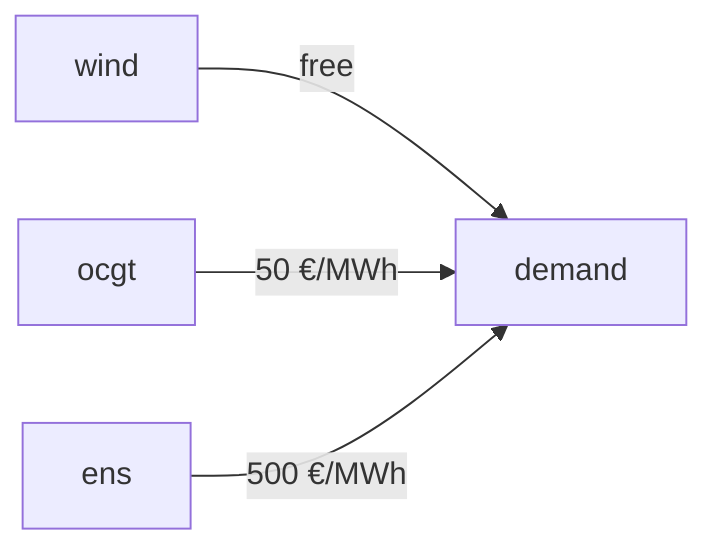

# [Risk-Averse Investment with Conditional Value at Risk (CVaR)](@id cvar-tutorial)

## Introduction

Energy system planning must grapple with **uncertainty**: wind and solar availability fluctuate, demand varies, and fuel prices change year to year. The standard approach minimises the **expected cost** across scenarios, but this can lead to solutions that perform well on average yet expose the system to high costs in bad years.

**Conditional Value at Risk (CVaR)** is a risk measure that addresses this problem by penalising the worst outcomes. At confidence level $\alpha$, $\text{CVaR}_\alpha$ is the *average cost of the $(1-\alpha)$-fraction of most expensive scenarios*. Tulipa's **mean-CVaR** objective blends expected cost and CVaR through a risk-aversion weight $\lambda$:

$$\text{minimise} \quad (1 - \lambda) \cdot \underbrace{\mathbb{E}[C]}_{\text{expected cost}} + \lambda \cdot \underbrace{\text{CVaR}_{\alpha}[C]}_{\text{risk measure}}$$

| $\lambda$ | Behaviour |
|---|---|
| `0.0` | Risk-neutral: minimise expected cost only |
| `0.5` | Balanced: equal weight on expected cost and CVaR |
| `1.0` | Fully risk-averse: minimise CVaR only |

!!! note
    CVaR is only activated when **both** $\lambda > 0$ and there are **at least two** stochastic scenarios. Otherwise, the model reduces to the standard expected-cost minimisation.

In this tutorial you will learn how to:

1. Set up a two-scenario energy system.
2. Activate CVaR via `model-parameters.csv`.
3. Interpret the CVaR decision variables $v^\mu$ and $v^\xi_s$.
4. Observe how varying $\lambda$ changes the optimal investment.

For the mathematical background, see [`Risk-Averse Optimization with CVaR`](@ref cvar-setup) in the user guide.

## The Energy System

We model a small electricity system with **two stochastic scenarios** representing different wind years:

| Scenario | Probability | Wind availability |
|---|---|---|
| 1 — Good wind year | 0.6 | 90 % of installed capacity |
| 2 — Bad wind year | 0.4 | 10 % of installed capacity |

The system has four assets:

| Asset | Type | Description |
|---|---|---|
| `wind` | Producer (investable) | Wind farm, 100 MW/unit, 0 €/MWh |
| `ocgt` | Producer (fixed) | Gas turbine, 100 MW, 50 €/MWh |
| `demand` | Consumer | Constant demand of 100 MW |
| `ens` | Producer (fixed) | Energy not served, 200 MW, 500 €/MWh |

Wind is the **only investable asset** with investment cost 100 €/MW. The optimizer decides how much wind capacity to build (up to 100 MW = 1 unit) before the scenarios are revealed.



## Loading the Data

```@example cvar
import TulipaIO as TIO
import TulipaEnergyModel as TEM
using DuckDB
using DataFrames

input_dir = joinpath(@__DIR__, "my-awesome-energy-system/tutorial-cvar")
connection = DBInterface.connect(DuckDB.DB)
TIO.read_csv_folder(connection, input_dir)
TEM.populate_with_defaults!(connection)
```

The default `model-parameters.csv` activates CVaR with $\lambda = 0.5$ and $\alpha = 0.8$:

```@example cvar
DataFrame(DuckDB.query(connection, """
    SELECT discount_year, discount_rate,
           risk_aversion_weight_lambda   AS lambda,
           risk_aversion_confidence_level_alpha AS alpha
    FROM model_parameters
"""))
```

The two stochastic scenarios and their probabilities:

```@example cvar
DataFrame(DuckDB.query(connection, "SELECT * FROM stochastic_scenario"))
```

Wind availability profiles — scenario 1 maps to representative period 1 (availability 0.9), scenario 2 maps to representative period 2 (availability 0.1):

```@example cvar
DataFrame(DuckDB.query(connection, """
    SELECT profile_name, rep_period, timestep, value
    FROM profiles_rep_periods
    WHERE profile_name = 'availability-wind'
    ORDER BY rep_period, timestep
    LIMIT 6
"""))
```

## Running the Model (λ = 0.5)

```@example cvar
energy_problem = TEM.run_scenario(connection)
println("Objective value: ", round(energy_problem.objective_value; digits=2), " €")
```

### Investment Decision

With $\lambda = 0.5$, the model builds the full 100 MW of wind:

```@example cvar
DataFrame(DuckDB.query(connection, "SELECT asset, capacity, investment_limit, solution AS units_invested FROM var_assets_investment"))
```

### Dispatch by Scenario

In the good wind year (rep period 1, wind covers 90 MW), the gas turbine only runs at 10 MW:

```@example cvar
DataFrame(DuckDB.query(connection, """
    SELECT from_asset, scenario, rep_period, timestep_block_start AS timestep, solution AS flow_MW
    FROM var_flow
    WHERE from_asset IN ('wind', 'ocgt', 'ens')
    ORDER BY scenario, from_asset, timestep_block_start
"""))
```

In the bad wind year (rep period 2, wind covers only 10 MW), the gas turbine runs at 90 MW.

### CVaR Decision Variables

When CVaR is active, the model creates two auxiliary variables:

- **$v^\mu$** (`var_value_at_risk_threshold_mu`): the Value-at-Risk threshold, i.e. the cost level below which a fraction $\alpha$ of scenarios fall.
- **$v^\xi_s$** (`var_scenario_tail_excess`): the tail excess for scenario $s$, representing by how much scenario $s$ costs exceed the VaR threshold.

```@example cvar
mu_df = DataFrame(DuckDB.query(connection, "SELECT solution AS var_mu FROM var_value_at_risk_threshold_mu"))
xi_df = DataFrame(DuckDB.query(connection, """
    SELECT s.scenario, s.description, x.solution AS xi_s
    FROM var_scenario_tail_excess x
    JOIN stochastic_scenario s ON x.id = s.scenario
    ORDER BY s.scenario
"""))
println("VaR threshold μ = ", mu_df.var_mu[1], " €")
println()
xi_df
```

The VaR threshold $v^\mu = 50{,}500$ € equals the total cost of the **bad wind year** (investment 10,000 € + OCGT at 90 MW for 9 h × 50 €/MWh = 40,500 €). The tail excess for both scenarios is zero because the bad year *is* the worst case at the 80 % confidence level, so $\text{CVaR}_{0.8} = v^\mu = 50{,}500$ €.

The full objective is:

$$f = (1 - 0.5) \times 28{,}900 + 0.5 \times 50{,}500 = 14{,}450 + 25{,}250 = 39{,}700 \text{ €}$$

## Sensitivity to Risk Aversion (λ = 0 and λ = 1)

### Risk-Neutral Benchmark (λ = 0)

With $\lambda = 0$ the optimizer minimises only the expected cost and ignores worst-case scenarios.

```@example cvar
conn0 = DBInterface.connect(DuckDB.DB)
TIO.read_csv_folder(conn0, input_dir)
TEM.populate_with_defaults!(conn0)
DuckDB.query(conn0, "UPDATE model_parameters SET risk_aversion_weight_lambda = 0.0")
ep0 = TEM.run_scenario(conn0)
println("λ=0 objective: ", round(ep0.objective_value; digits=2), " €")
inv0 = DataFrame(DuckDB.query(conn0, "SELECT solution AS units_invested FROM var_assets_investment"))
println("Wind units invested: ", inv0.units_invested[1])
```

The risk-neutral model still invests fully in wind because the expected cost savings (26,100 €/unit) exceed the investment cost (10,000 €/unit).

### Fully Risk-Averse (λ = 1)

With $\lambda = 1$ the model minimises CVaR alone, completely ignoring expected cost.

```@example cvar
conn1 = DBInterface.connect(DuckDB.DB)
TIO.read_csv_folder(conn1, input_dir)
TEM.populate_with_defaults!(conn1)
DuckDB.query(conn1, "UPDATE model_parameters SET risk_aversion_weight_lambda = 1.0")
ep1 = TEM.run_scenario(conn1)
println("λ=1 objective: ", round(ep1.objective_value; digits=2), " €")
inv1 = DataFrame(DuckDB.query(conn1, "SELECT solution AS units_invested FROM var_assets_investment"))
println("Wind units invested: ", inv1.units_invested[1])
```

Surprisingly, the fully risk-averse model **does not invest in wind at all**. Why?

### Explaining the CVaR Flip

With no wind (0 units):

| Scenario | Total cost |
|---|---|
| Good wind year | 100 MW × 9 h × 50 €/MWh = 45,000 € |
| Bad wind year | 100 MW × 9 h × 50 €/MWh = 45,000 € |

Both scenarios have identical cost = 45,000 €, so CVaR = 45,000 €.

With 1 unit of wind (100 MW):

| Scenario | Total cost |
|---|---|
| Good wind year | 10,000 € (invest) + 10 MW × 9 h × 50 €/MWh = 14,500 € |
| Bad wind year | 10,000 € (invest) + 90 MW × 9 h × 50 €/MWh = 50,500 € |

CVaR$_{0.8}$ = 50,500 € (the 80th-percentile worst case is the bad scenario).

**Investing in wind worsens the bad scenario's total cost** because the investment is a sunk cost that increases the bad-year expenditure without providing sufficient operational savings. From CVaR's perspective, wind investment is undesirable.

### Results Summary

| $\lambda$ | Wind invested | Objective | E[cost] | CVaR$_{0.8}$ |
|---|---|---|---|---|
| 0.0 (risk-neutral) | 1 unit | 28,900 € | 28,900 € | 50,500 € |
| 0.5 (balanced) | 1 unit | 39,700 € | 28,900 € | 50,500 € |
| 1.0 (fully risk-averse) | 0 units | 45,000 € | 45,000 € | 45,000 € |

The transition from "invest" to "don't invest" occurs at $\lambda^* \approx 0.745$. For $\lambda < \lambda^*$ the expected savings dominate; for $\lambda > \lambda^*$ CVaR reduction dominates.

!!! tip "Choosing λ in practice"
    In real-world problems, a moderate $\lambda$ (0.2–0.5) often captures meaningful risk reduction without sacrificing too much expected cost. The right value depends on the decision-maker's risk tolerance and the spread between scenarios.

## Summary

In this tutorial you have learned how to:

- Configure the mean-CVaR objective using `risk_aversion_weight_lambda` ($\lambda$) and `risk_aversion_confidence_level_alpha` ($\alpha$) in `model-parameters.csv`.
- Interpret the CVaR decision variables $v^\mu$ (VaR threshold) and $v^\xi_s$ (scenario tail excess).
- Understand how $\lambda$ controls the trade-off between expected cost and risk: higher $\lambda$ protects against worst-case outcomes but may sacrifice average performance.
- Recognise that CVaR can change investment decisions — assets that are attractive under expected-cost minimisation may be undesirable under high risk aversion.

For further reading, see:

- [`Risk-Averse Optimization with CVaR`](@ref cvar-setup) — user-guide reference for CVaR parameters.
- [`Two-Stage Stochastic Optimization`](@ref two-stage-stochastic) — background on the stochastic formulation used here.
- [`Mathematical Formulation`](@ref formulation) — full mathematical description of the CVaR objective and constraints.
