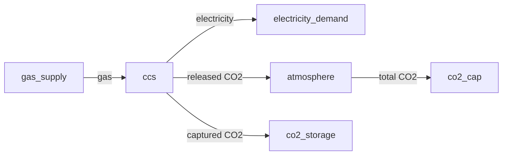
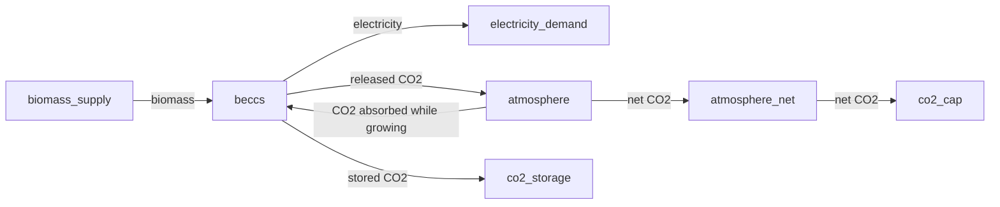
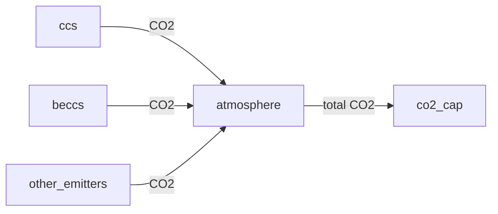

# [Configuring Model Features](@id configuring-model-features)

```@contents
Pages = ["30-configuring-model-features.md"]
Depth = [2, 3]
```

This section assumes users have already followed the basic Tutorials and are looking for specific instructions for certain features.

## [Using `use_inter_period_constraints`](@id use-inter-period-constraints-setup)

The `use_inter_period_constraints` parameter enables inter-period constraints for an asset. In practice, it is used in two main feature groups:

- Seasonal storage behavior (storage assets): it enables the inter-period storage balance across representative periods.
- Outgoing energy limits (any asset type): it enables maximum/minimum outgoing energy constraints over timeframe periods.

### Typical usage

- Short-duration storage (for example, batteries with a few hours of duration and 24-hour representative periods): use `false`.
- Long-duration or seasonal storage (for example, hydro reservoirs, hydrogen storage, or other multi-period storage): use `true`.
- Outgoing energy caps/floors (`max_energy_timeframe_partition` or `min_energy_timeframe_partition`): use `true` on the asset where the limit is applied.

### Important notes

- One representative period covering the whole year (for example, one 8760-hour period): storage usually don't need constraints inter representative periods because one would like to track the storage level within the year, so use `false` for storage assets unless you intentionally need inter-period behavior (for example, modeling the CO2 emissions as a storage asset that aggregates over the year).
- For outgoing energy limits, this flag is still required even when there is only one representative period, because it is the switch that activates those constraints.

!!! tip
    For storage assets, you can validate which formulation is active by checking the output tables:
    - rep-period behavior: `var_storage_level_intra_rep_period`
    - inter-period behavior: `var_storage_level_inter_period`

## Storage constraints

### [Seasonal and non-seasonal storage](@id seasonal-setup)

Section [Storage Modeling](@ref storage-modeling) explains the main concepts for modeling seasonal and non-seasonal storage in _TulipaEnergyModel.jl_. To define if an asset is one type or the other then consider the following:

- _Seasonal storage_: When the storage capacity of an asset is greater than the total length of representative periods, we recommend using the inter-period constraints. To apply these constraints, you must set the input parameter `use_inter_period_constraints` to `true`.
- _Non-seasonal storage_: When the storage capacity of an asset is lower than the total length of representative periods, we recommend using the rep-period constraints. To apply these constraints, you must set the input parameter `use_inter_period_constraints` to `false`.

!!! info
    If the input data covers only one representative period for the entire year, for example, with 8760-hour timesteps, and you have a monthly hydropower plant, then you should set the `use_inter_period_constraints` parameter for that asset to `false`. This is because the length of the representative period is greater than the storage capacity of the storage asset.

### [The energy storage investment method](@id storage-investment-setup)

Energy storage assets have a unique characteristic wherein the investment is based not solely on the capacity to charge and discharge, but also on the capacity storage energy. Some storage asset types have a fixed duration for a given capacity, which means that there is a predefined ratio between energy and power. For instance, a battery of 10MW/unit and 4h duration implies that the capacity storage energy is 40MWh. Conversely, other storage asset types do not have a fixed ratio between the investment of capacity and storage capacity. Therefore, the capacity storage energy can be optimized independently of the capacity investment, such as hydrogen storage in salt caverns. This behavior is controlled by `storage_method_energy`:

- `none`: Do not create storage-energy investment/decommission variables. The storage-energy capacity only comes from `capacity_storage_energy` and existing `initial_storage_units`.
- `optimize_storage_capacity`: Create storage-energy investment/decommission variables and optimize them independently. In this mode, it is necessary to define:

  - `investment_cost_storage_energy`: To establish the cost of investing in the storage capacity (e.g., kEUR/MWh/unit).
  - `fixed_cost_storage_energy`: To establish the fixed cost of energy storage capacity (e.g., kEUR/MWh/unit).
  - `investment_min_limit_storage_energy`: To define the minimum capacity-storage-energy investment (e.g., MWh). It defaults to `0.0`.
  - `investment_max_limit_storage_energy`: To define the maximum capacity-storage-energy investment (e.g., MWh). `Missing` values mean that there is no upper limit.
  - `investment_integer_storage_energy`: To determine whether the investment variables of storage capacity are integer or continuous.

- `use_fixed_energy_to_power_ratio`: Do not create storage-energy investment/decommission variables. Instead, invested storage-energy capacity is linked to invested power capacity through `energy_to_power_ratio`.

In addition, the parameter `capacity_storage_energy` defines the energy per unit of storage capacity invested in (e.g., MWh/unit).

For more details on the constraints that apply when selecting one method or the other, please visit the [`mathematical formulation`](@ref formulation) section.

### [Initial storage level](@id initial-storage-level-setup)

`initial_storage_level` is the fraction of the available storage-energy capacity that is stored at the start of a milestone year. It accepts values from `0` (empty) through `1` (full). The initial energy in MWh is therefore:

```math
E^{\text{initial}}_{a,y} = p^{\text{initial storage level}}_{a,y} \cdot E^{\text{available}}_{a,y}.
```

How the available capacity is calculated depends on `storage_method_energy`:

- With `none`, it is `capacity_storage_energy * initial_storage_units`. For example, `initial_storage_level = 0.5` and 100 MWh of available capacity starts the asset at 50 MWh.
- With `optimize_storage_capacity`, it includes the independently optimized storage-energy investments and decommissions. The initial energy consequently scales with the capacity selected by the optimization.
- With `use_fixed_energy_to_power_ratio`, it includes the existing storage-energy capacity plus the storage energy associated with available power capacity through `energy_to_power_ratio`. The initial energy scales with that total.

When capacity can be invested in or decommissioned, `initial_storage_level` represents a fill fraction, not a fixed quantity of MWh. To impose a fixed initial quantity, fix the available capacity and convert the quantity to p.u.

If `initial_storage_level` is missing, the model uses a cyclic boundary condition: the last storage level supplies the initial state. If it is defined, including as `0`, the first balance starts from the specified fraction and the final level must be at least that fraction of available capacity. Storage-level profiles apply after each dispatch block, so charging and discharging in the first block can move the level away from its initial value.

In a rolling-horizon run, the input value initializes the first window. Each later window uses the previous window's solved storage level in p.u. as the initial value for the next window. Storage assets therefore require an explicit initial level when the rolling horizon is enabled.

Existing input data that stores this field in MWh can be migrated with:

```bash
uv run --with duckdb python utils/scripts/migrate-initial-storage-level.py --input-folder path/to/input-data
```

The migration divides the old MWh value by the fixed available capacity and fails with an explanation when that conversion is ambiguous, such as when investment makes the capacity decision-dependent. Run it only once on legacy data.

### [Control simultaneous charging and discharging](@id storage-binary-method-setup)

Depending on the configuration of the energy storage assets, it may or may not be possible to charge and discharge them simultaneously. For instance, a single battery cannot charge and discharge at the same time, but some pumped hydro storage technologies have separate components for charging (pump) and discharging (turbine) that can function independently, allowing them to charge and discharge simultaneously. To account for these differences, the model provides users with three options for the `use_binary_storage_method` parameter:

- `binary`: the model adds a binary variable to prevent charging and discharging simultaneously.
- `relaxed_binary`: the model adds a binary variable that allows values between 0 and 1, reducing the likelihood of charging and discharging simultaneously. This option uses a tighter set of constraints close to the convex hull of the full formulation, resulting in fewer instances of simultaneous charging and discharging in the results.
- If no value is set, i.e., `missing` value, the storage asset can charge and discharge simultaneously.

For more details on the constraints that apply when selecting this method, please visit the [`mathematical formulation`](@ref formulation) section.

## [Multi-year Investments and Vintage Modeling](@id multi-year-setup)

It is possible to simultaneously model different milestone years, which is essential for modeling multi-year investment pathways. Multi-year investments refer to making investment decisions at different points in time, such that a pathway of investments can be modeled. This is particularly useful when long-term scenarios are modeled but representing each year is not practical, or when investment decisions must be made at different points in time.

For conceptual background on the vintage methods and the economic representation (discounting), see the [multi-year investment modeling](@ref multi-year-investment-modeling) section in Concepts.

### Setting up the input data

The following steps describe how to set up a model with multi-year information. The illustrative example below uses assets, but flows follow the same idea.

#### Asset basic data

Fill in the parameters in the `asset.csv` file. These parameters are for the assets across all the years, i.e., not dependent on years. Examples are lifetime (both `technical_lifetime` and `economic_lifetime`) and capacity of a unit.

You need to choose a `vintage_method` for the asset. The default is `aggregated`, which treats all units identically regardless of their commissioning year. Alternatively, you can choose `compact_profiles` (to use vintage-specific availability profiles) or `compact_efficiencies` (to use vintage-specific efficiencies). For a detailed explanation of these methods, see [vintage modeling](@ref vintage-modeling) in Concepts.

In addition, you control whether investment and decommissioning are allowed through separate parameters:

- `investable` (in `asset-milestone.csv`): whether the model can invest in new units of this asset at a given milestone year.
- `decommissionable` (in `asset-both.csv`): whether existing or invested units can be decommissioned.

Below is an overview of the important set-ups regarding the vintage methods.

| Set-up                            | `vintage_method`       | `investable`  | `decommissionable` | Notes                                                                                                                      |
| :-------------------------------- | :--------------------- | :------------ | :----------------- | :------------------------------------------------------------------------------------------------------------------------- |
| Operation only (no investment)    | `aggregated`           | `false`       | `false`            | No investment or decommissioning occurs                                                                                    |
| Aggregated investment             | `aggregated`           | set per asset | set per asset      | All units treated identically; `milestone_year = commission_year` in `asset-both.csv`                                      |
| Compact with vintage profiles     | `compact_profiles`     | set per asset | set per asset      | Vintage-specific profiles; requires multiple commission years per milestone year in `asset-both.csv` and matching profiles |
| Compact with vintage efficiencies | `compact_efficiencies` | set per asset | set per asset      | Vintage-specific efficiencies; introduces vintage flow variables                                                           |

!!! info "Which asset types support which methods?"
    The `compact_profiles` methods can only be applied to producer and the `compact_efficiencies` method to conversion assets. Transport, storage, and consumer assets always use the `aggregated` method. For more details on the constraints that apply when selecting these methods, see the [`mathematical formulation`](@ref formulation).

#### Asset milestone year data

Fill in the parameters related to the milestone year. Whether the model allows investment at a milestone year for an asset is set by the `investable` parameter in `asset-milestone.csv`. You can only invest in milestone years. Optional `min_available_units` and `max_available_units` constrain the total number of available asset units in that milestone year. Leave either value `missing` to omit that bound. These limits apply to assets only.

#### Asset commission year data

Fill in the parameters related to the commission year, e.g., investment costs and fixed costs. `investment_min_limit` defaults to `0.0`; `investment_max_limit` is optional and limits capacity investment when defined. For independently optimized storage energy, use the corresponding `_storage_energy` fields. Minimum and maximum limits are expressed in capacity units, not numbers of investment units.

#### Existing capacities and decommissioning

Existing capacities and decommissioning are taken care of in `asset-both.csv`:

- In the `milestone_year` column, fill in all the milestone years. In the `commission_year` column, fill in the commission years of the existing assets that are still available in this `milestone_year` and put the existing units in the column `initial_units`.
- Whether the model allows decommissioning at a `milestone_year` for an asset that has been commissioned in a `commission_year` is set by the parameter `decommissionable`.

Let's explain further using an example. To do so, we take a look at the `asset-both.csv` file:

```@example multi-year-setup
using DataFrames # hide
using CSV # hide
input_asset_file = "../../../test/inputs/Multi-year Investments/asset-both.csv" # hide
assets_data = CSV.read(input_asset_file, DataFrame) # hide
assets_data = assets_data[:, [:asset, :milestone_year, :commission_year, :decommissionable, :initial_units]] # hide
```

- `battery` has 1.09 existing units in 2030 and 2.02 existing units in 2050. Both units can be decommissioned.
- `ccgt` has 1 existing unit in 2030 and 2050. Neither can be decommissioned.
- `demand` is a consumer, so it has no initial units and you only have data where `milestone_year = commission_year`.
- `ens` has 1 existing unit in 2030 and 2050. Neither can be decommissioned.
- `ocgt` has no existing units.
- `solar` has no existing units.
- `wind` has 0.07 existing units, commissioned in 2020, and still available in 2030 but not in 2050. Another 0.02 existing units, commissioned in 2030, available in 2030 and 2050. There are no initial units commissioned in 2050.

!!! info
    We only consider the existing units which are still available in the milestone years.

#### Profiles information

You can use different profiles for assets commissioned in different years, which is the power of the `compact_profiles` method. You fill in the profile names in `assets-profiles.csv` for relevant years. In `profiles-rep-periods.csv`, you relate the profile names with the modeled years.

Let's explain further using an example. To do so, we can take a look at the `assets-profiles.csv` file:

```@example multi-year-setup
input_asset_file = "../../../test/inputs/Multi-year Investments/assets-profiles.csv" # hide
assets_profiles = CSV.read(input_asset_file, DataFrame, header = 1) # hide
assets_profiles = assets_profiles[:, :] # hide
```

We have 3 profiles for `wind` commissioned in 2020, 2030, and 2050, respectively. Imagine these are 3 wind turbines with different capacity factors due to the year of manufacture.

#### Economic representation

For economic representation, the following parameters need to be set up. For conceptual background, see [economic representation](@ref economic-representation) in Concepts.

- [optional] `discount_year` and `discount_rate` in the `model_parameters` table (for CSV input, in `model-parameters.csv`): model-wide discount year and rate. By default, the model will use a discount rate of 0. The `discount_year` defaults to the first milestone year (or the user-provided value if it is earlier).
- `discount_rate` in the `asset` table: technology-specific discount rate, used for annualizing investment costs and computing salvage values.
- `economic_lifetime` in the `asset` table: used together with the technology-specific discount rate for discounting.

!!! info
    1. Since the model explicitly discounts, all input costs should be given in the nominal costs of the relevant year. For example, to model investments in 2030 and 2050, the `investment_cost` should be given in 2030 costs and 2050 costs, respectively.
    2. For the full formulas, see the [`mathematical formulation`](@ref formulation) section.

## [Unit Commitment constraints](@id unit-commitment-setup)

The unit commitment constraints are only applied to producer and conversion assets. The `unit_commitment` parameter determines which unit commitment method to use. The current version of the code only includes the basic version. Future versions will add more detailed constraints as additional options. Additionally, the following parameters should be set in that same file:

- `units_on_cost`: Objective function coefficient on `units_on` variable. (e.g., no-load cost or idling cost in kEUR/h/unit)
- `unit_commitment_integer`: It determines whether the unit commitment variables are considered as integer or not (`true` or `false`)
- `min_operating_point`: Minimum operating point or minimum stable generation level defined as a portion of the capacity of asset (p.u.)

!!! info "Minimum operating point constraints without unit commitment"
    Even when `unit_commitment = 'none'`, producer and conversion assets with `min_operating_point > 0` still receive a minimum output-flow constraint (for aggregated and compact profiles vintage methods). This is useful to represent must-run conditions without the full unit commitment formulation.

For more details on the constraints that apply when selecting this method, please visit the [`mathematical formulation`](@ref formulation) section.

## [Ramping constraints](@id ramping-setup)

The ramping constraints are only applied to producer and conversion assets. The `ramping` parameter must be set to `true` to include the constraints. Additionally, the following parameters should be set in that same file:

- `max_ramp_up`: Maximum ramping up rate as a portion of the capacity of asset (p.u./h)
- `max_ramp_down:`Maximum ramping down rate as a portion of the capacity of asset (p.u./h)

For more details on the constraints that apply when selecting this method, please visit the [`mathematical formulation`](@ref formulation) section.

## [Outgoing energy constraints (maximum or minimum)](@id max-min-outgoing-energy-setup)

For the model to add constraints for a [maximum or minimum energy limit](@ref inter-period-energy-constraints) for an asset throughout the model's timeframe (e.g., a year), we need to establish a couple of parameters:

- `use_inter_period_constraints = true`. This parameter enables the inter-period constraints for that asset. See [Using `use_inter_period_constraints`](@ref use-inter-period-constraints-setup).
- `max_energy_timeframe_partition` $\neq$ `missing` or `min_energy_timeframe_partition` $\neq$ `missing`. This value represents the peak energy that will be then multiplied by the profile for each period in the timeframe.

!!! info
    These parameters are defined per period, and the default values for profiles are 1.0 p.u. per period. If the periods are determined daily, the energy limit for the whole year will be 365 times `max`or `min_energy_timeframe_partition`.

- (optional) `profile_type` and `profile_name` in the timeframe files. If there is no profile defined, then by default it is 1.0 p.u. for all periods in the timeframe.
- (optional) define a period partition in timeframe partition files. If there is no partition defined, then by default the constraint is created for each period in the timeframe, otherwise, it will consider the partition definition in the file.

!!! tip "Tip"
    If you want to set a limit on the maximum or minimum outgoing energy for a year with representative days, you can use the partition definition to create a single partition for the entire year to combine the profile.

These constraints are also the mechanism behind emission budgets, see the [modeling greenhouse gas emissions](@ref greenhouse-gas-emissions) section.

### Example: Setting Energy Limits

Let's assume we have a year divided into 365 days because we are using days as periods in the representatives from [_TulipaClustering.jl_](https://github.com/TulipaEnergy/TulipaClustering.jl). Also, we define the `max_energy_timeframe_partition = 10 MWh`, meaning the peak energy we want to have is 10MWh for each period or period partition. So depending on the optional information, we can have:

| Profile | Period Partitions | Example                                                                                                                                                                                                                                                                                                                                                                                                                                                                                                                                                                                                    |
| ------- | ----------------- | ---------------------------------------------------------------------------------------------------------------------------------------------------------------------------------------------------------------------------------------------------------------------------------------------------------------------------------------------------------------------------------------------------------------------------------------------------------------------------------------------------------------------------------------------------------------------------------------------------------- |
| None    | None              | The default profile is 1.p.u. for each period and since there are no period partitions, the constraints will be for each period (i.e., daily). So the outgoing energy of the asset for each day must be less than or equal to 10MWh.                                                                                                                                                                                                                                                                                                                                                                       |
| Defined | None              | The profile definition and value will be in the timeframe profiles files. For example, we define a profile that has the following first four values: 0.6 p.u., 1.0 p.u., 0.8 p.u., and 0.4 p.u. There are no period partitions, so constraints will be for each period (i.e., daily). Therefore the outgoing energy of the asset for the first four days must be less than or equal to 6MWh, 10MWh, 8MWh, and 4MWh.                                                                                                                                                                                        |
| Defined | Defined           | Using the same profile as above, we now define a period partition in the timeframe partitions file as `uniform` with a value of 2. This value means that we will aggregate every two periods (i.e., every two days). So, instead of having 365 constraints, we will have 183 constraints (182 every two days and one last constraint of 1 day). Then the profile is aggregated with the sum of the values inside the periods within the partition. Thus, the outgoing energy of the asset for the first two partitions (i.e., every two days) must be less than or equal to 16MWh and 12MWh, respectively. |

## Group constraints

A group of assets refers to a set of assets that share certain constraints. For example, the investments of a group of assets may be capped at a maximum value, which represents the potential of a specific area that is restricted in terms of the maximum allowable MW due to limitations on building licenses.

Groups are useful to represent several common constraints.

### [Creating Groups](@id group-setup)

In order to define the groups in the model, the following steps are necessary:

1. Create a group file by defining the `name` property and its parameters in the `investment_group_asset` table (or CSV file).
2. Assign assets to the group by adding entries to the `investment_group_asset_membership` table (or CSV file).

### [Group Asset Constraints](@id investment-group-setup)

A group asset constraint is a constraint of the form

$\sum_{a \in G} x_a \times \text{coefficient}_a \left\{\begin{array}{c} \leq \\ \geq \\ =\end{array}\right\} \text{right hand side}$,

where `invest_method` selects $x_a$:

- `use_only_investment_units` uses the investment variable for asset $a$ in the group's milestone year.
- `use_available_units` uses the available units of asset $a$ in the group's milestone year, including initial units, investments that remain within their technical lifetime, and decommissions.
- `none` creates no constraint.

The mathematical formulation of these constraints is available [here](@ref investment-group-constraints).

!!! info
    Group constraints support investment units and available units through `investment_group_asset` and `investment_group_asset_membership`.
    If you need constraints involving other variables, add them manually to the JuMP model as shown in the [Bids tutorial](@ref bids-tutorial).

Create group constraints by adding rows in `investment_group_asset` such that:

- Each row in table `investment_group_asset`
  - `name` is the name of the group, and unique identifier.
  - `milestone_year` is the year for which the group is defined.
  - `invest_method` is `use_only_investment_units`, `use_available_units`, or `none`.
  - `constraint_sense` is `<=`, `>=`, or `==`.
  - `rhs` is the corresponding value.
- Each row in table `investment_group_asset_membership`
  - `group_name` should match `investment_group_asset.name`.
  - `asset` is the name of the asset.
  - `milestone_year` should match `investment_group_asset.milestone_year` and `asset.milestone_year`.
  - `coefficient` multiplies the investment or available-units expression selected by `invest_method`.

!!! warning
    Notice that only one constraint is created per row in `investment_group_asset`, which means that if both the minimum and maximum investment limits are desired, two rows are required in `investment_group_asset`, one with `constraint_sense = '<='` and one with `constraint_sense = '>='`. In this case, the names of the groups must be different, from instance `ccgt_max` and `ccgt_min`.
    Similarly, the elements in `investment_group_asset_membership` will need to be duplicated, one for each group.

### Example: Group of Assets

Let's explore how the groups are set up in the test case called [Norse](https://github.com/TulipaEnergy/TulipaEnergyModel.jl/tree/main/test/inputs/Norse). First, let's take a look at the `investment-group-asset.csv` file:

```@example display-group-setup
using DataFrames # hide
using CSV # hide
input_asset_file = "../../../test/inputs/Norse/investment-group-asset.csv" # hide
assets = CSV.read(input_asset_file, DataFrame, header = 1) # hide
```

In the given data, there are two groups: `renewables` and `ccgt`. Both use `invest_method = "use_only_investment_units"`, preserving the original investment-limit behavior. For the `renewables` group, the `constraint_sense` is `<=` and the `rhs` is 40000 MW, indicating that this is a maximum investment limit, i.e., that the total investments of assets in the group must be less than or equal to this value. In contrast, the `ccgt` group has `>=` and 10000 MW in the corresponding fields, indicating a minimum investment limit.

Let's now explore which assets are in each group. To do so, we can take a look at the `asset.csv` file:

```@example display-group-setup
input_file = "../../../test/inputs/Norse/investment-group-asset-membership.csv" # hide
investment_group_asset_membership = CSV.read(input_file, DataFrame) # hide
```

Here we can see that the assets `Asgard_Solar` and `Midgard_Wind` belong to the `renewables` group, while the assets `Asgard_CCGT` and `Midgard_CCGT` belong to the `ccgt` group.

!!! info
    Assets in `use_only_investment_units` groups have to allow investment (`asset_milestone.investable = true` for the corresponding year) and must not be consumers (`asset.type != "consumer"`).
    Assets in `use_available_units` groups may be non-investable, which allows limits on existing capacity and decommissioning trajectories.
    Assets in `use_available_units` groups may be have different `vintage_method`, i.e., they can be `aggregated` or `compact_profiles` and the group constraints will be applied accordingly.

## [Flow Coefficients](@id flow-coefficient)

### [In the capacity constraints](@id coefficient-for-capacity-constraints)

Capacity constraints apply to all the outputs and inputs to assets according to the equations in the [`capacity constraints`](@ref cap-constraints) section of the mathematical formulation. The coefficient $p^{\text{capacity coefficient}}_{f,y}$ in the capacity constraints can be set to model situations or processes where the flows in the capacity constraint are multiplied by a constant factor.

For instance, a hydro reservoir (i.e., storage asset) with two outputs, one for electricity production and another for water spillage. The electricity output flow must be in the capacity constraints. However, the water spillage is an output that can be excluded from the capacity constraint. In that case, the coefficient for the capacity constraint of the water output can be zero and therefore not included in that constraint.

Another situation comes from industrial processes where the sum of both outputs must be below the capacity, but one of the outputs can be above the capacity if only produced in that flow. For example,

$\text{flow process A} + 0.8 \cdot \text{flow process B} \leq \text{C}$

In that case the sum must be always below the total capacity $\text{C}$, but if you only produce flow through B then you can produce $1.25 \cdot \text{C}$ and still satisfy this constraint.

To set up this parameter you need to fill in the information for the `capacity_coefficient` in the `flow_commission` table, see more in the [model parameters](@ref table-schemas) section.

### [In the conversion constraints](@id coefficient-for-conversion-constraints)

Conversion constraints apply to all the outputs and inputs of a conversion asset according to the equations in the [`conversion balance constraints`](@ref conversion-balance-constraints) section of the mathematical formulation. The coefficient $p^{\text{conversion coefficient}}_{f,y}$ in that constraint can be set to model situations or processes where the flows in the conversion balance constraint are multiplied by a constant factor.

For instance, CO2 emissions modeled as an extra output of a gas-fired power plant that produces electricity. Here, the conversion is from gas (input) into electricity (output) through an conversion efficiency parameter of the asset. However, the CO2 emissions are also an output of the asset, therefore by default they are considered in the conversion balance, unless we set the `conversion_coefficient` to zero.

To set up this parameter you need to fill in the information for the `conversion_coefficient` in the `flow_commission` table, see more in the [model parameters](@ref table-schemas) section.

!!! info "Conversion coefficient and flexible time resolution"
    As explained in the [flexible time resolution section](@ref flex-time-res), the resolution of the conversion balance constraint is determined by the highest resolution of the input and output flows because it is treated as an energy constraint. Nevertheless, for consistency, only the flows with a `conversion_coefficient` greater than zero are included in the definition of the constraint's resolution.

### [In the storage constraints](@id coefficient-for-storage-constraints)

Storage balance constraints apply to all the inputs (charging) and outputs (discharging) of a storage asset according to the equations in the [`storage balance constraints`](@ref rep-period-storage-balance) section of the mathematical formulation. The coefficient $p^{\text{storage coefficient}}_{f,y}$ in that constraint can be set to model situations or processes where the flows in the storage balance constraint are multiplied by a constant factor.

For instance, a compressed-air energy storage (CAES) asset that charges and discharges electricity, but that also has an auxiliary output representing a by-product such as CO2 emissions. By default this auxiliary output would be part of the storage balance and would therefore draw down the stored energy. By setting its `storage_coefficient` to zero, the flow is excluded from the storage balance, while it can still be costed in the objective and constrained elsewhere (for example, through a [flows relationship](@ref flow-relationships) or the capacity constraints).

To set up this parameter you need to fill in the information for the `storage_coefficient` in the `flow_commission` table, see more in the [model parameters](@ref table-schemas) section.

!!! info "Storage coefficient and flexible time resolution"
    As explained in the [flexible time resolution section](@ref flex-time-res), the resolution of the storage balance constraint follows the resolution of the storage-level variable, which combines the storage asset's own time resolution with the resolution of its charging and discharging flows. For consistency, only the flows with a `storage_coefficient` greater than zero are included in the definition of that resolution; the storage asset's own time resolution is always kept, so at the default value (`storage_coefficient = 1` for every flow) the resolution is unchanged.

!!! note "Storage coefficient and by-products"
    Excluding an auxiliary flow from the storage balance is independent from excluding it from the [capacity constraints](@ref coefficient-for-capacity-constraints). A by-product output that should neither draw down the stored energy nor consume the asset's charging/discharging capacity needs both `storage_coefficient = 0` and `capacity_coefficient = 0`.

## [Defining Flows Relationships](@id flow-relationships)

Two flows in the model can be related using the [`flows relationships constraints`](@ref flows-relationships-constraints) section of the mathematical formulation. The parameters in this constraint, i.e., the constant, sense, and ratio, and the flows in the relationship are defined in the `flows_relationships` table, see more in the [model parameters](@ref table-schemas) section.

There will be a set of constraints for each row in the `flows_relationships` table, meaning that the same flows can have different sets of constraints to describe different relationships between them. One example is the Combined Heat and Power (CHP) extraction plants, which rely on a set of inequality constraints between the electricity and heat outputs to define a feasible operating region. For more details about this example, refer to the [`multiple inputs and outputs`](@ref flex-time-res-mimo) example in the concepts section. Flow relationships are also the basis for representing greenhouse gas emissions, see the [modeling greenhouse gas emissions](@ref greenhouse-gas-emissions) section.

## [Modeling Greenhouse Gas Emissions](@id greenhouse-gas-emissions)

The model provides a general definition of assets, so specific definitions for different greenhouse gases, such as CO2 or methane, do not exist: there is no emission variable, no emission parameter, and no emission asset type. Instead, emissions are modeled as ordinary flows between ordinary assets, and an emission budget is an ordinary constraint on those flows.

This means that emission modeling is not a feature of its own, but a recipe that combines features documented elsewhere in this page:

| Building block                                                    | What it does for emissions                                                                                    |
| ----------------------------------------------------------------- | ------------------------------------------------------------------------------------------------------------- |
| [Flows relationships](@ref flow-relationships)                    | Ties the emission flow of an asset to its fuel input or energy output, with the emission factor as the ratio. |
| [Flow coefficients](@ref flow-coefficient)                        | Keeps the emission flows out of the capacity and balance constraints of the emitting asset.                   |
| [Consumer balance sense](@ref table-schemas)                      | Builds the accounting nodes that pass the emissions through or absorb them.                                   |
| [Outgoing energy constraints](@ref max-min-outgoing-energy-setup) | Imposes a per-period emission budget over the timeframe, for example a yearly cap.                            |
| [Seasonal storage](@ref seasonal-setup)                           | Accumulates the emissions as a storage level, giving a cumulative carbon budget.                              |
| [Flexible time resolution](@ref flex-time-res)                    | Represents the emission flows at a coarser resolution than the energy flows, to save variables.               |

The three steps below explain the recipe, and the three examples that follow apply it to [carbon capture and storage](@ref ccs-example), to [negative emissions with BECCS](@ref beccs-example), and to a [system-wide emission cap](@ref emission-cap-example).

### [Step 1: Creating the emission flow](@id emissions-step-creating)

Through the concept of [`flows relationships`](@ref flow-relationships), any input (e.g., fuel consumption) or output (e.g., electricity) of the asset can be linked to an output flow that represents greenhouse gas emissions (e.g., CO2). In this context, the fixed ratio in the relationship equation serves as the emission factor.

Concretely, a row in the `flows_relationships` table with the emission flow as flow 1, the flow it is proportional to (e.g., the fuel input) as flow 2, `sense = '=='`, `constant = 0`, and `ratio` equal to the emission factor (e.g., tCO2 per MWh of fuel) forces the emission output to follow the fuel consumption of the asset at every timestep.

Thanks to the [`flexible temporal resolution`](@ref flex-time-res) in the model, the output flow representing greenhouse gases can have a coarse resolution, such as daily, monthly, or even yearly. This flexibility allows for varying resolutions based on modeling needs and helps in reducing the number of variables in the model.

!!! warning "Emission flows should not distort the constraints of the emitting asset"
    An emission flow is a by-product: it enters or leaves the asset, but it neither consumes the asset's capacity nor takes part in its energy balance. Therefore, on **every** emission-carrying flow of the asset, both incoming and outgoing, you should set the [`capacity_coefficient`](@ref coefficient-for-capacity-constraints) to zero, to prevent the emission flow from limiting the asset's energy output, and the [`conversion_coefficient`](@ref coefficient-for-conversion-constraints) to zero for a conversion asset (or the [`storage_coefficient`](@ref coefficient-for-storage-constraints) to zero for a storage asset), so that the emissions are not counted in the asset's balance constraint. All three parameters are defined in the `flow_commission` table, see more in the [model parameters](@ref table-schemas) section.

### [Step 2: Aggregating the emissions](@id emissions-step-aggregating)

The emission flows of the individual emitting assets normally end in an accounting node that represents a particular greenhouse gas pool, such as the atmosphere. A consumer asset with `peak_demand = 0` is the usual choice, and its `consumer_balance_sense` decides how the node behaves:

| `consumer_balance_sense` | Balance at the node            | Behavior                                                                                                                           |
| ------------------------ | ------------------------------ | ---------------------------------------------------------------------------------------------------------------------------------- |
| `'=='` (default)         | incoming $-$ outgoing $= 0$    | **Pass-through node.** Everything that arrives must leave again, so the node forwards the emissions to the next node in the chain. |
| `'>='`                   | incoming $-$ outgoing $\geq 0$ | **Sink node.** Absorbs whatever arrives. Use it to terminate a chain.                                                              |

A storage asset can be used instead, in which case the storage level accumulates the total emissions and becomes the budget itself, see [using a storage asset as the emission accounting node](@ref emissions-as-storage).

For an example of implementing CO2 emissions as a consumer asset, refer to the [`multiple inputs and outputs`](@ref flex-time-res-mimo) example in the concepts section.

!!! warning "A terminal node must not use the default balance sense"
    A terminal node with `consumer_balance_sense = '=='` and `peak_demand = 0` has no outgoing flow, so its balance reduces to incoming $= 0$, which forces the emissions to be zero and typically makes the model infeasible. The last node of a chain must use `'>='`.

### [Step 3: Limiting the total emissions](@id emissions-step-limiting)

There are three ways to impose an emission budget, and it is up to the modeler to decide which is best suited for their case study.

| Approach                                                        | Accounting node                     | What the limit means                                                                                                                        | Cost                                                                                              |
| --------------------------------------------------------------- | ----------------------------------- | ------------------------------------------------------------------------------------------------------------------------------------------- | ------------------------------------------------------------------------------------------------- |
| [Storage level bounds](@ref emissions-as-storage)               | storage                             | A **cumulative** budget. The storage level is the running total of the emissions since the start of the timeframe, and is bounded directly. | Adds storage level variables and balance constraints; cannot represent a net-negative total.      |
| Post-processing                                                 | consumer with `'>='`                | Nothing. The emission flows are summed over the desired duration after the solve.                                                           | Cheapest in variables, but the budget is _not_ enforced by the model.                             |
| [Outgoing energy constraint](@ref emissions-as-outgoing-energy) | consumer with `'=='` (pass-through) | A **per-block** budget. Each period block of the timeframe gets its own limit on the emission flows.                                        | One constraint per period block and no extra variables; a yearly budget needs a single partition. |

The second approach adds nothing to the model and needs no explanation. The other two are described below. They differ in more than cost: the storage level carries a running total across the whole timeframe, which is what a carbon budget usually means, whereas the outgoing energy constraint limits each period block independently.

#### [Using a storage asset as the emission accounting node](@id emissions-as-storage)

Instead of a consumer, the accounting node can be a **storage asset** whose charging flows are the emission flows of the system. The storage level then _is_ the accumulated emissions: at every point of the timeframe it holds the total CO2 emitted since the start of the year, directly as a model variable and without any post-processing.

This is particularly convenient with representative periods. Setting `use_inter_period_constraints = true` activates the [inter-period storage constraints](@ref inter-period-storage-balance), which accumulate the level across the representative periods weighted by the `rep_periods_mapping`. The running total therefore follows the real chronological year, even though only a few periods are actually modeled. Bounding that level with `capacity_storage_energy` then gives a genuine cumulative carbon budget, whose trajectory can additionally be shaped period by period with a `max_storage_level` profile.

To set it up:

1. Make the accounting node a storage asset and connect every emission flow of the system as an input to it.
2. Set `use_inter_period_constraints = true` in the `asset` table.
3. Set `capacity_storage_energy` in the `asset` table to the emission budget, and `initial_storage_units` in `asset_both` to 1. With the default `storage_method_energy = 'none'`, the available energy capacity is the product of the two, and the level limit is the `max_storage_level` profile times that capacity. The profile defaults to 1.0 p.u., so the level is capped at the budget.
4. Set `initial_storage_level = 0` in the `asset_milestone` table (see [Initial storage level](@ref initial-storage-level-setup) and the warning below).
5. (optional) Add a `max_storage_level` profile in `assets_timeframe_profiles` to make the budget tighten or relax over the year, or a `min_storage_level` profile to impose a floor.

Keep the defaults for `storage_charging_efficiency` (1.0) and `storage_loss_from_stored_energy` (0), otherwise CO2 is created or destroyed on its way into the accumulator.

!!! warning "The initial storage level must be set, or the emissions are forced to zero"
    When `initial_storage_level` is missing, the [inter-period cycling constraint](@ref inter-period-storage-balance) makes the level of the first period block equal to the level of the last one. An emission accumulator only charges, so its level can only increase, and the only way to close the cycle is a level that never changes, i.e., zero emissions everywhere. Defining `initial_storage_level = 0` replaces the cycle with a final level greater than or equal to the initial one, which is what a carbon budget needs.

!!! info "Emission flows into the accounting node keep the default storage coefficient"
    The by-product warning in [step 1](@ref emissions-step-creating) is about the _emitting_ asset, whose own balance the emissions must stay out of. At the accounting node the opposite holds: the emission flows are exactly what the storage balance should count, so they keep the default `storage_coefficient = 1`.

The two costs of this approach are:

- **Model size.** A seasonal storage asset adds an [accumulated intra-period level](@ref accumulated-intra-period-storage-balance) variable per timestep block, an [inter-period level](@ref inter-period-storage-balance) variable per period, and the balance and limit constraints that go with them. The [outgoing energy constraint](@ref emissions-as-outgoing-energy) adds one constraint per period block and no variables at all.
- **Negative emissions are awkward.** A removal has to become a discharging flow out of the accumulator, which then needs a `capacity_coefficient = 0` to stay out of the storage asset's capacity constraints and a destination asset of its own. More fundamentally, storage level variables have a lower bound of zero, so the cumulative total can never become net-negative. In the consumer chain of the [BECCS example](@ref beccs-example) a removal is simply a flow in the opposite direction, which is why that example does not use a storage node.

#### [Using the outgoing energy constraint as an emission budget](@id emissions-as-outgoing-energy)

The [outgoing energy constraints](@ref max-min-outgoing-energy-setup) limit the total energy leaving an asset over a period block of the timeframe, which is exactly the shape of an emission budget. To use them for emissions:

1. Make the accounting node a **pass-through node** (`consumer_balance_sense = '=='`, `peak_demand = 0`) whose **only** outgoing flow is the aggregated emission flow, and terminate the chain with a sink node (`consumer_balance_sense = '>='`).
2. Set `use_inter_period_constraints = true` for the pass-through node in the `asset` table, to enable the inter-period constraints.
3. Set `max_energy_timeframe_partition` for the pass-through node in the `asset_milestone` table to the emission budget **per period**. Use `min_energy_timeframe_partition` if instead you need a floor.
4. (optional) Add a row to `assets_timeframe_profiles` with `profile_type = 'max_energy'` (or `'min_energy'`) pointing to a profile in `profiles_timeframe`, if the budget should vary over the periods. Without a profile, the default is 1.0 p.u. for every period.
5. (optional) Add a row to `assets_timeframe_partitions` to aggregate periods into a single constraint.

!!! warning "The cap applies to every outgoing flow of the asset"
    The constraint sums every outgoing flow of the asset, so it must be placed on a node whose outgoing flows are only emissions. Setting `max_energy_timeframe_partition` directly on a gas-fired power plant would cap the sum of its electricity output _and_ its CO2 output, which is not an emission budget. For the same reason, an accounting node that sends emissions to more than one place needs an extra pass-through node that carries only the flow to be capped, as in the [BECCS example](@ref beccs-example).

!!! info "The seasonal flag is not restricted to storage assets"
    Although the description of `use_inter_period_constraints` refers to seasonal storage (e.g., hydro), the flag is what enables the inter-period constraints for _any_ asset type, so it can be set on an accounting node as well.

Since `max_energy_timeframe_partition` is defined **per period**, and the profile of a period block is aggregated with a sum, the value to fill in is the budget of a single period, not the budget of the whole year. What the partition changes is how tightly the budget is distributed over the year, not its total. For example, with a year clustered into 365 daily periods, an annual budget of 3650 tCO2, and no profile defined:

- Without a partition, `max_energy_timeframe_partition = 10` produces 365 daily constraints of 10 tCO2 each. The yearly total is capped at 3650 tCO2, but the emissions cannot be shifted between days.
- With a row in `assets_timeframe_partitions` using `specification = 'uniform'` and `partition = '365'`, the same `max_energy_timeframe_partition = 10` produces a single constraint for the whole year, whose right-hand side is the sum of the default 1.0 p.u. over the 365 periods times 10, i.e., 3650 tCO2. This is the annual budget, and it lets the optimization decide when to emit.

### [Example: Carbon capture and storage (CCS)](@id ccs-example)

A CCS plant burns gas to produce electricity, releases part of the resulting CO2 to the atmosphere, and captures the rest for permanent storage. The capture rate is the split between the two CO2 outputs.



The assets are set up as follows:

| Asset         | `type`     | Notes                                                                                                                  |
| ------------- | ---------- | ---------------------------------------------------------------------------------------------------------------------- |
| `ccs`         | conversion | Gas in, electricity out. The two CO2 flows are by-products, see the warning in [step 1](@ref emissions-step-creating). |
| `atmosphere`  | consumer   | `consumer_balance_sense = '=='`, `peak_demand = 0`. Pass-through node that carries the emission budget.                |
| `co2_cap`     | consumer   | `consumer_balance_sense = '>='`, `peak_demand = 0`. Sink that terminates the chain.                                    |
| `co2_storage` | consumer   | `consumer_balance_sense = '>='`, `peak_demand = 0`. Use a storage asset instead if the storage volume is limited.      |

Two rows in `flows_relationships` describe the chemistry, where $\eta$ is the emission factor of the fuel and $\kappa$ is the capture rate:

- Total CO2 follows the gas input: `flow_1 = (ccs, atmosphere)`, `flow_2 = (gas_supply, ccs)`, `sense = '=='`, `constant = 0`, `ratio =` $\eta \cdot (1 - \kappa)$.
- Captured CO2 follows the gas input as well: `flow_1 = (ccs, co2_storage)`, `flow_2 = (gas_supply, ccs)`, `sense = '=='`, `constant = 0`, `ratio =` $\eta \cdot \kappa$.

!!! info "One pair of flows per row"
    Each row of `flows_relationships` links exactly one flow 1 to exactly one flow 2, since the flows are identified by the four `flow_*_from_asset` and `flow_*_to_asset` columns. A quantity that has to be split over several flows, as the CO2 is here, therefore needs one row per flow, each tied to the same reference flow.

Because the released and captured shares are both tied to the same gas input with constant ratios, the capture rate $\kappa$ is a fixed input, not a decision of the optimization. To choose between capturing and not capturing, model the two operating modes as two separate assets and let the investment or dispatch decide between them.

Finally, `use_inter_period_constraints = true` and `max_energy_timeframe_partition` on `atmosphere` turn the flow towards `co2_cap` into the emission budget, as described in [step 3](@ref emissions-step-limiting).

### [Example: Negative emissions with BECCS](@id beccs-example)

BECCS (bioenergy with carbon capture and storage) differs from CCS in one respect: the biomass it burns has already removed CO2 from the atmosphere while growing. That removal is modeled as a flow that goes **into** the plant **from** the atmosphere, so the atmosphere node sees both a release and an uptake.



The `atmosphere` node is a pass-through node, so its balance reads

```math
\underbrace{v^{\text{flow}}_{(\text{beccs},\text{atmosphere})}}_{\text{released}} - \underbrace{v^{\text{flow}}_{(\text{atmosphere},\text{beccs})}}_{\text{absorbed}} - v^{\text{flow}}_{(\text{atmosphere},\text{atmosphere\_net})} = 0
```

which makes the flow towards `atmosphere_net` the **net** emissions, released minus absorbed. Two rows in `flows_relationships` complete the picture, where $\eta$ is the emission factor of the biomass:

- The absorbed CO2 follows the biomass input: `flow_1 = (atmosphere, beccs)`, `flow_2 = (biomass_supply, beccs)`, `sense = '=='`, `constant = 0`, `ratio =` $\eta$.
- The stored CO2 equals the absorbed CO2: `flow_1 = (beccs, co2_storage)`, `flow_2 = (atmosphere, beccs)`, `sense = '=='`, `constant = 0`, `ratio = 1`. This is the `flow_3 = flow_2` condition that makes the removal permanent.

!!! info "Why the extra net emissions node?"
    The `atmosphere` node has two outgoing flows: the CO2 absorbed by the biomass and the net emissions. Since the [outgoing energy constraint](@ref max-min-outgoing-energy-setup) sums _all_ outgoing flows of an asset, placing the cap on `atmosphere` would also count the absorbed CO2. The `atmosphere_net` pass-through node has exactly one outgoing flow, so it is the node that carries `use_inter_period_constraints = true` and `max_energy_timeframe_partition`.

!!! warning "The net flow of the accounting node cannot become negative"
    Flows have a lower bound of zero unless they are transport flows, so the flow towards `atmosphere_net` cannot be negative, and the balance above therefore enforces released $\geq$ absorbed **at the node**. With BECCS as the only asset connected to `atmosphere`, the model consequently cannot reach a net-negative total. This is normally not a restriction, because the other emitters of the system share the same node: the balance then reads (sum of all releases) $-$ (sum of all removals) $\geq 0$, so BECCS can be net-negative individually as long as the system as a whole is not. Only a system that should end up net-negative overall runs into the bound.

If a case study needs more than one accounting scheme, for instance the physical atmosphere alongside a regulatory scope such as an emission trading system, repeat the chain: give the emitting asset a parallel pair of release and absorption flows towards a second accounting node, and give that node its own pass-through node and cap.

### [Example: A system-wide emission cap](@id emission-cap-example)

Once each emitting asset has its emission flows, the system-wide cap is a single chain. All emitters send their CO2 to the same accounting node, which forwards the total to a sink.



The cap is then a single row in `asset` and a single row in `asset_milestone` for the `atmosphere` node:

| Table             | Column                           | Value                                                                      |
| ----------------- | -------------------------------- | -------------------------------------------------------------------------- |
| `asset`           | `use_inter_period_constraints`   | `true`                                                                     |
| `asset`           | `consumer_balance_sense`         | `'=='`                                                                     |
| `asset_milestone` | `peak_demand`                    | `0`                                                                        |
| `asset_milestone` | `max_energy_timeframe_partition` | The emission budget per period, see [step 3](@ref emissions-step-limiting) |

Adding a new emitter later requires no change to the cap: its emission flow simply joins the others at the `atmosphere` node.

## [Simulating Bids using Unit Commitment](@id bids)

In our context, a bid is a proposal to buy energy at a given price at one or more time steps.
Currently, bids are not natively supported in Tulipa, but they can be simulated with some existing workarounds related to unit commitment to consumers.
For a step-by-step creation of a problem with bids, follow the [Bids tutorial](@ref bids-tutorial).

Bids can be created in any existing Tulipa problem that satisfied the following assumptions:

- There is only 1 year.
- There is only 1 representative period.
- There is at least one consumer that will serve as "manager" of the bids, i.e., that will receive energy from the generators and pass it on to the bids, if accepted.

To have bids in Tulipa, you need create a new asset for each of the bid blocks.
Each of these bid assets is a consumer asset, and the "demand" profile for this consumer is the requested amounts of energy in the bid.
To satisfy the "demand" of the bid assets, we create a flow from the "manager" asset to these bid assets.
To simulate the `price` willing to be paid by a bid, we use the `operational_cost` between the "manager" and the bid asset.
In summary:

- For each bid, create a new asset. We'll name it "Bid". Set
  - `capacity = 1.0`
  - `consumer_balance_sense = "=="` (which is the default)
  - `initial_units = 1.0`
  - `peak_demand` as anything positive (`1.0` makes it easier to understand the results, `maximum(bid_block.profile)` is the common normalized way)
  - `type = :consumer`
  - `unit_commitment = "basic"`
  - `unit_commitment_integer = true`
- Set the time resolution of the asset to the full length of the profile (`assets_rep_periods_partitions.partition = rep_periods_data.num_timesteps`)
- Find an existing consumer, we'll name it "Bid Manager".
- Connect a flow from the "Bid Manager" to "Bid", with `flow_milestone.operational_cost = -price`.
- Create a loop flow, connecting the asset "Bid" to itself.
- Create a profile in `profiles_rep_periods` or `profiles`, depending on whether you still have to cluster or not.
  - Use the bid's quantities, normalized by `peak_demand`, as `value`, for the corresponding time steps as `timestep`.
  - Use 0 as `value` for the missing `timestep`.
  - Choose a `profile_name`
- Relate the profile above to the asset "Bid" in `assets_profiles`, with `profile_type = 'demand'`.

Finally, if there are exclusive groups in the bids, i.e., at most 1 bid in the same exclusive group can be accepted, then you also need to modify the underlying JuMP model.
We need to add a constraint like $\displaystyle \sum_{i: i \in G_k} u_i \leq 1$, where $u_i$ are the unit commitment variables (i.e., the bid-acceptance variables), and $G_k$ are the exclusive groups.

## [Two-Stage Stochastic Optimization](@id stochastic-setup)

Tulipa formulates energy system planning as a **two-stage stochastic optimization** problem:

- **First stage** (investment decisions): capacity investments are made before uncertainty is realized and are therefore **shared across all scenarios**.
- **Second stage** (operational decisions): dispatch and storage levels are determined after the scenario is revealed and are therefore **scenario-dependent**.

This structure allows the model to find investment plans that are robust against uncertainty in, for example, renewable availability, demand, or hydro inflows.

!!! info
    Without multiple scenarios (i.e., $\lvert \mathcal{S} \rvert = 1$), the model reduces to a standard deterministic planning problem.

### Defining Stochastic Scenarios

Scenarios are defined through the `rep_periods_mapping` table (or `rep-periods-mapping.csv` for CSV input). Each row maps an original period to a representative period for a given milestone year, with the following key columns for the stochastic feature:

- `scenario`: Integer identifier for the stochastic scenario. Default is `1`, which corresponds to a single deterministic scenario.
- `rep_period`: The representative period that this original period is mapped to under this scenario.
- `weight`: The fraction of the original period captured by the representative period.

To run with multiple stochastic scenarios, include rows with different `scenario` values in `rep_periods_mapping`. Representative periods can be organized in two ways:

- **Per-scenario clustering**: each scenario has its own set of representative periods (diagonal block structure in the mapping matrix). With $\lvert \mathcal{S} \rvert$ scenarios and $K$ representative periods each, there are $\lvert \mathcal{S} \rvert \times K$ representative periods in total.
- **Cross-scenario clustering**: representative periods are shared across scenarios (full matrix structure). With $K$ cross-scenario representative periods, there are only $K$ representative periods in total regardless of the number of scenarios.

See [_TulipaClustering.jl_](https://github.com/TulipaEnergy/TulipaClustering.jl) and the Two-Stage Stochastic Optimization tutorial in the Tutorials section for guidance on how to cluster representative periods per or cross scenario.

### Scenario Probabilities

Scenario probabilities are stored in the `stochastic_scenario` table (or `stochastic-scenario.csv` for CSV input). Each row defines:

- `scenario`: Integer identifier matching the values used in `rep_periods_mapping`.
- `probability`: Probability of the scenario, in $[0, 1]$. Probabilities must sum to 1.
- `description` (optional): A free-text description of the scenario (e.g., `'Weather year 1982'`). Default is an empty string.

!!! info "Default probabilities"
    If no `stochastic_scenario` table or CSV file is provided, Tulipa automatically assigns **uniform probabilities** to all scenarios found in `rep_periods_mapping`: each scenario gets a probability of $1 / \lvert \mathcal{S} \rvert$.

To override the default probabilities, add a `stochastic-scenario.csv` file to your input directory. Another option is to modify the `stochastic_scenario` table in the database directly after calling [`populate_with_defaults!`](@ref):

```julia
DBInterface.execute(
    connection,
    """
    UPDATE stochastic_scenario
    SET probability = CASE
        WHEN scenario = 1 THEN 0.7
        WHEN scenario = 2 THEN 0.3
    END;
    """,
)
```

!!! warning "Probabilities must sum to 1"
    The model validates that all scenario probabilities sum to 1 and raises an error if they do not.

For more details on the objective function and constraints for the stochastic setting, see the [`mathematical formulation`](@ref formulation) section.

## [Risk-Averse Optimization with Conditional Value at Risk (CVaR)](@id cvar-setup)

By default, Tulipa minimizes the **expected total operational system cost** across stochastic scenarios, which is the standard risk-neutral objective. When multiple stochastic scenarios are present and you want to account for risk, you can activate the **mean-CVaR** (Conditional Value at Risk) formulation. This penalizes scenarios with high operational costs and produces a solution that is more robust to worst-case outcomes.

The mean-CVaR objective is a convex combination of the expected operational cost and the CVaR at confidence level $\alpha$:

$$\text{minimize} \quad C^I + C^F + (1 - \lambda) \cdot \mathbb{E}[C^O] + \lambda \cdot \text{CVaR}_{\alpha}$$

where $\lambda \in [0, 1]$ controls the trade-off between average performance and risk aversion, and $C^I$ and $C^F$ are the total investment and fixed costs that don't depend on the scenarios, $\mathbb{E}[C^O]$ is the total expected operational cost across scenarios, and $\text{CVaR}_{\alpha}$ is the Conditional Value at Risk at confidence level $\alpha$.

### Setting up CVaR

To activate CVaR, set the following parameters in the `model_parameters` table (or `model-parameters.csv` for CSV input):

- `risk_aversion_weight_lambda`: Risk aversion weight $\lambda \in [0, 1]$. Default is `0.0` (risk-neutral). Increasing this value shifts the objective towards minimizing risk.
- `risk_aversion_confidence_level_alpha`: Confidence level $\alpha \in (0, 1)$ for the Value at Risk threshold. Default is `0.95`.

!!! info
    The CVaR feature is only active when **both** `risk_aversion_weight_lambda > 0` **and** there are more than one stochastic scenario ($\lvert \mathcal{S} \rvert > 1$). Otherwise, the model reduces to the standard expected cost minimization regardless of the values set.

!!! tip "Choosing the parameters"
    - `risk_aversion_weight_lambda = 0.0` gives the fully risk-neutral expected cost solution.
    - `risk_aversion_weight_lambda = 1.0` minimizes the CVaR only (fully risk-averse).
    - Typical values are in the range $[0.1, 0.5]$, depending on the desired trade-off between average cost and protection against high-cost scenarios.
    - A higher `risk_aversion_confidence_level_alpha` (e.g., `0.99` vs `0.95`) focuses the risk measure on a smaller fraction of the worst scenarios.

### What the model adds when CVaR is active

When the CVaR feature is activated, the model automatically creates two additional variables:

- **Value at Risk threshold** ($v^{\mu}$): a single non-negative scalar variable representing the cost threshold at the $\alpha$ confidence level.
- **Tail excess slack** ($v^{\xi}_{s}$): one non-negative variable per scenario $s \in \mathcal{S}$, capturing how much the total cost of scenario $s$ exceeds the threshold $v^{\mu}$.

These variables are linked through the [scenario tail excess constraints](@ref cvar-constraints), which enforce $v^{\xi}_{s} \geq C_s - v^{\mu}$ for every scenario $s$.

For more details on the mathematical formulation of the CVaR objective and constraints, see the [`mathematical formulation`](@ref formulation) section.
