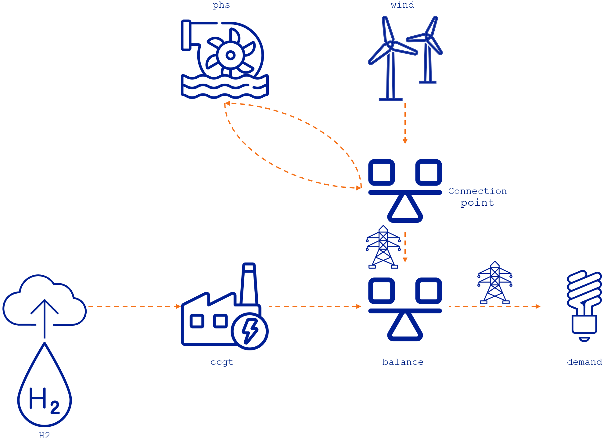
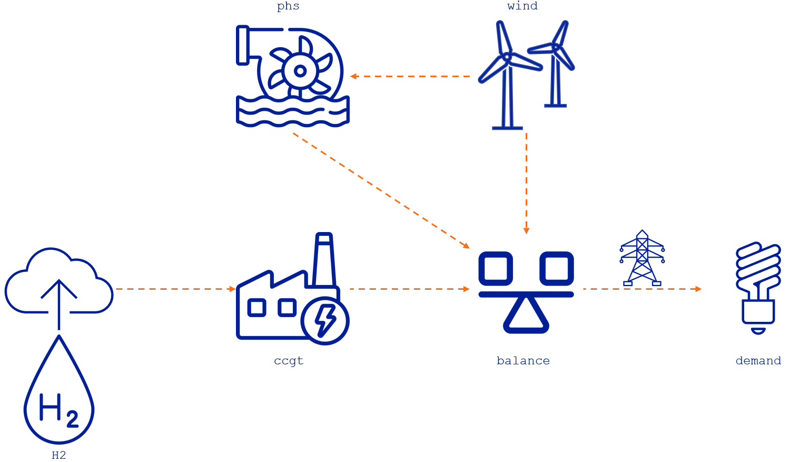
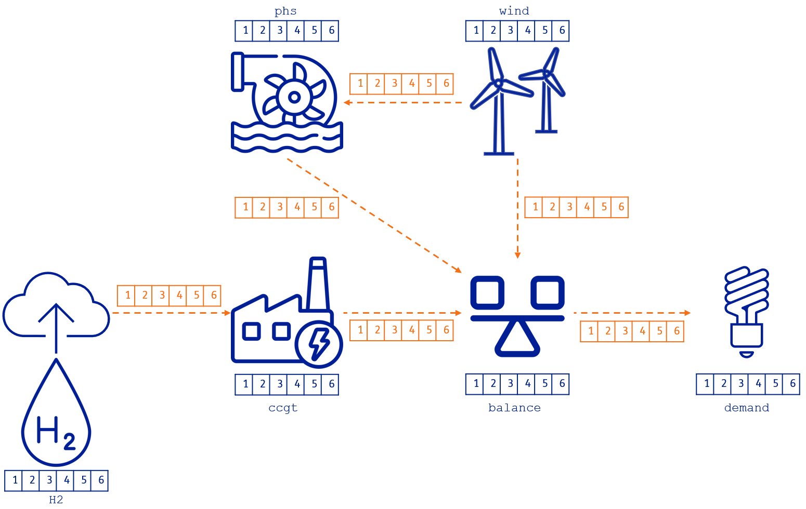
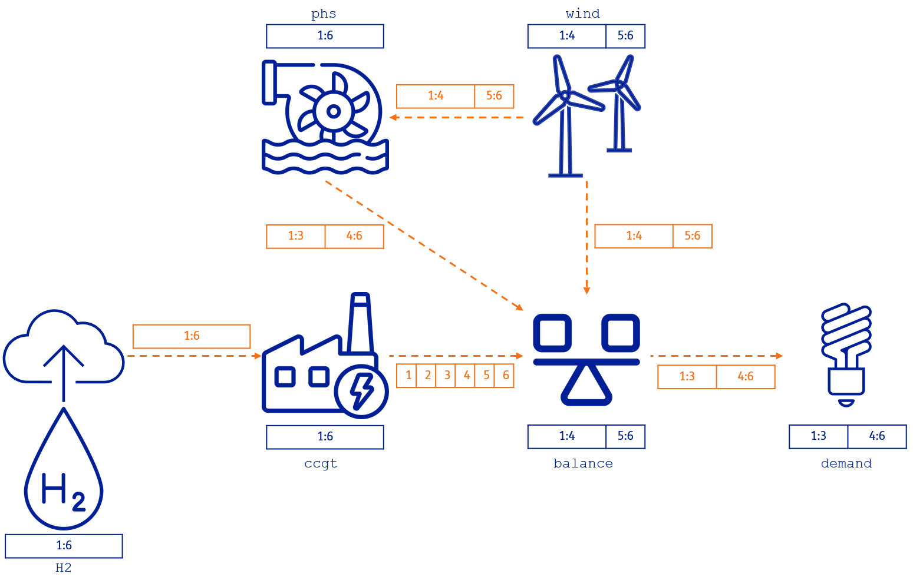
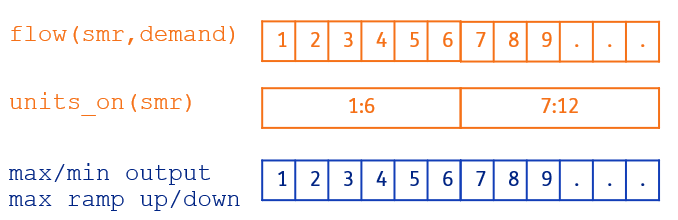
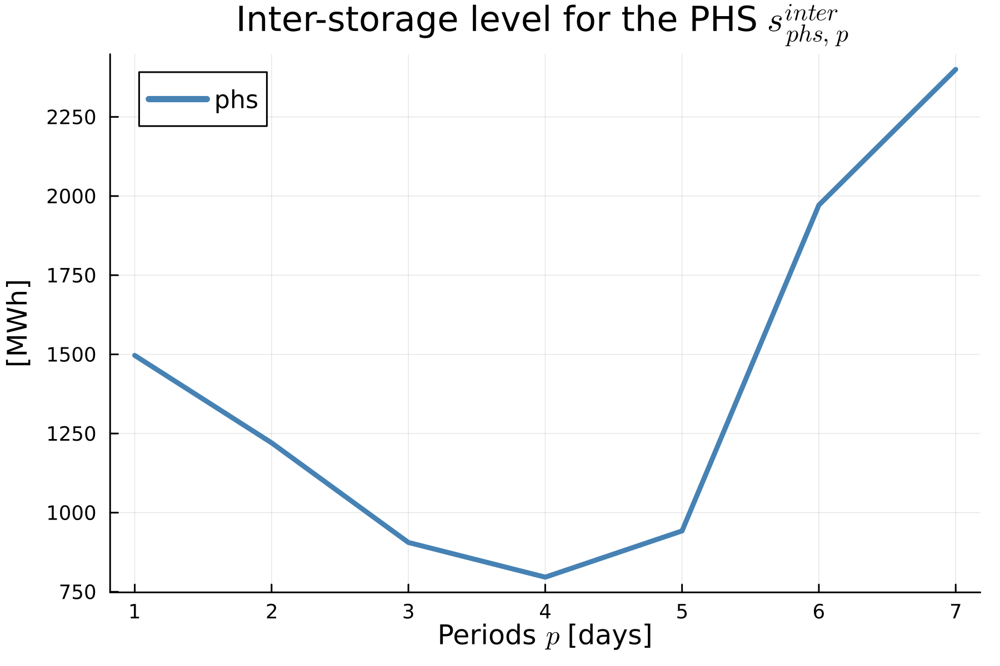

# [Concepts](@id concepts)

```@contents
Pages = ["30-concepts.md"]
Depth = 3
```

## [Summary](@id concepts-summary)

_TulipaEnergyModel.jl_ incorporates two fundamental concepts that serve as the foundation of the optimization model:

- **Energy Assets**: representation of a physical asset that can produce, consume, store, balance, or convert energy. Some examples of what these assets can represent are:
  - Producer: e.g., wind turbine, solar panel
  - Consumer: e.g., electricity demand, heat demand
  - Storage: e.g., battery, pumped-hydro storage
  - Balancing Hub: e.g., an electricity network that serves as a connection among other energy assets
  - Conversion: e.g., power plants, electrolyzers
- **Flows**: representation of the connections among assets, e.g., pipelines, transmission lines, or simply the energy production that goes from one asset to another.

In a nutshell, the model guarantees a balance of energy for the various types of assets while considering the flow limits. It considers a set of [representative periods](@ref representative-periods) (e.g., days or weeks) for a given [timeframe](@ref timeframe) (e.g., a year) the user wants to analyze. Therefore, the model has two types of temporal (time) constraints to consider the different chronology characteristics of the assets:

- **Intra-temporal Constraints**: These constraints limit the asset or flow within a representative period. The intra-temporal constraints help to characterize the short-term operational dynamics of the assets. So far, the model considers balance and flow limitations within the representative period, as well as unit commitment and ramping. In the future, reserve constraints will also be included.
- **Inter-temporal Constraints**: These constraints combine the information of the representative periods and create limitations between them to recover chronological information across the whole timeframe. The inter-temporal constraints help to characterize the long-term operational dynamics of the assets (e.g., seasonality). So far, the model uses this type of constraint to model seasonal storage. Future developments will include, for example, maximum or minimum production/consumption for a year (or any timeframe).

The [`mathematical formulation`](@ref formulation) shows an overview of these constraints and the variables in the model.

Another essential concept in the model is the [flexible time resolution](@ref flex-time-res), which allows for each asset to be considered in a single timestep (e.g., 1, 2, 3...) or in a range of timesteps (e.g., 1:3, meaning that the asset's variable represents the value of timesteps 1, 2, and 3). This concept allows the modeling of different dynamics depending on the asset; for instance, electricity assets can be modeled hourly, whereas hydrogen assets can be modeled in a 6-hour resolution (avoiding creating unnecessary constraints and variables).

The following sections explain these concepts in more detail.

## [Flexible Connection of Energy Assets](@id flex-asset-connection)

In energy system modeling, it is becoming common to have hybrid assets like `storage + renewable` (e.g., battery + solar), `electrolyzer + renewable` (e.g., electrolyzer + wind), or `renewable + hydro` (e.g., solar + hydro) that are located at the same site and share a common connection point to the grid. The standard method of modeling these assets requires extra variables and constraints for them to function correctly. For example, flows from the grid are not allowed, as they either avoid charging from the grid or require green hydrogen production. Therefore, hybrid connections typically require an additional node to regulate this connection with the grid.

The representation of the energy system in _TulipaEnergyModel.jl_ is based on [Graph Theory](https://en.wikipedia.org/wiki/Graph_theory), which deals with the connection between vertices by edges. This representation provides a more flexible framework to model energy _assets_ in the system as _vertices_ and _flows_ between energy assets as _edges_. By connecting assets directly to each other (i.e., without having a node in between), we reduce the number of variables and constraints needed to represent hybrid configurations, thus reducing the model size.

Consider the following example to demonstrate the benefits of using a graph theory approach. In the classic connection approach, the nodes play a crucial role in modeling. For instance, every asset must be connected to a node with balance constraints. When a storage asset and a renewable asset are in a hybrid connection like the one described before, a connection point is needed to connect the hybrid configuration to the rest of the system. Therefore, to consider the hybrid configuration of a storage asset and a renewable asset, we must introduce a node (i.e., a connection point) between these assets and the external power grid (i.e., a balance point), as shown in the following figure:



In this system, the `phs` storage asset charges and discharges from the `connection point`, while the `wind` turbine produces power that goes directly to the `connection point`. This `connection point` is connected to the external power grid through a transmission line that leads to a `balance` hub that connects to other assets. Essentially, the `connection point` acts as a balancing hub point for the assets in this hybrid configuration. Furthermore, these hybrid configurations impose an extra constraint to avoid storage charges from the power grid.

Let's consider the modeling approach in _TulipaEnergyModel.jl_. As nodes are no longer needed to connect assets, we can connect them directly to each other, as shown in the figure below:



By implementing this approach, we can reduce the number of variables and constraints involved. For example, the balance constraint in the intermediate node and the extra constraint to avoid the storage charging from the power grid are no longer needed. Additionally, we can eliminate the variable determining the flow between the intermediate node and the power grid, because the flow from `phs` to `balance` can directly link to the external grid. The section [`comparison of different modeling approaches`](@ref comparison) shows the quantification of these reductions.

This example of a `phs` and a `wind` asset is useful for illustrating the advantages of this modeling approach and will be reused in the following sections. However, please keep in mind that there are other applications of hybrid configurations, such as battery-solar, hydro-solar, and electrolyzer-wind.

## [Flexible Time Resolution](@id flex-time-res)

One of the core features of _TulipaEnergyModel.jl_ is that it can handle different time resolutions on the assets and the flows. Typically, the time resolution in an energy model is hourly, like in the following figure where we have a 6-hour energy system:



Therefore, for this simple example, we can determine the number of constraints and variables in the optimization problem:

- _Number of variables_: 42 since we have six connections among assets (i.e., 6 flows x 6 hours = 36 variables) and one storage asset (i.e., 1 storage level x 6 h = 6 variables)
- _Number of constraints_: 72, which are:

  - 24 from the maximum output limit of the assets that produce, convert, or discharge energy (i.e., `H2`, `wind`, `ccgt`, and `phs`) for each hour (i.e., 4 assets x 6 h = 24 constraints)
  - 6 from the maximum input limit of the storage or charging limit for the `phs`
  - 6 from the maximum storage level limit for the `phs`
  - 12 from the import and export limits for the transmission line between the `balance` hub and the `demand`
  - 24 from the energy balance on the consumer, hub, conversion, and storage assets (i.e., `demand`, `balance`, `ccgt`, and `phs`) for each hour (i.e., 4 assets x 6 h = 24 constraints)

Depending on the input data and the level of detail you want to model, hourly resolution in all the variables might not be necessary. _TulipaEnergyModel.jl_ can have different time resolutions for each asset and flow to simplify the optimization problem and approximate hourly representation. This feature is useful for large-scale energy systems that involve multiple sectors, as detailed granularity is not always necessary due to the unique temporal dynamics of each sector. For instance, we can use hourly resolution for the electricity sector and six-hour resolution for the hydrogen sector. We can couple multiple sectors, each with its own temporal resolution.

Let's explore the flexibility of time resolution with a few examples.

The following table shows the user input data for the definition of asset time resolution. Please note that the values presented in this example are just for illustrative purposes and do not represent a realistic case.

```@example print-partitions
using DataFrames # hide
using CSV # hide
input_asset_file = "../../test/inputs/Variable Resolution/assets-rep-periods-partitions.csv" # hide
assets = CSV.read(input_asset_file, DataFrame, header = 1) # hide
assets = assets[assets.asset .!= "wind", :] # hide
```

The table shows that the `H2` producer and the `phs` storage have a `uniform` definition of 6 hours. This definition means we want to represent the `H2` production profile and the storage level of the `phs` every six hours.

The same time resolution can be specified for the flows, for example (again, the values are for illustrative purposes and do not represent a realistic case):

```@example print-partitions
input_flow_file = "../../test/inputs/Variable Resolution/flows-rep-periods-partitions.csv" # hide
flows_partitions = CSV.read(input_flow_file, DataFrame, header = 1) # hide
```

The table shows a `uniform` definition for the flow from the hydrogen producer (`H2`) to the conversion asset (`ccgt`) of 6 hours, from the wind producer (`wind`) to the storage (`phs`) of 3 hours, and from the balance hub (`balance`) to the consumer (`demand`) of 3 hours, too. In addition, the flow from the wind producer (`wind`) to the balance hub (`balance`) is defined using the `math` specification of `1x2+1x4`, meaning that there are two time blocks, one of two hours (i.e., `1:2`) and another of four hours (i.e., `3:6`). Finally, the flow from the storage (`phs`) to the balance hub (`balance`) is defined using the `math` specification of `1x4+1x2`, meaning that there are two time blocks, one of four hours (i.e., `1:4`) and another of two hours (i.e., `5:6`).

The following figure illustrates these definitions on the example system.



So, let's recap:

- The hydrogen producer (`H2`) is in a 6-hour resolution represented by the range `1:6`, meaning that the balance of the hydrogen produced is for every 6 hours.
- The flow from the hydrogen producer to the ccgt power plant (`H2,ccgt`) is also in a 6-hour resolution `1:6`.
- The flow from the ccgt power plant to the balance hub (`ccgt, balance`) has hourly resolution `[1,2,3,4,5,6]`.
- The `ccgt` is a conversion plant that takes hydrogen to produce electricity. Since both sectors have different time resolutions, the energy balance in the conversion asset is defined in the lowest resolution connecting to the asset. In this case, the energy balance in the `ccgt` is defined every 6 hours, i.e., in the range `1:6`.
- The `wind` producer has an hourly profile of electricity production, so the resolution of the asset is hourly.
- The `wind` producer output has two connections, one to the `balance` hub and the other to the pumped-hydro storage (`phs`) with different resolutions:
  - The flow from the wind producer to the phs storage (`wind, phs`) has a uniform resolution of two blocks from hours 1 to 3 (i.e., `1:3`) and from hours 4 to 6 (i.e., `4:6`).
  - The flow from the wind producer to the balance hub (`wind, balance`) has a variable resolution of two blocks, too, but from hours 1 to 2 (i.e., `1:2`) and from hours 3 to 6 (i.e., `3:6`).
- The `phs` is in a 6-hour resolution represented by the range `1:6`, meaning the storage balance is determined every 6 hours.
- The flow from the phs to the balance (`phs, balance`) represents the discharge of the `phs`. This flow has a variable resolution of two blocks from hours 1 to 4 (i.e., `1:4`) and from hours 5 to 6 (i.e., `5:6`), which differs from the one defined for the charging flow from the `wind` asset.
- The `demand` consumption has hourly input data with one connection to the `balance` hub:
  - The flow from the balance hub to the demand (`balance, demand`) has a uniform resolution of 3 hours; therefore, it has two blocks, one from hours 1 to 3 (i.e., `1:3`) and the other from hours 4 to 6 (i.e., `4:6`).
- The `balance` hub integrates all the different assets with their different resolutions. The lowest resolution of all connections determines the balance equation for this asset. Therefore, the resulting resolution is into two blocks, one from hours 1 to 4 (i.e., `1:4`) and the other from hours 5 to 6 (i.e., `5:6`).

> **Note:**
> This example demonstrates that different time resolutions can be assigned to each asset and flow in the model. Additionally, the resolutions do not need to be uniform and can vary throughout the horizon.

The complete input data for this example can be found [here](https://github.com/TulipaEnergy/TulipaEnergyModel.jl/tree/main/test/inputs/Variable%20Resolution).

Due to the flexible resolution, we must explicitly state how the constraints are constructed. For each constraint, three things need to be considered:

- Whether it is type _power_ or type _energy_.
  - type _power_: highest resolution
  - type _energy_: lowest resolution (multiplied by durations)
- How the resolution is determined (regardless of whether it is highest or lowest): the incoming flows, the outgoing flows, or a combination of both.
- How the related parameters are treated. We use two methods of aggregation, _sum_ or _mean_.

Below is the table outlining the details for each type of constraint. Note _min_ means highest resolution, and _max_ means lowest resolution.

| Name                                           | Variables involved             | Profile involved | Constraint type | Resolution of the constraints                                                            | Profile aggregation |
| ---------------------------------------------- | ------------------------------ | ---------------- | --------------- | ---------------------------------------------------------------------------------------- | ------------------- |
| Consumer Balance                               | inputs, outputs                | demand           | power           | min(incoming flows, outgoing flows)                                                      | mean                |
| Storage Balance                                | inputs, outputs, storage level | inflows          | energy          | max(asset, min(incoming flows, outgoing flows))                                          | sum                 |
| Hub Balance                                    | inputs, outputs                | -                | power           | min(incoming flows, outgoing flows)                                                      | -                   |
| Conversion Balance                             | inputs, outputs                | -                | energy          | max(incoming flows, outgoing flows)                                                      | -                   |
| Producers Capacity Constraints                 | outputs                        | availability     | power           | min(outgoing flows)                                                                      | mean                |
| Storage Capacity Constraints (outgoing)        | outputs                        | -                | power           | min(outgoing flows)                                                                      | -                   |
| Conversion Capacity Constraints (outgoing)     | outputs                        | -                | power           | min(outgoing flows)                                                                      | -                   |
| Conversion Capacity Constraints (incoming)     | inputs                         | -                | power           | min(incoming flows)                                                                      | -                   |
| Storage Capacity Constraints (incoming)        | inputs                         | -                | power           | min(incoming flows)                                                                      | -                   |
| Transport Capacity Constraints (upper bounds)  | flow                           | availability     | power           | if it connects two hubs or demands then max(hub a,hub b), otherwise its own              | mean                |
| Transport Capacity Constraints (lower bounds)  | flow                           | availability     | power           | if it connects two hubs or demands then max(hub a,hub b), otherwise its own              | mean                |
| Maximum Energy Limits (outgoing)               | outputs                        | max_energy       | energy          | Determine by timeframe partitions. The default value is for each period in the timeframe | sum                 |
| Minimum Energy Limits (outgoing)               | outputs                        | min_energy       | energy          | Determine by timeframe partitions. The default value is for each period in the timeframe | sum                 |
| Maximum Output Flow with Unit Commitment       | outputs, units_on              | availability     | power           | min(outgoing flows, units_on)                                                            | mean                |
| Minimum Output Flow with Unit Commitment       | outputs, units_on              | availability     | power           | min(outgoing flows, units_on)                                                            | mean                |
| Maximum Ramp Up Flow with Unit Commitment      | outputs, units_on              | availability     | power           | min(outgoing flows, units_on)                                                            | mean                |
| Maximum Ramp Down Flow with Unit Commitment    | outputs, units_on              | availability     | power           | min(outgoing flows, units_on)                                                            | mean                |
| Maximum Ramp Up Flow without Unit Commitment   | outputs                        | availability     | power           | min(outgoing flows)                                                                      | mean                |
| Maximum Ramp Down Flow without Unit Commitment | outputs                        | availability     | power           | min(outgoing flows)                                                                      | mean                |

For this basic example, we can describe the balance and capacity constraints in the model. For the sake of simplicity, we consider only the intra-temporal constraints, the representative period index is dropped from the equations, and there are no investment variables in the equations.

### Energy Balance Constraints

In the following sections, we lay out all the balance constraints of this example.

#### Storage Balance

As shown in the table, the resolution of the storage balance is energy, which is calculated by _max(asset, min(incoming flows, outgoing flows))_. The resolutions of the incoming and outgoing flows of the storage are `1:3`, `4:6`, `1:4`, and `5:6`, resulting in a minimum resolution of 2. The resolution of the storage is 6. Then, _max(asset, min(incoming flows, outgoing flows))_ becomes _max(6, min(3, (4, 2)))_ which results in 6, and thus this balance is for every 6 hours. The charging and discharging flows are multiplied by their durations to account for the energy in the range `1:6`.

```math
\begin{aligned}
& \text{storage\_balance}_{\text{phs},1:6}: \\
& \qquad v^{\text{intra-storage}}_{\text{phs},1:6} = 3 \cdot p^{\text{eff}}_{(\text{wind},\text{phs})} \cdot v^{\text{flow}}_{(\text{wind},\text{phs}),1:3} + 3 \cdot p^{\text{eff}}_{(\text{wind},\text{phs})} \cdot v^{\text{flow}}_{(\text{wind},\text{phs}),4:6} \\
& \qquad \quad - \frac{4}{p^{\text{eff}}_{(\text{phs},\text{balance})}} \cdot v^{\text{flow}}_{(\text{phs},\text{balance}),1:4} - \frac{2}{p^{\text{eff}}_{(\text{phs},\text{balance})}} \cdot v^{\text{flow}}_{(\text{phs},\text{balance}),5:6} \\
\end{aligned}
```

#### Consumer Balance

The flows coming from the balancing hub are defined every 3 hours. Therefore, the flows impose the lowest resolution and the demand is balanced every 3 hours. The input demand is aggregated as the mean of the hourly values in the input data. As with the storage balance, the flows are multiplied by their durations.

```math
\begin{aligned}
& \text{consumer\_balance}_{\text{demand},1:3}: \\
& \qquad v^{\text{flow}}_{(\text{balance},\text{demand}),1:3} = p^{\text{peak demand}}_{\text{demand}} \cdot \frac{\sum_{b=1}^{3} p^{\text{demand profile}}_{\text{demand},b}}{3} \\
& \text{consumer\_balance}_{\text{demand},4:6}: \\
& \qquad v^{\text{flow}}_{(\text{balance},\text{demand}),4:6} = p^{\text{peak demand}}_{\text{demand}} \cdot \frac{\sum_{b=4}^{6} p^{\text{demand profile}}_{\text{demand},b}}{3} \\
\end{aligned}
```

#### Hub Balance

The hub balance is quite interesting because it integrates several flow resolutions. Remember that we didn't define any specific time resolution for this asset. Therefore, the highest resolution of all incoming and outgoing flows in the horizon implies that the hub balance must be imposed for all 6 blocks. The balance must account for each flow variable's duration in each block.

```math
\begin{aligned}
& \text{hub\_balance}_{\text{balance},1:1}: \\
& \qquad v^{\text{flow}}_{(\text{balance},\text{demand}),1:3} = v^{\text{flow}}_{(\text{ccgt},\text{balance}), 1:1} + v^{\text{flow}}_{(\text{wind},\text{balance}),1:2} + v^{\text{flow}}_{(\text{phs},\text{balance}),1:4} \\
& \text{hub\_balance}_{\text{balance},2:2}: \\
& \qquad v^{\text{flow}}_{(\text{balance},\text{demand}),1:3} = v^{\text{flow}}_{(\text{ccgt},\text{balance}), 2:2} + v^{\text{flow}}_{(\text{wind},\text{balance}),1:2} + v^{\text{flow}}_{(\text{phs},\text{balance}),1:4} \\
& \text{hub\_balance}_{\text{balance},3:3}: \\
& \qquad v^{\text{flow}}_{(\text{balance},\text{demand}),1:3} = v^{\text{flow}}_{(\text{ccgt},\text{balance}), 3:3} + v^{\text{flow}}_{(\text{wind},\text{balance}),3:6} + v^{\text{flow}}_{(\text{phs},\text{balance}),1:4} \\
& \text{hub\_balance}_{\text{balance},4:4}: \\
& \qquad v^{\text{flow}}_{(\text{balance},\text{demand}),4:6} = v^{\text{flow}}_{(\text{ccgt},\text{balance}), 4:4} + v^{\text{flow}}_{(\text{wind},\text{balance}),3:6} + v^{\text{flow}}_{(\text{phs},\text{balance}),1:4}\\
& \text{hub\_balance}_{\text{balance},5:5}: \\
& \qquad v^{\text{flow}}_{(\text{balance},\text{demand}),4:6} = v^{\text{flow}}_{(\text{ccgt},\text{balance}), 5:5} + v^{\text{flow}}_{(\text{wind},\text{balance}),3:6} + v^{\text{flow}}_{(\text{phs},\text{balance}),5:6} \\
& \text{hub\_balance}_{\text{balance},6:6}: \\
& \qquad v^{\text{flow}}_{(\text{balance},\text{demand}),4:6} = v^{\text{flow}}_{(\text{ccgt},\text{balance}), 6:6} + v^{\text{flow}}_{(\text{wind},\text{balance}),3:6} + v^{\text{flow}}_{(\text{phs},\text{balance}),5:6} \\
\end{aligned}
```

#### Conversion Balance

The flows connected to the CCGT conversion unit have different resolutions, too. In this case, the hydrogen imposes the lowest resolution; therefore, the energy balance in this asset is also every 6 hours.

```math
\begin{aligned}
& \text{conversion\_balance}_{\text{ccgt},1:6}: \\
& \qquad 6 \cdot p^{\text{eff}}_{(\text{H2},\text{ccgt})} \cdot v^{\text{flow}}_{(\text{H2},\text{ccgt}),1:6} = \frac{1}{p^{\text{eff}}_{(\text{ccgt},\text{balance})}} \sum_{b=1}^{6} v^{\text{flow}}_{(\text{ccgt},\text{balance}),b}  \\
\end{aligned}
```

### Capacity Constraints

All capacity constraints are defined in the highest resolution to guarantee that the flows are below the limits of each asset capacity.

#### Storage Capacity Constraints

Since the storage unit only has one input and output, the capacity limit constraints are in the same resolution as the individual flows. Therefore, the constraints for the outputs of the storage (i.e., discharging capacity limit) are:

```math
\begin{aligned}
& \text{max\_output\_flows\_limit}_{\text{phs},1:4}: \\
& \qquad v^{\text{flow}}_{(\text{phs},\text{balance}),1:4} \leq p^{\text{init capacity}}_{\text{phs}} \\
& \text{max\_output\_flows\_limit}_{\text{phs},5:6}: \\
& \qquad v^{\text{flow}}_{(\text{phs},\text{balance}),5:6} \leq p^{\text{init capacity}}_{\text{phs}} \\
\end{aligned}
```

And the constraints for the inputs of the storage (i.e., charging capacity limit) are:

```math
\begin{aligned}
& \text{max\_input\_flows\_limit}_{\text{phs},1:3}: \\
& \qquad v^{\text{flow}}_{(\text{wind},\text{phs}),1:3} \leq p^{\text{init capacity}}_{\text{phs}} \\
& \text{max\_input\_flows\_limit}_{\text{phs},4:6}: \\
& \qquad v^{\text{flow}}_{(\text{wind},\text{phs}),4:6} \leq p^{\text{init capacity}}_{\text{phs}} \\
\end{aligned}
```

#### Conversion Capacity Constraints

Similarly, each outflow is limited to the `ccgt` capacity for the conversion unit.

```math
\begin{aligned}
& \text{max\_output\_flows\_limit}_{\text{ccgt},b}: \\
& \qquad v^{\text{flow}}_{(\text{ccgt},\text{balance}),b} \leq p^{\text{init capacity}}_{\text{ccgt}} \quad \forall b \in [1,6] \\
\end{aligned}
```

#### Producer Capacity Constraints

The `wind` producer asset is interesting because the output flows are in different resolutions, i.e., `1:2`, `3:6`, `1:3`, and `4:6`. The highest resolution is `1:2`, `3`, and `4:6`.
Therefore, the constraints are as follows:

```math
\begin{aligned}
& \text{max\_output\_flows\_limit}_{\text{wind},1:2}: \\
& \qquad v^{\text{flow}}_{(\text{wind},\text{balance}),1:2} + v^{\text{flow}}_{(\text{wind},\text{phs}),1:3} \leq \frac{p^{\text{init capacity}}_{\text{wind}}}{2} \cdot \sum_{b=1}^{2} p^{\text{availability profile}}_{\text{wind},b} \\
& \text{max\_output\_flows\_limit}_{\text{wind},3}: \\
& \qquad v^{\text{flow}}_{(\text{wind},\text{balance}),3:6} + v^{\text{flow}}_{(\text{wind},\text{phs}),1:3} \leq p^{\text{init capacity}}_{\text{wind}} \cdot p^{\text{availability profile}}_{\text{wind},3} \\
& \text{max\_output\_flows\_limit}_{\text{wind},4:6}: \\
& \qquad v^{\text{flow}}_{(\text{wind},\text{balance}),3:6} + v^{\text{flow}}_{(\text{wind},\text{phs}),4:6} \leq \frac{p^{\text{init capacity}}_{\text{wind}}}{2} \cdot \sum_{b=5}^{6} p^{\text{availability profile}}_{\text{wind},b} \\
\end{aligned}
```

Since the flow variables $v^{\text{flow}}_{(\text{wind}, \text{balance}),1:2}$ and $v^{\text{flow}}_{(\text{wind}, \text{balance}),1:3}$ represent power, the first constraint sets the upper bound of the power for both timestep 1 and 2, by assuming an average capacity across these two timesteps. The same applies to the other two constraints.

The hydrogen (H2) producer capacity limit is straightforward, since both the asset and the flow definitions are in the same time resolution:

```math
\begin{aligned}
& \text{max\_output\_flows\_limit}_{\text{H2},1:6}: \\
& \qquad v^{\text{flow}}_{(\text{H2},\text{ccgt}),1:6} \leq p^{\text{init capacity}}_{\text{H2}} \cdot p^{\text{availability profile}}_{\text{H2},1:6} \\
\end{aligned}
```

#### Transport Capacity Constraints

For the connection from the hub to the demand, there are associated transmission capacity constraints, which are in the same resolution as the flow:

```math
\begin{aligned}
& \text{max\_transport\_flows\_limit}_{(\text{balance},\text{demand}),1:3}: \\
& \qquad v^{\text{flow}}_{(\text{balance},\text{demand}),1:3} \leq p^{\text{init export capacity}}_{(\text{balance},\text{demand})} \\
& \text{max\_transport\_flows\_limit}_{(\text{balance},\text{demand}),4:6}: \\
& \qquad v^{\text{flow}}_{(\text{balance},\text{demand}),4:6} \leq p^{\text{init export capacity}}_{(\text{balance},\text{demand})} \\
\end{aligned}
```

```math
\begin{aligned}
& \text{min\_transport\_flows\_limit}_{(\text{balance},\text{demand}),1:3}: \\
& \qquad v^{\text{flow}}_{(\text{balance},\text{demand}),1:3} \geq - p^{\text{init import capacity}}_{(\text{balance},\text{demand})} \\
& \text{min\_transport\_flows\_limit}_{(\text{balance},\text{demand}),4:6}: \\
& \qquad v^{\text{flow}}_{(\text{balance},\text{demand}),4:6} \geq - p^{\text{init import capacity}}_{(\text{balance},\text{demand})} \\
\end{aligned}
```

### Storage Level limits

Since the system has a storage asset, we must limit the maximum storage level. The `phs` time resolution is defined for every 6 hours, so we only have one constraint.

```math
\begin{aligned}
& \text{max\_storage\_level\_limit}_{\text{phs},1:6}: \\
& \qquad v^{\text{intra-storage}}_{\text{phs},1:6} \leq p^{\text{init storage capacity}}_{\text{phs}}
\end{aligned}
```

### [Comparison of Different Modeling Approaches](@id comparison)

This section quantifies the advantages of the [`flexible connection`](@ref flex-asset-connection) and [`flexible time resolution`](@ref flex-time-res) in the _TulipaEnergyModel.jl_ modeling approach. So, let us consider three different approaches based on the same example:

1. Classic approach with hourly resolution: This approach needs an extra asset, `node`, to create the hybrid operation of the `phs` and `wind` assets.
2. Flexible connection with hourly resolution: This approach uses the flexible connection to represent the hybrid operation of the `phs` and `wind` assets.
3. Flexible connection and flexible time: This approach uses both features, the flexible connection and the flexible time resolution.

> **Note:** The flexibility of _TulipaEnergyModel.jl_ allows any of these three modeling approaches.

The table below shows the constraints and variables for each approach over a 6-hour horizon. These results show the potential of flexible connections and time resolution for reducing the size of the optimization model.

| Modeling approach                          | Nº Variables | Nº Constraints | Objective Function |
| :----------------------------------------- | :----------- | :------------- | :----------------- |
| Classic approach with hourly resolution    | 48           | 84             | 28.4365            |
| Flexible connection with hourly resolution | 42           | 72             | 28.4365            |
| Flexible connection and time resolution    | 16           | 29             | 28.4587            |

By comparing the classic approach with the other methods, we can analyze their differences:

- The flexible connection with hourly resolution reduces 6 variables ($12.5\%$) and 12 constraints ($\approx 14\%$). Notice that we include the 6 extra constraints related to not allowing charging from the grid, although these constraints can also be modeled as bounds. Finally, the objective function value is the same, since we use an hourly time resolution in both cases.
- The combination of features reduces 32 variables ($\approx 67\%$) and 55 constraints ($\approx 65\%$) with an approximation error of $\approx 0.073\%$.

The level of reduction and approximation error will depend on the case study. Some cases that would benefit from this feature include:

- Coupling different energy sectors with various dynamics. For instance, methane, hydrogen, and heat sectors can be represented in energy models with lower resolutions (e.g., 4, 6, or 12h) than the electricity sector, usually modeled in higher resolutions (e.g., 1h, 30 min).

- Having high resolutions for all assets in a large-scale case study may not be necessary. For example, if analyzing a European case study focusing on a specific country like The Netherlands, hourly details for distant countries (such as Portugal and Spain) may not be required. However, one would still want to consider their effect on The Netherlands without causing too much computational burden. In such cases, flexible time resolution can maintain hourly details in the focus country, while reducing the detail in distant countries by increasing their resolution (to two hours or more). This reduction allows a broader scope without over-burdening computation.

## [Flexible Time Resolution in the Unit Commitment and Ramping Constraints](@id flex-time-res-uc)

In the previous section, we have seen how the flexible temporal resolution is handled for the model's flow capacity and balance constraints. Here, we show how flexible time resolution is applied when considering the model's unit commitment and ramping constraints. Let's consider the example in the folder [`test/inputs/UC-ramping`](https://github.com/TulipaEnergy/TulipaEnergyModel.jl/tree/main/test/inputs/UC-ramping) to explain how all these constraints are created in _TulipaEnergyModel.jl_ when having the flexible time resolution.


The example demonstrates various assets that supply demand. Each asset has different input data in the `assets-data` file, which activates different sets of constraints based on the method. For example, the `gas` producer has ramping constraints but not unit commitment constraints, while the `ocgt` conversion has unit commitment constraints but not ramping constraints. Lastly, the `ccgt` and `smr` assets both have unit commitment and ramping constraints.

```@example unit-commitment
using DataFrames # hide
using CSV # hide
input_dir = "../../test/inputs/UC-ramping" # hide
assets_data = CSV.read(joinpath(input_dir, "assets-data.csv"), DataFrame, header = 1) # hide
graph_assets = CSV.read(joinpath(input_dir, "graph-assets-data.csv"), DataFrame, header = 1) # hide
assets = leftjoin(graph_assets, assets_data, on=:name) # hide
filtered_assets = assets[assets.type .== "producer" .|| assets.type .== "conversion", ["name", "type", "capacity", "initial_units", "unit_commitment",  "ramping"]] # hide
```

The `assets-rep-periods-partitions` file defines the time resolution for the assets in the `partition` column. For instance, here we can see that the time resolutions are 3h for the `ccgt` and 6h for the `smr`. These values mean that the unit commitment variables (e.g., `units_on`) in the model have three and six hours resolution, respectively.

```@example unit-commitment
assets_partitions_data = CSV.read(joinpath(input_dir, "assets-rep-periods-partitions.csv"), DataFrame, header = 1) # hide
filtered_assets_partitions = assets_partitions_data[!, ["asset", "specification", "partition"]] # hide
```

The `flows-rep-periods-partitions` file defines the time resolution for the flows. In this example, we have that the flows from the `gas` asset to the `ccgt` and from the `ccgt` asset to the `demand` are in a 2h resolution.

```@example unit-commitment
flows_partitions_data = CSV.read(joinpath(input_dir, "flows-rep-periods-partitions.csv"), DataFrame, header = 1) # hide
filtered_flows_partitions = flows_partitions_data[!, ["from_asset", "to_asset", "specification", "partition"]] # hide
```

The default value for the assets and flows partitions is 1 hour. This means that assets and flows not in the previous tables are considered on an hourly basis in the model.

> **Important**: It's not recommended to set up the input data `partitions` in such a way that the `flow` variables have a lower resolution than the `units_on`. This is because doing so will result in constraints that fix the value of the `units_on` in the timestep block where the `flow` is defined, leading to unnecessary extra variable constraints in the model. For instance, if the `units_on` are hourly and the `flow` is every two hours, then a non-zero `flow` in the timestep block 1:2 will require the `units_on` in timestep blocks 1:1 and 2:2 to be the same and equal to one. Therefore, the time resolution of the `units_on` should always be lower than or equal to the resolution of the `flow` in the asset.

Remember that the section [`mathematical formulation`](@ref formulation) shows the unit commitment and ramping constraints in the model considering an uniform time resolution as a reference.

With this information, we can analyze the constraints in each of the following cases:

- Ramping in assets with multiple outputs
- Unit commitment in assets with constant time resolution
- Unit commitment and ramping in assets with flexible time resolution that are multiples of each other
- Unit commitment and ramping in assets with flexible time resolution that are not multiples of each other

We will analyze each case in the following sections, considering the constraints resolution defined in the summary table in the [flexible time resolution](@ref flex-time-res) section. For the sake of simplicity, we only show the asset $a$ and timestep block $b_k$ index and the constraints as they appear in the .lp file of the example, i.e., with all the coefficients and RHS values calculated from the input parameters. The .lp file can be exported using the keyword argument `write_lp_file = true` in the [`run_scenario`](@ref) function.

### Ramping in Assets with Multiple Outputs

In the case of the `gas` asset, there are two output flows above the minimum operating point with different time resolutions. The ramping constraints follow the highest time resolution of the two flows at each timestep block. Since the highest resolution is always defined by the hourly output of the `flow(gas,ocgt)`, the ramping constraints are also hourly. The figure below illustrates this situation.


Let's now take a look at the resulting constraints in the model.

`max_ramp_up(gas)`: The first constraint starts in the second timestep block and takes the difference between the output flows above the minimum operating point from $b_k =$ `2:2` and $b_k =$ `1:1`. Note that since the `flow(gas,ccgt)` is the same in both timestep blocks, the only variables that appear in this first constraint are the ones associated with the `flow(gas,ocgt)`. The second constraint takes the difference between the output flows from $b_k =$ `3:3` and $b_k =$ `2:2`; in this case, there is a change in the `flow(gas, ocgt)`; therefore, the constraint considers both changes in the output flows of the asset. In addition, the ramping parameter is multiplied by the flow duration with the highest resolution, i.e., one hour, which is the duration of the `flow(gas,ocgt)`.

- $b_k =$ `2:2`: -1 `flow(gas,ocgt,1:1)` + 1 `flow(gas,ocgt,2:2)` <= 1494
- $b_k =$ `3:3`: -1 `flow(gas,ocgt,2:2)` + 1 `flow(gas,ocgt,3:3)` - 1 `flow(gas,ccgt,1:2)` + 1 `flow(gas,ccgt,3:4)` <= 1494
- $b_k =$ `4:4`: -1 `flow(gas,ocgt,3:3)` + 1 `flow(gas,ocgt,4:4)` <= 1494
- $b_k =$ `5:5`: -1 `flow(gas,ocgt,4:4)` + 1 `flow(gas,ocgt,5:5)` - 1 `flow(gas,ccgt,3:4)` + 1 `flow(gas,ccgt,5:6)` <= 1494

For the maximum ramp down we have similiar constraints as the ones shown above.

### Unit Commitment in Assets with Constant Time Resolution

The `ocgt` asset includes both the `flow(oct,demand)` and the asset time resolution, which defines the resolution of the `units_on` variable, with a default setting of one hour. As a result, the unit commitment constraints are also set on an hourly basis. This is the conventional method for representing these types of constraints in power system models. The figure below illustrates this situation.


Let's now take a look at the resulting constraints in the model. Because everything is based on an hourly timestep, the equations are simple and easy to understand.

`limit_units_on(ocgt)`: The upper bound of the `units_o`n is the investment variable of the `asset`

- $b_k =$ `1:1`: -1 `assets_investment(ocgt)` + 1 `units_on(ocgt,1:1)` <= 0
- $b_k =$ `2:2`: -1 `assets_investment(ocgt)` + 1 `units_on(ocgt,2:2)` <= 0
- $b_k =$ `3:3`: -1 `assets_investment(ocgt)` + 1 `units_on(ocgt,3:3)` <= 0

`min_output_flow(ocgt)`: The minimum operating point is 10 MW, so the asset must produce an output flow greater than this value when the unit is online.

- $b_k =$ `1:1`: 1 `flow(ocgt,demand,1:1)` - 10 `units_on(ocgt,1:1)` >= 0
- $b_k =$ `2:2`: 1 `flow(ocgt,demand,2:2)` - 10 `units_on(ocgt,2:2)` >= 0
- $b_k =$ `3:3`: 1 `flow(ocgt,demand,3:3)` - 10 `units_on(ocgt,3:3)` >= 0

`max_output_flow(ocgt)`: The capacity is 100 MW, so the asset must produce an output flow lower than this value when the unit is online.

- $b_k =$ `1:1`: 1 `flow(ocgt,demand,1:1)` - 100 `units_on(ocgt,1:1)` <= 0
- $b_k =$ `2:2`: 1 `flow(ocgt,demand,2:2)` - 100 `units_on(ocgt,2:2)` <= 0
- $b_k =$ `3:3`: 1 `flow(ocgt,demand,3:3)` - 100 `units_on(ocgt,3:3)` <= 0

For the maximum ramp down we have similiar constraints as the ones shown above.

### Unit Commitment and Ramping in Assets with Flexible Time Resolution that are Multiples of Each Other

In this case, the `smr` asset has an output `flow(smr,demand)` in a hourly basis, but its time resolution (i.e., partition) is every six hours. Therefore, the `unist_on` variables are defined in timestep block of every six hours. As a result, the unit commitment and ramping constraints are set on highest resolution of both, i.e., the hourly resolution of the `flow(smr,demand)`. The figure below illustrates this situation.



Let's now take a look at the resulting constraints in the model.

`limit_units_on(smr)`: The `units_on` variables are defined every 6h; therefore, the upper bound of the variable is also every 6h. In addition, the `smr` is not investable and has one existing unit that limits the commitment variables.

- $b_k =$ `1:6`: 1 `units_on(smr,1:6)` <= 1
- $b_k =$ `7:12`: 1 `units_on(smr,7:12)` <= 1
- $b_k =$ `13:18`: 1 `units_on(smr,13:18)` <= 1
- $b_k =$ `19:24`: 1 `units_on(smr,19:24)` <= 1

`min_output_flow(smr)`: The minimum operating point is 150 MW, so the asset must produce an output flow greater than this value when the unit is online. Since the `units_on` variables are defined every 6h, the first six constraints show that the minimum operating point is multiplied by the variable in block `1:6`. The next six constraints are multiplied by the `units_on` in block `7:12`, and so on.

- $b_k =$ `1:1`: 1 `flow(smr,demand,1:1)` - 150 `units_on(smr,1:6)` >= 0
- $b_k =$ `2:2`: 1 `flow(smr,demand,2:2)` - 150 `units_on(smr,1:6)` >= 0
- $b_k =$ `3:3`: 1 `flow(smr,demand,3:3)` - 150 `units_on(smr,1:6)` >= 0
- $b_k =$ `4:4`: 1 `flow(smr,demand,4:4)` - 150 `units_on(smr,1:6)` >= 0
- $b_k =$ `5:5`: 1 `flow(smr,demand,5:5)` - 150 `units_on(smr,1:6)` >= 0
- $b_k =$ `6:6`: 1 `flow(smr,demand,6:6)` - 150 `units_on(smr,1:6)` >= 0
- $b_k =$ `7:7`: 1 `flow(smr,demand,7:7)` - 150 `units_on(smr,7:12)` >= 0
- $b_k =$ `8:8`: 1 `flow(smr,demand,8:8)` - 150 `units_on(smr,7:12)` >= 0

`max_output_flow(smr)`: The capacity is 200 MW, so the asset must produce an output flow lower than this value when the unit is online. Similiar to the minimum operating point constraint, here the `units_on` for the timestep block `1:6` are used in the first six constraints, the `units_on` for the timestep block `7:12` are used in the next six constraints, and so on.

- $b_k =$ `1:1`: 1 `flow(smr,demand,1:1)` - 200 `units_on(smr,1:6)` <= 0
- $b_k =$ `2:2`: 1 `flow(smr,demand,2:2)` - 200 `units_on(smr,1:6)` <= 0
- $b_k =$ `3:3`: 1 `flow(smr,demand,3:3)` - 200 `units_on(smr,1:6)` <= 0
- $b_k =$ `4:4`: 1 `flow(smr,demand,4:4)` - 200 `units_on(smr,1:6)` <= 0
- $b_k =$ `5:5`: 1 `flow(smr,demand,5:5)` - 200 `units_on(smr,1:6)` <= 0
- $b_k =$ `6:6`: 1 `flow(smr,demand,6:6)` - 200 `units_on(smr,1:6)` <= 0
- $b_k =$ `7:7`: 1 `flow(smr,demand,7:7)` - 200 `units_on(smr,7:12)` <= 0
- $b_k =$ `8:8`: 1 `flow(smr,demand,8:8)` - 200 `units_on(smr,7:12)` <= 0

`max_ramp_up(smr)`: The ramping capacity is 20MW, so the change in the output flow above the minimum operating point needs to be below that value when the asset is online. For constraints from `2:2` to `6:6`, the `units_on` variable is the same, i.e., `units_on` at timestep block `1:6`. The ramping constraint at timestep block `7:7` shows the `units_on` from the timestep block `1:6` and `7:12` since the change in the flow includes both variables. Note that if the `units_on` variable is zero in the timestep block `1:6`, then the ramping constraint at timestep block `7:7` allows the asset to go from zero flow to the minimum operating point plus the ramping capacity (i.e., 150 + 20 = 170).

- $b_k =$ `2:2`: -1 `flow(smr,demand,1:1)` + 1 `flow(smr,demand,2:2)` - 20 `units_on(smr,1:6)` <= 0
- $b_k =$ `3:3`: -1 `flow(smr,demand,2:2)` + 1 `flow(smr,demand,3:3)` - 20 `units_on(smr,1:6)` <= 0
- $b_k =$ `4:4`: -1 `flow(smr,demand,3:3)` + 1 `flow(smr,demand,4:4)` - 20 `units_on(smr,1:6)` <= 0
- $b_k =$ `5:5`: -1 `flow(smr,demand,4:4)` + 1 `flow(smr,demand,5:5)` - 20 `units_on(smr,1:6)` <= 0
- $b_k =$ `6:6`: -1 `flow(smr,demand,5:5)` + 1 `flow(smr,demand,6:6)` - 20 `units_on(smr,1:6)` <= 0
- $b_k =$ `7:7`: -1 `flow(smr,demand,6:6)` + 1 `flow(smr,demand,7:7)` + 150 `units_on(smr,1:6)` - 170 `units_on(smr,7:12)` <= 0
- $b_k =$ `8:8`: -1 `flow(smr,demand,7:7)` + 1 `flow(smr,demand,8:8)` - 20 `units_on(smr,7:12)` <= 0
- $b_k =$ `9:9`: -1 `flow(smr,demand,8:8)` + 1 `flow(smr,demand,9:9)` - 20 `units_on(smr,7:12)` <= 0

For the maximum ramp down we have similiar constraints as the ones shown above.

### Unit Commitment and Ramping in Assets with Flexible Time Resolution that are NOT Multiples of Each Other

In this case, the `ccgt` asset has an output `flow(ccgt,demand)` on a two-hour basis, but its time resolution (i.e., partition) is every three hours. Therefore, the `unist_on` variables are defined in a timestep block every three hours. This setup means that the flow and unit commitment variables are not multiples of each other. As a result, the unit commitment and ramping constraints are defined on the highest resolution, meaning that we also need the intersections of both resolutions. The figure below illustrates this situation.


Let's now take a look at the resulting constraints in the model.

`limit_units_on(ccgt)`: The `units_on` variables are defined every 3h; therefore, the upper bound of the variable is also every 3h. In addition, the `ccgt` is investable and has one existing unit that limits the commitment variables.

- $b_k =$ `1:3`: -1 `assets_investment(ccgt)` + 1 `units_on(ccgt,1:3)` <= 1
- $b_k =$ `4:6`: -1 `assets_investment(ccgt)` + 1 `units_on(ccgt,4:6)` <= 1
- $b_k =$ `7:9`: -1 `assets_investment(ccgt)` + 1 `units_on(ccgt,7:9)` <= 1

`min_output_flow(ccgt)`: The minimum operating point is 50 MW, so the asset must produce an output flow greater than this value when the unit is online. Here, we can see the impact of the constraints of having different temporal resolutions that are not multiples of each other. For instance, the constraint is defined for all the intersections, so `1:2`, `3:3`, `4:4`, `5:6`, etc., to ensure that the minimum operating point is correctly defined considering all the timestep blocks of the `flow` and the `units_on` variables.

- $b_k =$ `1:2`: 1 `flow(ccgt,demand,1:2)` - 50 `units_on(ccgt,1:3)` >= 0
- $b_k =$ `3:3`: 1 `flow(ccgt,demand,3:4)` - 50 `units_on(ccgt,1:3)` >= 0
- $b_k =$ `4:4`: 1 `flow(ccgt,demand,3:4)` - 50 `units_on(ccgt,4:6)` >= 0
- $b_k =$ `5:6`: 1 `flow(ccgt,demand,5:6)` - 50 `units_on(ccgt,4:6)` >= 0

`max_output_flows(ccgt)`: The capacity is 200 MW, so the asset must produce an output flow lower than this value when the unit is online. The situation is similar as in the minimum operating point constraint, we have constraints for all the intersections of the resolutions to ensure the correct definition of the maximum capacity.

- $b_k =$ `1:2`: 1 `flow(ccgt,demand,1:2)` - 200 `units_on(ccgt,1:3)` <= 0
- $b_k =$ `3:3`: 1 `flow(ccgt,demand,3:4)` - 200 `units_on(ccgt,1:3)` <= 0
- $b_k =$ `4:4`: 1 `flow(ccgt,demand,3:4)` - 200 `units_on(ccgt,4:6)` <= 0
- $b_k =$ `5:6`: 1 `flow(ccgt,demand,5:6)` - 200 `units_on(ccgt,4:6)` <= 0

`max_ramp_up(ccgt)`: The ramping capacity is 120MW, so the change in the output flow above the minimum operating point needs to be below that value when the asset is online. When the time resolutions of the flow and `units_on` are not multiples of each other, we encounter some counterintuitive constraints. For example, consider the constraint at timestep block `4:4`. This constraint only involves `units_on` variables because the flow above the minimum operating point at timestep block `4:4` differs from the previous timestep block `3:3` only in terms of the `units_on` variables. As a result, the ramping-up constraint establishes a relationship between the `units_on` variable at `1:3` and `4:6`.
This means that if the unit is on at timestep `1:3`, then it must also be on at timestep `4:6`. However, this is redundant because there is already a flow variable defined for `3:4` that ensures this, thanks to the minimum operating point and maximum capacity constraints. Therefore, although this constraint is not incorrect, it is unnecessary due to the flexible time resolutions that are not multiples of each other.

- $b_k =$ `3:3`: -1 `flow(ccgt,demand,1:2)` + 1 `flow(ccgt,demand,3:4)` - 120 `units_on(ccgt,1:3)` <= 0
- $b_k =$ `4:4`: 50 `units_on(ccgt,1:3)` - 170 `units_on(ccgt,4:6)` <= 0
- $b_k =$ `5:6`: -1 `flow(ccgt,demand,3:4)` + 1 `flow(ccgt,demand,5:6)` - 120 `units_on(ccgt,4:6)` <= 0
- $b_k =$ `7:8`: -1 `flow(ccgt,demand,5:6)` + 1 `flow(ccgt,demand,7:8)` + 50 `units_on(ccgt,4:6)` - 170 `units_on(ccgt,7:9)` <= 0
- $b_k =$ `9:9`: -1 `flow(ccgt,demand,7:8)` + 1 `flow(ccgt,demand,9:10)` - 120 `units_on(ccgt,7:9)` <= 0

For the maximum ramp down we have similiar constraints as the ones shown above.

> **Important**: The time resolutions of the unit commitment constraints do not have to be multiples of each other. However, using multiples of each other can help avoid extra redundant constraints.

### Unit Commitment and Ramping Case Study Results

Let's now optimize the model for the data in the example [`test/inputs/UC-ramping`](https://github.com/TulipaEnergy/TulipaEnergyModel.jl/tree/main/test/inputs/UC-ramping) and explore the results. The first result is the unit commitment of the assets with this method, i.e., `ocgt`, `ccgt`, and `smr`. One of the characteristics of having flexible time resolution on the unit commitment variables (e.g., `units_on`) is that it allows us to consider implicitly minimum up/down times in a simplified manner. For instance, the `ccgt` asset can only increase the number of units every 3h, and the `smr` can only start up again after 6h.


Let's now examine the hourly production balance in the results. We can see that the assets with a unit commitment method only produce electricity (e.g., flow to the demand asset) when they are on (`units_on >= 1`). In addition, the `smr` has a slow flow change due to its ramping limits.


In this example, we demonstrated the use of unit commitment and ramping constraints with flexible time resolution in the model, and we illustrated what the results look like. The flexible time resolution applied to the unit commitment variables aids in minimizing the number of binary/integer variables in the model and simplifies the representation of the assets' minimum up and down times.

## [Storage Modeling](@id storage-modeling)

Energy storage systems can be broadly classified into two categories: seasonal and non-seasonal storage. Seasonal storage refers to assets that can store energy for more extended periods, usually spanning months or even years. Examples of such assets include hydro reservoirs, hydrogen storage in salt caverns, or empty gas fields. On the other hand, non-seasonal storage refers to assets that can store energy only for a few hours, such as batteries or small pumped-hydro storage units.

Both storage categories can be represented in _TulipaEnergyModel.jl_ using the representative periods approach:

- _Non-seasonal storage_: When the storage capacity of an asset is lower than the total length of representative periods, like in the case of a battery with a storage capacity of 4 hours and representative periods of 24-hour timesteps, intra-temporal constraints should be applied.
- _Seasonal storage_: When the storage capacity of an asset is greater than the total length of representative periods, like in the case of a hydroplant with a storage capacity of a month and representative periods of 24-hour timesteps, inter-temporal constraints should be applied.

The equations of intra- and inter-temporal constraints for energy storage are available in the [`mathematical formulation`](@ref formulation). An example is shown in the following section to explain these concepts. In addition, the section [`seasonal and non-seasonal storage setup`](@ref seasonal-setup) shows how to set the parameters in the model to consider each type in the storage assets.

### Example to Model Seasonal and Non-seasonal Storage

We use the example in the folder [`test/inputs/Storage`](https://github.com/TulipaEnergy/TulipaEnergyModel.jl/tree/main/test/inputs/Storage) to explain how all these concepts come together in _TulipaEnergyModel.jl_.

Let's first look at this feature's most relevant input data, starting with the `assets-data` file. Here, we show only the storage assets and the appropriate columns for this example, but all the input data can be found in the previously mentioned folder.

```@example seasonal-storage
using DataFrames # hide
using CSV # hide
input_dir = "../../test/inputs/Storage" # hide
assets_data = CSV.read(joinpath(input_dir, "assets-data.csv"), DataFrame, header = 1) # hide
graph_assets = CSV.read(joinpath(input_dir, "graph-assets-data.csv"), DataFrame, header = 1) # hide
assets = leftjoin(graph_assets, assets_data, on=:name) # hide
filtered_assets = assets[assets.type .== "storage", ["name", "type", "capacity", "capacity_storage_energy", "initial_storage_units", "initial_storage_level", "is_seasonal"]] # hide
```

The `is_seasonal` parameter determines whether or not the storage asset uses the inter-temporal constraints. The `phs` is the only storage asset with this type of constraint and inter-storage level variable (i.e., $v^{\text{inter-storage}}_{\text{phs},p}$), and has 100MW capacity and 4800MWh of storage capacity (i.e., 48h discharge duration). The `battery` will only consider intra-temporal constraints with intra-storage level variables (i.e., $v^{\text{intra-storage}}_{\text{battery},k,b_k}$), and has 10MW capacity with 20MWh of storage capacity (i.e., 2h discharge duration).

The `rep-periods-data` file has information on the representative periods in the example. We have three representative periods, each with 24 timesteps and hourly resolution, representing a day. The figure below shows the availability profile of the renewable energy sources in the example.

```@example seasonal-storage
rp_file = "../../test/inputs/Storage/rep-periods-data.csv" # hide
rp = CSV.read(rp_file, DataFrame, header = 1) # hide
```


The `rep-periods-mapping` relates each representative period with the periods in the timeframe. We have seven periods in this case, meaning the timeframe is a week. Each value in the file indicates the weight of each representative period in the timeframe period. Notice that each period is composed of a linear combination of the representative periods. For more details on obtaining the representative periods and the weights, please look at [_TulipaClustering.jl_](https://github.com/TulipaEnergy/TulipaClustering.jl). For the sake of readability, we show here the information in the file in tabular form:

```@example seasonal-storage
map_file = "../../test/inputs/Storage/rep-periods-mapping.csv" # hide
map = CSV.read(map_file, DataFrame, header = 1) # hide
unstacked_map = unstack(map, :period, :rep_period, :weight) # hide
rename!(unstacked_map, ["period", "k=1", "k=2", "k=3"]) # hide
unstacked_map[!,["k=1", "k=2", "k=3"]] = convert.(Float64, unstacked_map[!,["k=1", "k=2", "k=3"]]) # hide
unstacked_map # hide
```

The file `assets-timeframe-partitions` has the information on how often we want to evaluate the inter-temporal constraints that combine the information of the representative periods. In this example, we define a uniform distribution of one period, meaning that we will check the inter-storage level every day of the week timeframe.

```@example seasonal-storage
phs_partitions_file = "../../test/inputs/Storage/assets-timeframe-partitions.csv" # hide
phs_partitions = CSV.read(phs_partitions_file, DataFrame, header = 1) # hide
```

> **Note:**
> For the sake of simplicity, we show how using three representative days can recover part of the chronological information of one week. The same method can be applied to more representative periods to analyze the seasonality across a year or longer timeframe.

Now let's solve the example and explore the results:

```@example seasonal-storage
using DuckDB, TulipaIO, TulipaEnergyModel

input_dir = "../../test/inputs/Storage" # hide
# input_dir should be the path to the Storage example
connection = DBInterface.connect(DuckDB.DB)
read_csv_folder(connection, input_dir; schemas = TulipaEnergyModel.schema_per_table_name)
energy_problem = run_scenario(connection)
```

Since the `battery` is not seasonal, it only has results for the intra-storage level of each representative period, as shown in the following figure:


Since the `phs` is defined as seasonal, it has results for only the inter-storage level. Since we defined the period partition as 1, we get results for each period (i.e., day). We can see that the inter-temporal constraints in the model keep track of the storage level through the whole timeframe definition (i.e., week).



In this example, we have demonstrated how to partially recover the chronological information of a storage asset with a longer discharge duration (such as 48 hours) than the representative period length (24 hours). This feature enables us to model both short- and long-term storage in _TulipaEnergyModel.jl_.
