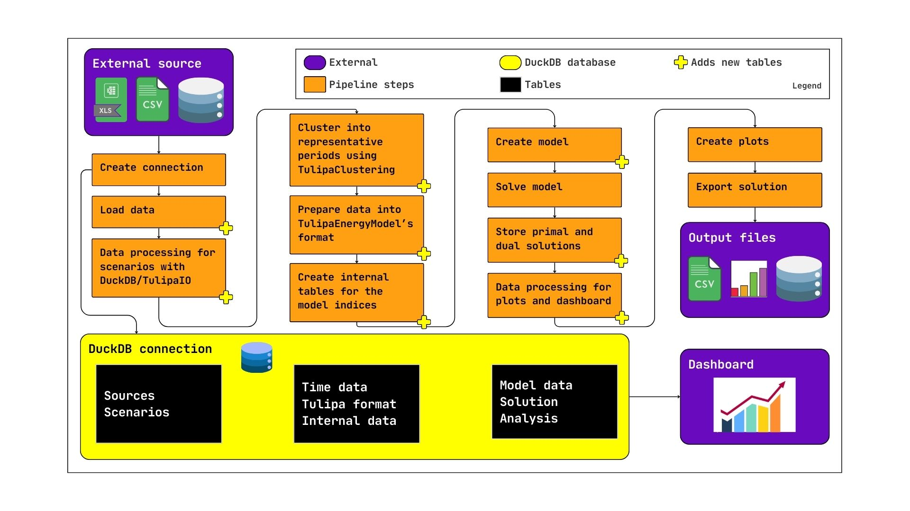

# [Data pipeline/workflow](@id data)

---

## [TODO](@id TODO)

- [ ] diagrams
- [ ] Replace
  > To create these tables we currently use CSV files that follow this same schema and then convert them into tables using TulipaIO, as shown in the basic example of the [Tutorials](@ref basic-example) section.
- [ ]Review below
- [ ] Link to OBZ

---

In this section we will take a look into the data in more details, focusing on what you need to go from your raw data all the way to the results.
We also have a tutorial going over the [full workflow](#TODO), focusing on the code parts.

```@contents
Pages = ["50-schemas.md"]
Depth = [2, 3]
```

## Workflow overview

Here is a brief look at how we imagine a normal usage of the Tulipa model:



Workflow explanation:

- **External source**: The first thing that you need, and hopefully have, is data. Currently, Tulipa does not provide any public data sources, so we expected that you will _load_ all required data.
- **Create connection**: Tulipa uses a DuckDB database to store the input data, the representation of variables, constraints, and other internal tables, as well as the output. This database is informed through the `connection` argument in various parts of the API. Most notably, [`run_scenario`](@ref) and [`EnergyProblem`](@ref) receive the `connection` as main argument to create the model (and various internal tables).
  - **DuckDB connection**: This visual representation of the DuckDB shows which tables are created throughout the steps.
- **Load data**: Whether you have CSV/Excel/Parquet files or a separate Database containing your data, you have to load it into the DuckDB connection, i.e., create tables (or table views) with the data that you will process for Tulipa.
  - **DuckDB connection**: We denote this by the `Sources` tables. We have no expectations or control over what this data contains, but you will need to prepare it for Tulipa in some specific way later.
- **Data processing for scenarios with DuckDB/TulipaIO**: Now we need to prepare this data for clustering. Even if you don't need to cluster your data, you still need to run the [`DummyClustering`](#TODO). Since your data in now inside the `connection`, we assume that you'll use `DuckDB`'s SQL and/or `TulipaIO.jl`'s convenience functions to manipulate it. However, you can create the data that you need externally and just load it again. You are also free to read the data from the connection in whatever other way you find useful (e.g., from Julia or Python, processing with Data Frames, and loading the result into the connection). The important thing is:
  - [You need to satisfy the TulipaClustering format](#TODO)
  - **DuckDB connection**: This data is represented by the `Scenerios` tables, but it could have been loaded with the `Sources`.
- **Cluster into representative periods using TulipaClustering**: Run TulipaClustering to compute the representative periods and create tables with this information.
  - **DuckDB connection**: We call these tables the `Time data` tables. The table created in this step will have a prefix `cluster_` (see [Namespaces](@ref) below)
- **Prepare data for TulipaEnergyModel's format**: Once more, you have to process your data and create tables for the next step. Since the TulipaEnergyModel is reasonably extensive, you might want to use the `populate_with_defaults!` function. See [Minimum data and using defaults](@ref minimum_data) for more details.
  - **DuckDB connection**: TulipaEnergyModel expects the `Time data` tables from the previous step and new tables that we denote `Tulipa format`. In rare instances, your data will be complete, but most likely you will need to, at the very least, enhance your tables with default values for columns that are not important for your problem. The tables required by TulipaEnergyModel have the prefix `input_` or `cluster_`.
- **Create internal tables for the model indices**: Finally, we start using Tulipa. Your exact experience will depend on [what level of the API you are using](#TODO), but the underlying idea is the same. The first interaction with Tulipa will create the tables that Tulipa uses to store the variables, constraints, and expressions indices, as well as other internal tables required to get there. We also validate the data to try to make sure that the tables follow the expected requirements.
  - **DuckDB connection**: There are various new tables at this stage that we denote simply as `Internal data`. See the [Namespaces](@ref) section for more details.
- **Create model**: This is where most of the heavy lifting is done in the workflow, apart from solving the model. This step creates all the Julia/JuMP structures using the tables from the previous step. For instance, for each row of each variable table, there is an associated JuMP variable created in this step.
  - **DuckDB connection**: Very little data is created in DuckDB actually. For the most part, we create expressions, prefixed by `expr_`, that could not have been created before. A lot of Julia/JuMP specific things are created, though, but they cannot be stored in a DuckDB connection.
- **Solve model**: Finally, we give the model to the solver and wait for a result.
- **Store primal and dual solutions**: In this step we compute the dual variables and then load the values of the primal and dual variables in the variable and constraints tables.
  - **DuckDB connection**: We technically don't create any new tables in this step. Instead, we attach new columns to the `var_` and `cons_` tables with the variable values.
- **Data processing for plots and dashboard**: This is the time to prepare the output that you need, once again using DuckDB/TulipaIO. You can also move all the data out of `DuckDB` and continue your analysis elsewhere.
  - **DuckDB connection**: You might, optionally, create new tables. We denote these `Analysis` tables. They can be used for the next steps or for a possible dashboard connecting directly to the DuckDB connection.
- **Create plots**: Optionally create plots.
- **Export solution**: Optionally export all the tables from the DuckDB connection to files, and/or create and save plots.
- **Output files**: External. The outputs of the workflow, which can be whatever you can produce. Notable, CSV/Parquet files with the full variables and constraints tables can be created easily.
- **Dashboard**: Representation of a possible dashboard connecting directly to the DuckDB connection.

## [Minimum data and using defaults](@id minimum_data)

Since `TulipaEnergyModel` is at a late stage in the workflow, its input data requirements are stricter.
Therefore, the input data required by the Tulipa model must follow the schema in the follow section.

Dealing with defaults is hard. A missing value might represent two different things to different people. That is why we require the tables to be complete.
However, we also understand that it is not reasonable to expect people to fill a lot of things that they don't need for their models.
Therefore, we have created the function [`populate_with_defaults!`](@ref) to fill the remaining columns of your tables with default values.

To know the defaults, check the table [Schemas](@ref schemas) below.

!!! warning "Beware implicit assumptions"
    When data is missing and you automatically fill it with defaults, beware of your assumptions on what that means.
    Check what are the default values and decide if you want to use them or not.
    If you think a default does not make sense, open an issue, or a discussion thread.

### Example of using `populate_with_defaults!`

Below we have the minimum amount of data (essentially, nothing), that is necessary to start Tulipa.

```@example minimum_data
using TulipaEnergyModel, TulipaIO, DuckDB, DataFrames

data = Dict(
    # Basic asset data
    "input_asset" => DataFrame(
        :asset => ["some_producer", "some_consumer"],
        :type => ["producer", "consumer"],
    ),
    "input_asset_both" => DataFrame(
        :asset => ["some_producer", "some_consumer"],
        :commission_year => [2030, 2030],
        :milestone_year => [2030, 2030],
    ),
    "input_asset_commission" => DataFrame(
        :asset => ["some_producer", "some_consumer"],
        :commission_year => [2030, 2030],
    ),
    "input_asset_milestone" => DataFrame(
        :asset => ["some_producer", "some_consumer"],
        :milestone_year => [2030, 2030],
    ),

    # Basic flow data
    "input_flow" => DataFrame(:from_asset => ["some_producer"], :to_asset => ["some_consumer"]),
    "input_flow_both" => DataFrame(
        :from_asset => ["some_producer"],
        :to_asset => ["some_consumer"],
        :commission_year => [2030],
        :milestone_year => [2030],
    ),
    "input_flow_commission" => DataFrame(
        :from_asset => ["some_producer"],
        :to_asset => ["some_consumer"],
        :commission_year => [2030],
    ),
    "input_flow_milestone" => DataFrame(
        :from_asset => ["some_producer"],
        :to_asset => ["some_consumer"],
        :milestone_year => [2030],
    ),

    # Basic time information
    "input_year_data" => DataFrame(:year => [2030]),
    "cluster_rep_periods_data" => DataFrame(:year => [2030, 2030], :rep_period => [1, 2]),
    "cluster_timeframe_data" => DataFrame(:year => 2030, :period => 1:365),
    "cluster_rep_periods_mapping" =>
        DataFrame(:year => 2030, :period => 1:365, :rep_period => mod1.(1:365, 2)),
)
```

And here we load this data into a DuckDB connection.

```@example minimum_data
connection = DBInterface.connect(DuckDB.DB)

# Loading the minimum data in the connection
for (table_name::String, table::DataFrame) in data
    DuckDB.register_data_frame(connection, table, table_name)
end

# Table `input_asset`:
DuckDB.query(connection, "FROM input_asset") |> DataFrame
```

Now we run `populate_with_defaults!` to fill the remaining columns with default values:

```@example minimum_data
TulipaEnergyModel.populate_with_defaults!(connection)

DuckDB.query(connection, "FROM input_asset") |> DataFrame
```

You can see the table has been modified to include many more columns.
Even this problem, with no relevant information, can be solved:

```@example minimum_data
energy_problem = TulipaEnergyModel.run_scenario(
    connection;
    output_folder = mktempdir(),
    show_log = false,
)

DuckDB.query(connection, "FROM var_flow LIMIT 5") |> DataFrame
```

## Namespaces

After creating a `connection` and loading data in a way that follows the schema (see the previous section on [minimum data](@ref minimum_data)), then Tulipa will create tables to handle the model data and various internal tables.
To differentiate between these tables, we use a prefix. This should also help differentiate between the data you might want to create yourself.
Here are the different namespaces:

- `cluster_`: Tables created by `TulipaClustering`.
- `input_`: Tables expected by `TulipaEnergyModel`.
- `var_`: Variable indices.
- `cons_`: Constraints indices.
- `expr_`: Expressions indices.
- `resolution_`: Unrolled partition blocks of assets and flows.
- `t_*`: Temporary tables.

## [Schemas](@id schemas)

The optimization model parameters with the input data must follow the schema below for each table.

The schemas can be found in the `input-schemas.json`. For more advanced users, they can also access the schemas at any time after loading the package by typing `TulipaEnergyModel.schema_per_table_name` in the Julia console. Here is the complete list of model parameters in the schemas per table (or CSV file):

!!! info "Optional tables/files and their defaults"
    The following tables/files are allowed to be missing: "assets\_rep\_periods\_partitions", "assets\_timeframe\_partitions", "assets\_timeframe\_profiles", "flows\_rep\_periods\_partitions", "group\_asset", "profiles\_timeframe".
    - For the partitions tables/files, the default value are `specification = uniform` and `partition = 1` for each asset/flow and year
    - For the profiles tables/files, the default value is a flat profile of value 1.0 p.u.
    - If no group table/file is available there will be no group constraints in the model

```@eval
"""
The output of the following code is a Markdown text with the following structure:

TABLE_NAME
=========

PARAMETER_NAME

  •  Description: Lorem ipsum
  •  Type: SQL type of the parameter
  •  Default: a value or "No default"
  •  Unit of measure: a value or "No unit"
  •  Constraints: a table or "No constraints"
"""

using Markdown, JSON
using OrderedCollections: OrderedDict

input_schemas = JSON.parsefile("../../src/input-schemas.json"; dicttype = OrderedDict)

let buffer = IOBuffer()
    for (i,(table_name, fields)) in enumerate(input_schemas)
        write(buffer, "## Table $i : `$table_name`\n\n")
        for (field_name, field_info) in fields
            _description = get(field_info, "description", "No description provided")
            _type = get(field_info, "type", "Unknown type")
            _unit = get(field_info, "unit_of_measure", "No unit")
            _default = get(field_info, "default", "No default")
            _constraints_values = get(field_info, "constraints", nothing)

            write(buffer, "**`$field_name`**\n\n")
            write(buffer, "- Description: $_description\n\n")
            write(buffer, "- Type: `$_type`\n")
            write(buffer, "- Unit of measure: `$_unit` \n")
            write(buffer, "- Default: `$_default`\n")

            if _constraints_values === nothing
                write(buffer, "- Constraints: No constraints\n")
            elseif isa(_constraints_values, OrderedDict)
                write(buffer, "| Constraints | Value |\n| --- | --- |\n")
                for (key, value) in _constraints_values
                    write(buffer, "| $key | `$value` |\n")
                end
                write(buffer, "\n")
            else
                write(buffer, "- Constraints: `$(string(_constraints_values))`\n")
            end
        end
    end
    Markdown.parse(String(take!(buffer)))
end

```
