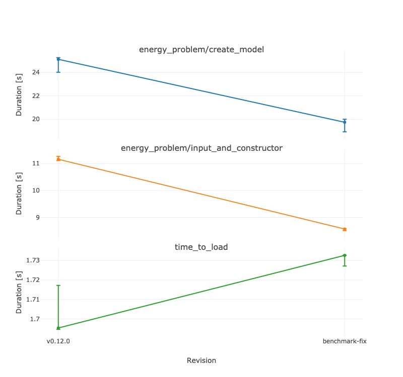

# [Developer Documentation](@id developer)

Welcome to TulipaEnergyModel.jl developer documentation. Here is how you can
contribute to our Julia-based toolkit for modeling and optimization of electric
energy systems.

This may seem like a lot, but that's because we walk you through step-by-step.
If you follow these steps, you'll contributing in no time!

```@contents
Pages = ["91-developer.md"]
Depth = [2, 3]
```

## First-Time Setup

Before you can start contributing, please read our [Contributing Guidelines](@ref contributing).

Also make sure that you have installed the
required software, and that it is properly configured. You only need to do this
once.

### Installing Software

To contribute to TulipaEnergyModel.jl, you need the following:

1. [Julia](https://julialang.org) programming language.
1. [Git](https://git-scm.com) for version control.
1. [VSCode](https://code.visualstudio.com) or any other editor. For VSCode, we recommend
   to install a few extensions. You can do it by pressing `Ctrl + Shift + X` (or `⇧ + ⌘ + X` on MacOS) and searching by the extension name:
   - [Julia for Visual Studio Code](https://www.julia-vscode.org)
   - [Git Graph](https://marketplace.visualstudio.com/items?itemName=mhutchie.git-graph)
1. [EditorConfig](https://editorconfig.org) for consistent code formatting.
   In VSCode, it is available as
   [an extension](https://marketplace.visualstudio.com/items?itemName=EditorConfig.EditorConfig).
1. [pre-commit](https://pre-commit.com) to run the linters and formatters.
   - To install pre-commit, you will first need [Python](https://www.python.org/) with pip (included by default in recent Python versions).

   You can install `pre-commit` globally using

   ```bash
   pip install pre-commit
   ```

   If you prefer to create a local environment with it, do the following:

   ```bash
   python -m venv env

   # Windows
   source env/Scripts/activate # in bash
   env/Scripts/Activate.ps1 # in powershell

   # Linux or macOS
   . env/bin/activate

   pip install --upgrade pip setuptools pre-commit
   ```

1. [JuliaFormatter.jl](https://github.com/domluna/JuliaFormatter.jl) for code
   formatting.

   To install it, open a Julia REPL, for example, by typing in the command line:

   ```bash
   julia
   ```

   > **Note:** `julia` must be part of your environment variables to call it from the command line.

   Then press `]` to enter package mode and enter the following:

   ```julia
   pkg> activate
   pkg> add JuliaFormatter@v1 # NOTE: We currently have to manually force v1 (see issue #1233)
   ```

   In VSCode, you can activate "Format on Save" for `JuliaFormatter`:
   - Open VSCode Settings (`Ctrl + ,`)
   - In "Search Settings", type "Format on Save" and tick the first result:

   

   > **Warning**:
   > Do not use the JuliaFormatter VSCode extension because it may
   > conflict with the formatting rules currently used in this codebase.

1. [LocalCoverage](https://github.com/JuliaCI/LocalCoverage.jl) for coverage
   testing. You can install it the same way you installed `JuliaFormatter`,
   that is, by opening Julia REPL in the package mode and typing:

   ```julia
   pkg> activate
   pkg> add LocalCoverage
   ```

### Forking the Repository

Any changes should be done in a [fork](https://docs.github.com/en/get-started/quickstart/fork-a-repo). You can fork this repository directly on GitHub:


After that, clone your fork. The fork should ideally be cloned to a folder that is not affected by any cloud, to prevent LiveServer accessing and overwriting your folder. Finally, add this repository as upstream:

```bash
cd path/to/folder #optionally, cd to a local folder
git clone https://github.com/your-name/TulipaEnergyModel.jl                   # use the fork URL
git remote add upstream https://github.com/TulipaEnergy/TulipaEnergyModel.jl  # use the original repository URL
```

Check that your origin and upstream are correct:

```bash
git remote -v
```

You should see something similar to:


If your names are wrong, use this command (with the relevant names) to correct it:

```bash
git remote set-url [name] [url]
```

### Configuring Git

Because operating systems use different line endings for text files, you need to configure Git to ensure code consistency across different platforms. You can do this with the following commands:

```bash
cd /path/to/TulipaEnergyModel.jl
git config --unset core.autocrlf         # disable autocrlf in the EnergyModel repo
git config --global core.autocrlf false  # explicitly disable autocrlf globally
git config --global --unset core.eol     # disable explicit file-ending globally
git config core.eol lf                   # set Linux style file-endings in EnergyModel
```

### Activating and Testing the Package

Start Julia REPL either via the command line or in the editor.

In the terminal, do:

```bash
cd /path/to/TulipaEnergyModel.jl  # change the working directory to the repo directory if needed
julia                             # start Julia REPL
```

In VSCode, first open your cloned fork as a new project. Then open the command palette with `Ctrl + Shift + P` (or `⇧ + ⌘ + P` on MacOS) and use the command called `Julia: Start REPL`.

In a Julia REPL, enter the package mode by pressing `]`.

In the package mode, first activate and instantiate the project, then run the
tests to ensure that everything is working as expected:

```bash
pkg> activate .   # activate the project
(TulipaEnergyModel) pkg> instantiate  # instantiate to install the required packages
(TulipaEnergyModel) pkg> test         # run the tests (uses TestItemRunner.jl)
```

> **Note:** The test suite uses TestItemRunner.jl for better test organization and
> granular execution. You can also run specific test categories using tags or
> individual test files as described in the testing section below.

### Configuring Linting and Formatting

With `pre-commit` installed, activate it as a pre-commit hook:

```bash
pre-commit install
```

To run the linting and formatting manually, enter the command below:

```bash
pre-commit run -a
```

Do it once now to make sure that everything works as expected.

Now, you can only commit if all the pre-commit tests pass.

> **Note:**
> On subsequent occasions when you need to run pre-commit in a new shell, you
> will need to activate the Python virtual environment. If so, do the following:
>
> ```bash
> . env/bin/activate  # for Windows the command is: . env/Scripts/activate
> pre-commit run -a
> ```

## Code format and guidelines

This section will list the guidelines for code formatting **not enforced** by JuliaFormatter.
We will try to follow these during development and reviews.

- Naming
  - `CamelCase` for classes and modules
  - `snake_case` for functions and variables
  - `kebab-case` for file names and documentation reference tags
- Use `using` instead of `import`, in the following way:
  - Don't use pure `using Package`, always list all necessary objects with `using Package: A, B, C`.
  - List obvious objects, e.g., `using JuMP: @variable`, since `@variable` is obviously from JuMP in this context.
  - For other objects inside `Package`, use `using Package: Package` and explicitly call `Package.A` to use it, e.g., `JuMP.direct_model`.
  - List all `using` in <src/TulipaEnergyModel.jl>.
- Explicitly state what a function will `return`; if returning nothing, simply use `return`.

### Markdown Table Formatting (MD060)

Markdown tables in the documentation must follow proper column alignment to pass the MD060 linting rule. This means that all pipes (`|`) in a table must be vertically aligned, and cells should be properly padded with spaces.

**Example of a properly formatted table:**

```markdown
| Column 1 | Column 2 | Column 3 |
| -------- | -------- | -------- |
| Value 1  | Value 2  | Value 3  |
| Data A   | Data B   | Data C   |
```

**Example of an incorrectly formatted table:**

```markdown
| Column 1 | Column 2 | Column 3 |
| --- | --- | --- |
| Value 1 | Value 2 | Value 3 |
| Data A | Data B | Data C |
```

If the pre-commit linter fails due to MD060 violations, you have two options:

1. **Manually fix the table**: Adjust the spacing and alignment in your markdown file.
2. **Use the automatic formatting script**: Run the Python script located in `utils/apply_md_rule.py` to automatically format all tables in a markdown file:

   ```bash
   python utils/apply_md_rule.py path/to/your/file.md
   ```

   For example, to fix tables in the formulation documentation:

   ```bash
   python utils/apply_md_rule.py docs/src/40-scientific-foundation/40-formulation.md
   ```

   The script will automatically detect all tables in the file and apply proper alignment.

## Contributing Workflow

When the software is installed and configured, and you have forked the
TulipaEnergyModel.jl repository, you can start contributing to it.

We use the following workflow for all contributions:

1. Make sure that your fork is up to date
2. Create a new branch
3. Implement the changes
4. Run the tests
5. Run the linter
6. Commit the changes
7. Repeat steps 3-6 until all necessary changes are done
8. Make sure that your fork is still up to date
9. Create a pull request

Below you can find detailed instructions for each step.

### 1. Make Sure That Your Fork Is Up to Date

Fetch from org remote, fast-forward your local main:

```bash
git switch main
git fetch --all --prune
git merge --ff-only upstream/main
```

> **Warning**:
> If you have a conflict on your main, it will appear now. You can delete
> your old `main` branch using
>
> ```bash
> git reset --hard upstream/main
> ```

### 2. Create a New Branch

Create a branch to address the issue:

```bash
git switch -c <branch_name>
```

- If there is an associated issue, add the issue number to the branch name,
  for example, `123-short-description` for issue \#123.
- If there is no associated issue **and the changes are small**, add a prefix such as "typo", "hotfix", "small-refactor", according to the type of update.
- If the changes are not small and there is no associated issue, then create the issue first, so we can properly discuss the changes.

> **Note:**
> Always branch from `main`, i.e., the main branch of your own fork.

### 3. Implement the Changes

Implement your changes to address the issue associated with the branch.

### 4. Run the Tests

TulipaEnergyModel.jl uses [TestItemRunner.jl](https://github.com/julia-vscode/TestItemRunner.jl) for testing, which provides granular test execution and better development experience.

#### Running All Tests

In Julia:

```bash
TulipaEnergyModel> test
```

Or, using the CLI version:

```bash
julia --project=test test/runtests.jl --verbose
```

#### Running Tests with filters

The test suite uses tags for efficient test filtering during development. Here are some tags:

- `:unit` - Single component or function tests
- `:integration` - End-to-end tests
- `:validation` - Tests verifying expected values, behavior, or mathematical correctness
- `:fast` - Quick tests suitable for frequent execution
- `:slow` - Resource-intensive tests requiring significant time or memory

Check `test/runtests.jl` for a complete list or run with the `--list-tags` option.

Examples of running specific test categories:

```bash
# Run only fast unit tests
julia --project=test test/runtests.jl --tags unit,fast

# Run only files that match the name:
julia --project=test test/runtests.jl --file test-model.jl
```

And it's also possible to run a specific `@testitem`.
If you are on VSCode with the Julia extension installed, you will see a "play" button on the left side of the `@testitem`.
Otherwise, if you know (part of) the name of the test, you can run it with:

```bash
julia --project=test test/runtests.jl --name "Some test name"
```

Use `--help` to see the full help.

#### Test Coverage

To run the tests with code coverage, you can use the `LocalCoverage` package:

```julia
julia> using LocalCoverage
# ]
pkg> activate .
# <backspace>
julia> cov = generate_coverage()
```

This will run the tests, track line coverage and print a report table as output.
Note that we want to maintain 100% test coverage. If any file does not show 100%
coverage, please add tests to cover the missing lines.

If you are having trouble reaching 100% test coverage, you can set your pull
request to 'draft' status and ask for help.

#### Writing New Tests

When adding new tests, use the `@testitem` macro with appropriate setup and tags:

```julia
@testitem "Test description" setup = [CommonSetup] tags = [:unit, :fast] begin
    # Test code here
    @test actual_result == expected_result
end
```

Choose appropriate tags based on your test characteristics. If you need to add a new tag, check the `TAGS_DATA` dictionary on the `test/runtests.jl` file.

### 5. Run the Linter

In the bash/git bash terminal, run pre-commit:

```bash
. env/bin/activate # if necessary (for Windows the command is: . env/Scripts/activate)
pre-commit run -a
```

If any of the checks failed, find in the pre-commit log what the issues are and
fix them. Then, add them again (`git add`), rerun the tests & linter, and commit.

### 6. Commit the Changes

When the test are passing, commit the changes and push them to the remote
repository. Use:

```bash
git commit -am "A short but descriptive commit message" # Equivalent to: git commit -a -m "commit msg"
git push -u origin <branch_name>
```

When writing the commit message:

- use imperative, present tense (Add feature, Fix bug);
- have informative titles;
- if necessary, add a body with details.

> **Note:**
> Try to create "atomic git commits". Read
> [_The Utopic Git History_](https://blog.esciencecenter.nl/the-utopic-git-history-d44b81c09593)
> to learn more.

### 7. Make Sure That Your Fork Is Still Up to Date

If necessary, fetch any `main` updates from upstream and rebase your branch into
`origin/main`. For example, do this if it took some time to resolve the issue
you have been working on. If you don't resolve conflicts locally, you will
get conflicts in your pull request.

Do the following steps:

```bash
git switch main                  # switch to the main branch
git fetch --all --prune          # fetch the updates
git merge --ff-only upstream/main  # merge as a fast-forward
git switch <branch_name>         # switch back to the issue branch
git rebase main <branch_name>    # rebase it
```

If it says that you have conflicts, resolve them by opening the file(s) and
editing them until the code looks correct to you. You can check the changes
with:

```bash
git diff             # Check that changes are correct.
git add <file_name>
git diff --staged    # Another way to check changes, i.e., what you will see in the pull request.
```

Once the conflicts are resolved, commit and push.

```bash
git status # Another way to show that all conflicts are fixed.
git rebase --continue
git push --force origin <branch_name>
```

### 8. Create a Pull Request

When there are no more conflicts and all the test are passing, create a pull
request to merge your remote branch into the org main. You can do this on
GitHub by opening the branch in your fork and clicking "Compare & pull request".


Fill in the pull request details:

1. Describe the changes.
2. List the issue(s) that this pull request closes.
3. Fill in the collaboration confirmation.
4. (Optional) Choose a reviewer.
5. When all of the information is filled in, click "Create pull request".


You pull request will appear in the list of pull requests in the
TulipaEnergyModel.jl repository, where you can track the review process.

Sometimes reviewers request changes. After pushing any changes,
the pull request will be automatically updated. Do not forget to re-request a
review.

Once your reviewer approves the pull request, you need to merge it with the
main branch using "Squash and Merge".
You can also delete the branch that originated the pull request by clicking the button that appears after the merge.
For branches that were pushed to the main repo, it is recommended that you do so.

#### Tests on Pull Requests

The pull request tests are run by the workflow `TestOnPRs`, while the tests on `main` are run by the `Test` workflow.
The `Test` workflow is much more comprehensive, running the tests on two Julia versions (Latest and Long Term Support) and 3 operating systems (Linux, MacOS, Windows).

The `TestOnPRs` workflow, by default, only runs the tests using the latest Julia version and on Linux.
By tagging the pull request with the label `pr-test-all`, the `TestOnPRs` workflow changes behaviour to run the tests on all 3 OSs mentioned above.

## Documentation updates

When updating the documentation, pull requests mades from branches within the repo (i.e., not from forks) will have a preview build enabled and a preview link pasted on the comments.
The PR preview link will look something like: `https://tulipaenergy.github.io/TulipaEnergyModel.jl/previews/PRXXXX`.

Alternatively, you might want to build the documentation locally. See below for more information.

### Building the Documentation Locally

Following the latest suggestions, we recommend using `LiveServer` to build the documentation.

> **Note**:
> Ensure you have the package `Revise` installed in your global environment
> before running `servedocs`.

Here is how you do it:

1. Run `julia --project=docs` in the package root to open Julia in the environment of the docs.
1. If this is the first time building the docs
   1. Press `]` to enter `pkg` mode
   1. Run `pkg> dev .` to use the development version of your package
   1. Press backspace to leave `pkg` mode
1. Run `julia> using LiveServer`
1. Run `julia> servedocs(launch_browser=true)`

## Performance Considerations

If you updated something that might impact the performance of the package, we
expect that the `Benchmark.yml` workflow runs for your pull request.
To do that, add the tag `benchmark` in the pull request.
This will trigger the workflow and post the results as a comment in you pull
request.

> **Warning**:
> This requires that your branch was pushed to the main repo.
> If you have created a pull request from a fork, the Benchmark.yml workflow does not work.
> Instead, close your pull request, push your branch to the main repo, and open a new pull request.

If you want to manually run the benchmarks, you can do the following:

- Run `julia --project=benchmark` from the root folder
- Enter `pkg` mode by pressing `]` and `pkg> instantiate`  of `pkg> update` if necessary
- Now run

  ```julia
  include("benchmark/benchmarks.jl")
  tune!(SUITE)
  results = run(SUITE, verbose=true)
  ```

- To compare these results to a different run, say `results_old`, use

  ```julia
  judge(old=results_old, new=results)
  ```

### Manually running the benchmark across versions

We use the package [AirspeedVelocity.jl](https://github.com/MilesCranmer/AirspeedVelocity.jl) to run the benchmarks in the CI, but it can also be used to compare explicitly named versions manually.

1. Run the following to install AirspeedVelocity's commands to your Julia `bin` folder (`~/.julia/bin` on MacOS and Linux). On Windows, if you are using the default Julia installation, search for `C:/Users/` then the folder of your Windows user and then `.julia/bin`

   ```bash
   julia -e 'using Pkg; Pkg.activate(temp=true); Pkg.add("AirspeedVelocity")'
   ```

1. Check that `benchpkg` was installed:

   ```bash
   benchpkg --version
   ```

   If if can't be found, then it is possible that your Julia `bin` folder is not in the `PATH`. After fixing this, try again.

1. Then, run `benchpkg` with `--rev` to list the versions to be tested and `--bench-on` to indicate with script to use (if necessary). For instance:

   ```bash
   benchpkg TulipaEnergyModel --rev=v0.12.0,main --bench-on=main
   ```

   After all logging, the output should look like

   ```plaintext
   |                                      | v0.12.0       | main            | v0.12.0/main |
   |:-------------------------------------|:-------------:|:---------------:|:------------:|
   | energy_problem/create_model          | 25.1 ± 1.2 s  | 19.7 ± 1.1 s    | 1.27         |
   | energy_problem/input_and_constructor | 11.2 ± 0.15 s | 8.57 ± 0.064 s  | 1.3          |
   | time_to_load                         | 1.7 ± 0.022 s | 1.73 ± 0.0055 s | 0.979        |
   ```

   Be aware that the versions passed in `rev` must be compatible to the benchmark defined at `bench-on`.
   So, for instance, testing `v0.10.4` above would fail, before the versions are too different.

   If you are working on a local version of `TulipaEnergyModel`, it is possible to test the local modifications.
   First, make sure that you are at the root of the `TulipaEnergyModel` repo, and then issue

   ```bash
   benchpkg --rev=<other>,dirty
   ```

   The `dirty` value refers to the current local modifications.
   The `<other>` values can be tags or branches to compare.

1. When this is done, you can print just the table afterwards using `benchmarktable`:

   ```bash
   benchpkgtable TulipaEnergyModel --rev=v0.12.0,main
   ...
   |                                      | v0.12.0       | main            | v0.12.0/main |
   |:-------------------------------------|:-------------:|:---------------:|:------------:|
   | energy_problem/create_model          | 25.1 ± 1.2 s  | 19.7 ± 1.1 s    | 1.27         |
   | energy_problem/input_and_constructor | 11.2 ± 0.15 s | 8.57 ± 0.064 s  | 1.3          |
   | time_to_load                         | 1.7 ± 0.022 s | 1.73 ± 0.0055 s | 0.979        |
   ```

1. It is also possible to generate a plot, using `benchpkgplot`:

   ```bash
   benchpkgplot TulipaEnergyModel --rev=v0.12.0,main --format=jpeg
   ```

   Different formats can be used. Here is the output:

   

### Investigating performance issues

Make sure to check [Modern Julia Workflows](https://modernjuliaworkflows.org/optimizing/) at least until measurements.

When investigating performance issues, we use three main ways to check out (speed) performance of functions:

- Run the pipeline until the relevant part and check the `TimerOutput` log.
  - TulipaEnergyModel holds a global `TimerOutput`. This strategy is to simply run the relevant parts of the pipeline and `show(TEM.to)` to see the results.
  - You can also use `TimerOutputs.reset_timer!` to reset the timer manually, which can be useful to limit the log.
  - Check `benchmark/profiling/timer-output.jl`.
- Benchmark the relevant part, preparing a setup function.
  - Create a `setup` function that generates everything necessary for the function you're benchmarking
  - If you're benchmarking more than one function, wrap them in a function
  - Call `@benchmark` with a `setup` argument
  - Check `benchmark/profiling/benchmarktools.jl`
- Use `@profview` for flame graph profiling.
  - Reuse the code from above.
  - Call the setup function and then call `@profview` on the function that you're investigating.
  - This needs to be done in VSCode, or using the ProfileView package.
  - This will create a flame graph, where each function call is a block. The size of the block is proportional to the aggregate time it takes to run. The blocks below a block are functions called inside the function above.
  - Check `benchmark/profiling/profview.jl`.
  - See the [flame graph tips](@ref flame-graph-tips) below for more details.

In all cases, you can run the relevant function (after inspecting it) in the `benchmark` folder environment:

```bash
julia --project="benchmark/profiling"
# press ]
pkg> instantiate
# press backspace
julia> include("benchmark/profiling/relevant-file.jl")
```

### [Flame graph tips](@id flame-graph-tips)

When running `@profview` in VSCode, a tab will appear with the flame graph.
If running outside VSCode, you need the [ProfileView](https://github.com/timholy/ProfileView.jl) package.

The flame graph will normally have many functions (~15) from the Julia side _before_ the actual code.
This is normally identified by an `eval` block.
Click on a block to zoom into that region, and focus on the TEM code.

#### Too fast

Make sure that your `@profview` call is not too fast.
You want to have your code run for enough time that the sampler will capture relevant information.
If you have a larger data input, that is better. Otherwise, run the relevant code inside a loop.

#### Focus

If the part of the code that you want to profile does not appear in the flame graph and you are already running in a loop, then you need to change your benchmark to run something more focused.

Look into the tests, maybe there is already something that can be reused.

#### Large blocks

The size of the blocks is proportional to how much the code is taking to execute (according to the sampler).
If a block is large, it is relevant, but that doesn't mean that it's wrong.
In a large scale problem, some things will be slow.

#### Color codes

The color of the blocks are an indication of other problems in the code.

There are various tonalities of blue, which is normal.

The red blocks are bad. It means, in essence, that there are issues related to type. We should try to avoid these as much as possible, although sometimes it will happen in other packages (e.g. DataFrames).

The yellow blocks are also bad. It means that the garbage collector was called, which means that some memory stopped being used.
E.g., creating a temporary array.

See the [ProfileView color coding documentation](https://github.com/timholy/ProfileView.jl?tab=readme-ov-file#color-coding) for more information.

#### Repeated blocks

Sometimes a block will be small but will appear in many places.
Every time that the block appears, it's a separate execution.
This means that the actual time of the code is the aggregate of all blocks.
These are great candidates for improvement if they add up to become a large block.
However, as with the large blocks, being slow does not mean that it's wrong.

### Testing scalability

This is still a new topic for us, so material is scarce.
At the moment, check `benchmark/profiling/scalability.jl` for an example of running a benchmark on many artificial Tulipa problems, with varying sizes, saving the results, and creating a plot out of it.
You can see an example of the expected output in the file `results.csv` and the plot `results.png` in the same folder.

### Type instability investigation

To investigate type instability issues in the code, we can use `@code_warntype`, [JET.jl](https://github.com/aviatesk/JET.jl), and [Cthulhu.jl](https://github.com/JuliaDebug/Cthulhu.jl), in increasing complexity order.

If you have a single function that you can directly call, `@code_warntype` might be enough to investigate possible type instability issues.
Most times, though, the function will be deeply nested, so using JET or Cthulhu will be necessary to actually see what is going on.
See the `benchmark/profiling/type-stability.jl` script for an example of setting up the lower or higher level API and calling some of these functions.

Check [Modern Julia Workflow's type stability section](https://modernjuliaworkflows.org/optimizing/#type_stability) for more details.

### Memory profiling

To investigate memory usage of the code, we use the [Allocation Profiler](https://docs.julialang.org/en/v1/manual/profile/#allocation-profiler).
The script `benchmark/profiling/memory-profile.jl` has an example using PProf.
It should be possible to use VSCode's [`@profview_allocs`](https://www.julia-vscode.org/docs/stable/userguide/profiler/) as well.

Notice that the `sample_rate` value might be relevant in this investigation, though at the moment we don't have a recommendation on how to find the best value.

Profiling memory use is useful to figure out _where_ large amounts of memory are being allocated, but not exactly _why_.
Type stability is one of the main issues.
Check [Modern Julia Workflows' type stability section](https://modernjuliaworkflows.org/optimizing/#type_stability) and memory management section for more information.

## Testing the generated MPS files

To make sure that unintended changes don't change the model, we have a workflow that automatically compares the generated MPS files.
Here is an explanation of how it works, and how to run the same comparison locally.

Before we start, notice that there are files in `benchmark/model-mps-folder` with the `.mps` files for each of the test inputs.
There are the _existing_ MPS files.

### Updating the MPS files

To update the MPS files, you can simple run a script from the root of `TulipaEnergyModel.jl`:

```bash
julia --project=. utils/scripts/model-mps-update.jl
```

If you **know** that your changes will modify the model, then you need to update the MPS files as just showed.

### Comparison of MPS files via script

One quick way to check the difference between the existing MPS files and the new ones is just to run the update, and check the `git diff`.
However, if you don't want to update, or just want a summary of the changes, you can run the script:

```bash
julia --project=. utils/scripts/model-mps-compare.jl
```

!!! warning
    This comparison uses the _local version of `benchmark/model-mps-folder`_.
    So, if you run the update script, there will be no changes to be shown.

The generated log will look something liek this:

```plaintext
┌ Info: New comparison
│ Comparing files
│ - <path>/<file>.mps
└ - <temp-path>/<file>.mps
[ Info: Create mps for <path> in <temp-path>
[ Info: No difference found
┌ Info: New comparison
│ Comparing files
│ - <path>/<file>.mps
└ - <temp-path>/<file>.mps
[ Info: Create mps for <path> in <temp-path>
┌ Error: Line 1272"
│ ..Existing: '    assets_investment[2030,ocgt] max_output_flows_limit[ocgt,2030,1,18:18] -100'
│ .......New: '    assets_investment[2030,ocgt] max_output_flows_limit[ocgt,2030,1,18:18] -200'
└ @ Main <path>/utils/scripts/model-mps-compare.jl:75
```

There are 2 cases:

1. The first case starts at the beginning of the log and ends in "No difference found". There was nothing to show for that file.
2. The second case has "errors", i.e., differences between the existing and new MPS files.
   Here is what to expect from the error lines:
   - `Error: Line ####`: The line number of the MPS file (which you can manually inspect).
   - `..Existing`: Shows the existing line.
   - `.......New`: Shows the new line.

If the environment variable `TULIPA_COMPARE_MPS_LOGFILE` is defined and is a path to a file, then the log will be written to a file instead of printed.
This is mostly relevant for the GitHub workflow.

### GitHub Workflow

When creating a pull request, the workflow `CompareMPS.yml` will run the comparison above and write a PR comment to indicate whether the files are the same or not. If the files are not the same, then the workflow fails, and there are two ways in which the workflow can fail:

1. **Expected failure**: If you are making a change to the model, then the MPS file will be different. Then you should
   1.1. Verify that the changes are **only** what you expected to see (i.e., use the MPS difference to debug possible issues).
   1.2. Run the update script listed above to fix the comparison (i.e., the new MPS becomes the existing MPS).
   1.3. Commit and push your modifications and wait for the comparison to run again.
2. **Unexpected failure**: If you made modifications that were not supposed to change the model, then you need to investigate what happened. Use the MPS difference to debug what you have done. There is no easy fix for this. If you think there are bugs in the comparison script, discuss with your PR reviewer and open an issue if necessary.

!!! warning
    The comparison workflow only writes PR comments if the branch is made from within `TulipaEnergyModel` (i.e., not from forks). To see the log online in that case, you have to open the GitHub action log, or run the comparison locally, as explained in the previous section.

## Releasing a New Version

When publishing a new version of the model to the Julia Registry, follow this procedure:

!!! note
    To be able to register, you need to be a member of the organisation TulipaEnergy and set your visibility to public:
    

1. Click on the `Project.toml` file on GitHub.

1. Edit the file and change the version number according to [semantic versioning](https://semver.org/): Major.Minor.Patch

   

1. Commit the changes in a new branch and open a pull request. Change the commit message according to the version number.

   

1. Create the pull request and squash & merge it after the review and testing process. Delete the branch after the squash and merge.

   

1. Go to the main page of repo and click in the commit.
   

1. Add the following comment to the commit: `@JuliaRegistrator register`

   

1. The bot should start the registration process.

   

1. After approval, the bot will take care of the PR at the Julia Registry and automatically create the release for the new version.

   

   Thank you for helping make frequent releases!

## Adding a Package to the TulipaEnergy Organisation

To get started creating a new (Julia) package that will live in the TulipaEnergy organisation and interact with TulipaEnergyModel, please start by using [BestieTemplate.jl](https://github.com/JuliaBesties/BestieTemplate.jl), and follow the steps in their [Full guide](https://juliabesties.github.io/BestieTemplate.jl/stable/10-guides/10-full-guide) for a new package.

This will set up the majority of automation and workflows we use and make your repo consistent with the others!

> **Note:** TulipaEnergyModel.jl is the core repo of the organisation. The Discussions are focused there and in some cases the documentation of other packages should forward to the TulipaEnergyModel docs to avoid duplicate or scattered information.
