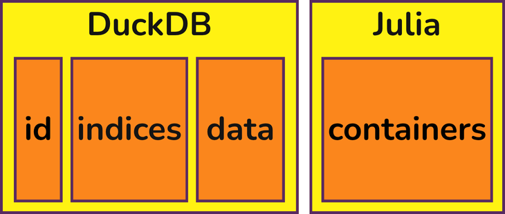

## Summary

`TulipaEnergyModel.jl` is a modelling framework for analysing the investment decisions and operational performance of future energy systems, using capacity expansion and dispatch optimisation. `TulipaEnergyModel.jl` is developed in [Julia](https://julialang.org) [@Julia]  using [JuMP.jl](https://jump.dev) [@JuMP] as an algebraic modelling language.
`TulipaEnergyModel.jl` is the main package of the Tulipa Energy ecosystem. As a framework, Tulipa formulates models completely based on input data, so users can analyse virtually any system using the generalised building blocks – producers, consumers, conversion, storage, and transport – and by specifying details such as time resolution, energy carriers or commodities, and geographic scope.
TulipaEnergyModel.jl focuses on model quality and efficient implementation, allowing it to break the tradeoff between model fidelity and computational load through: tighter MIP formulations; exact LP reformulations with fewer constraints and variables; more accurate LP approximations for storage and other technologies; and flexible model fidelity across temporal, technological, and spatial dimensions.

## Statement of Need

There are multiple existing models and frameworks related to Energy System Optimisation.
A few examples in the Julia and Python realm are [EnergyModelsX](https://github.com/EnergyModelsX) [@EnergyModelsX], [PowerModels](https://github.com/lanl-ansi/PowerModels.jl) [@PowerModels], [SpineOpt](https://www.tools-for-energy-system-modelling.org/) [@SpineOpt], [Sienna](https://www.nrel.gov/analysis/sienna) [@Sienna], [GenX](https://github.com/GenXProject/GenX) [@GenX], [PyPSA](https://pypsa.org) [@PyPSA], and [Calliope](https://github.com/calliope-project/calliope) [@Calliope].
However, existing models run into computational limits when solving large-scale problems, and have to resort to (over)simplifying the model to reduce computational burden. The common misconception is that the only strategy to speedup solving times without sacrificing model fidelity is through better software (decomposition & solvers) or hardware (high-performance computing). But there is another strategy that current models overlook: improving the theoretical quality of the mathematical formulation, as this fundamentally defines the computational load. That is, higher quality mathematical formulations increase model fidelity while simultaneously solving faster than standard formulations.
This insight inspired the development of TulipaEnergyModel.jl, with the core philosophy of advancing the state-of-the-art in formulation quality by exploiting the following three strategies: 1) lowering computational cost while maintaining model fidelity, by representing the same problem with fewer constraints and variables [@Tejada2025], and by creating tighter mixed-integer programming (MIP) formulations [@MoralesEspana2013]. 2) increasing model fidelity without extra computational cost, e.g., by developing more accurate linear programming (LP) approximations for storage [@Elgersma2025] and other technologies [@gentile2016; @MoralesEspana2022]. Finally, 3) balancing computational burden with adaptive/flexible model fidelity, i.e., having different levels of detail in different parts of the model, in the temporal [@Gao2025], technological [@MoralesEspana2022] and spatial dimensions.
These modelling strategies have significant computational benefits, especially when handling problems of realistic scale: with the spatial dimension of a continent, interacting with other energy carriers such as gas and hydrogen, and with a horizon of decades while reasoning about the (renewable) generation with an hourly resolution.
Since some of these modelling breakthroughs alter the foundation and structures of the model in ways that are incompatible with existing models, `TulipaEnergyModel.jl` had to be developed from the ground up. In this paper we explain some of the modelling and software design innovations that form the core of the model.

## Modelling Innovations

Two of the main innovations of Tulipa include:
1. Providing fully flexible temporal resolution [@Gao2025] for the assets and flows, and
2. Allowing direct connections between assets [@Tejada2025].
To illustrate these concepts, consider the following example:

For the fully flexible temporal resolution, consider the 6 hours of this system. The flow between "H2" and "ccgt" has a resolution of 6 hours (i.e., the whole period), while from "ccgt" to "balance" the resolution is 1 hour. The resolution from "wind" to "phs" is 3 hours, and the resolution from "phs" to "balance" is not regular, with a 4-hour block and then a 2-hour block. By correctly handling all of these various time blocks, Tulipa allows the user to choose the temporal detail throughout the model, thus creating fewer variables and constraints. This feature can drastically reduce problem sizes and improve solving speeds with little loss in accuracy. See @Gao2025 for further details.

For the direct connection between assets, notice that the storage “phs” unit is directly connected to the “wind“ producer to charge, and also directly connected to “balance” to discharge. This option for direct connection between assets completely avoids extra in-between elements (connections and nodes), which naturally avoids unnecessary variables and constraints. In systems where this can be applied, such as VRE production coupled with electrolysers, this method speeds up solving times without any loss of accuracy compared to traditional formulations. See @Tejada2025 for further details.

TulipaEnergyModel.jl is fundamentally focused on high quality mathematical formulations. The model also includes other key features such as seasonal storage modeling using representative periods [@Tejada2018; @greg2025], tight formulations to prevent simultaneous charging and discharging [@Elgersma2025], tight and compact unit commitment constraints [@MoralesEspana2013], and compact formulations for multi-year investment planning [@wang2025a; @wang2025b].

## Software Design Innovations

Due to the flexible resolution of assets and flows, many of our variables have a "time block" component, instead of a "time step" component.
Since different assets and flows can have different time resolutions, the indices of many of our variables and constraints are sparse.
To better explain this feature, look again at Figure \ref{fig:flexible-time-resolution}.
In an hourly implementation, we would have variables such as $f_{(\text{H2},\text{ccgt}),t}$, $f_{(\text{phs},\text{balance}),t}$ for $t = 1,\dots,6$.
Instead, looking at the time blocks of each flow, we have $f_{(\text{H2},\text{ccgt}),1:6}$, $f_{(\text{phs},\text{balance}),1:4}$, and $f_{(\text{phs},\text{balance}),5:6}$.
In other words, this flow variable could be defined as

$$f_{e,b} \qquad \forall e \in E, b \in B(e),$$

where $E$ is the set of edges of the graph, and $B(e)$ is the set of time blocks for this edge.

Similarly, some of the constraints and expressions in the model have their own time blocks (e.g., the balance constraints), and computing the coefficients of the flows involve matching indices and computing it intersections between time blocks.
Directly defining variables like this in JuMP leads to sparse indices, which are cumbersome and potentially slow for this kind of operation, especially when we are trying to avoid unnecessary computations.
Furthermore, it can create some performance pitfalls, such as the ["sum-if problem"](https://jump.dev/JuMP.jl/stable/tutorials/getting_started/sum_if/), when trying to determine the coefficients of each flow in each balance constraint.

To improve the storage of these objects, we use a tabular format for the collections of indices of each variable, constraint, and expression.
Each row of the table stores the corresponding set of indices for JuMP objects, and the JuMP objects themselves are stored in a linearized way in an array.
For instance, for the flow variable as described above, the first three rows are given in Table \ref{tab:linearized}.

| id | from asset | to asset | time block start | time block end |
|----|------------|----------|------------------|----------------|
|  1 | H2 | ccgt | 1 | 6 |
|  2 | phs | balance | 1 | 4 |
|  3 | phs | balance | 5 | 6 |

Table: "Simplified example of the `var_flow` table"\label{tab:linearized}

The table storage of the indices avoids the sparsity of the storage of the JuMP objects.
The actual JuMP objects are kept separately in an array, with positions matching the ids stored in the table.
Figure \ref{fig:indices} shows the representation of this storage.

{height=80pt}

A second main software design choices for TulipaEnergyModel.jl is to maintain a [DuckDB](https://duckdb.org) [@DuckDB] connection from the input data to model creation and output generation.
This enables us to handle different data formats by relying on DuckDB's capabilities, instead of Julia's.

We decided to also use DuckDB to store the indices tables, decreasing data movement and duplication by keeping the data in DuckDB for as long as possible.
When creating the variables and constraints, we can read the DuckDB tables per row, decreasing the memory usage in comparison to using an explicit Julia table, such as DataFrames.

Furthermore, this better separates the pipeline steps into (i) data ingestion and manipulation, (ii) indices creation, and (iii) model creation.
Figure \ref{fig:overview} shows an overview of how Tulipa interacts with the DuckDB connection.

This separation allows users to create the necessary input data from whatever platform the users are more comfortable with and load that data into the DuckDB connection.
Then, the indices are created from the data in the DuckDB connection and saved back into it.
While Tulipa still has this step tied to Julia, many of the operations are done in SQL, and could be performed independently in the pipeline if necessary.
Finally, the JuMP-specific part of the pipeline starts by reading the indices table, possibly complementing the data before creating the JuMP objects and the complete model.
Our model is tested and benchmarked using the HiGHS solver [@HiGHS], which is also the default solver in our interface, but other MIP solvers accepted by JuMP can be used as well.

## Acknowledgements

We thank Oscar Dowson for the initial suggestion to use DataFrames to handle the sum-if problem, which motivated the use of tabular storage for all indices.

This publication is part of the project NextGenOpt with project number ESI.2019.008, which is (partly) financed by the Dutch Research Council (NWO) and supported by eScienceCenter under project number NLeSC C 21.0226.
In addition, this research received partial funding from the European Climate, Infrastructure and Environment Executive Agency under the European Union’s HORIZON Research and Innovation Actions under grant agreement no. 101095998.

## References
