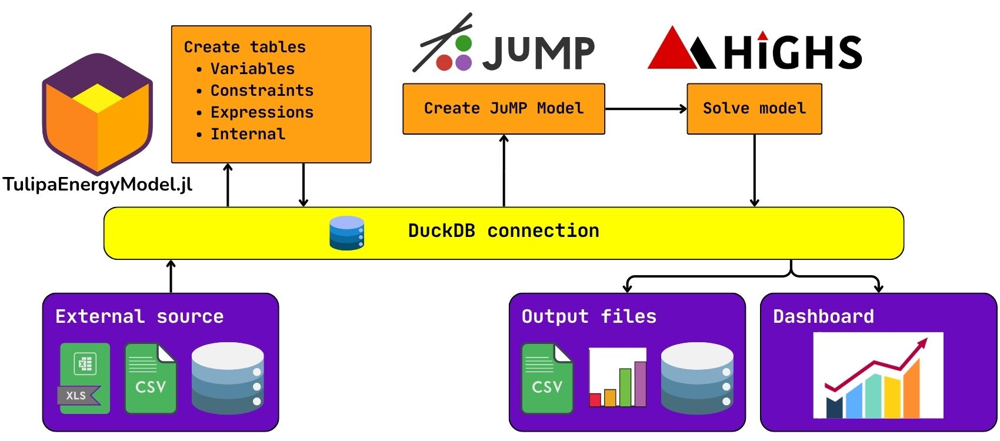

## Summary

`TulipaEnergyModel.jl` is a modelling framework for analysing the investment and operational performance of future energy systems, using capacity expansion and dispatch optimisation. `TulipaEnergyModel.jl` is developed in [Julia](https://julialang.org) [@Julia]  using [JuMP.jl](https://jump.dev) [@JuMP] as an algebraic modelling language.
`TulipaEnergyModel.jl` is the main package of the Tulipa Energy ecosystem. As a framework, Tulipa formulates models completely based on input data, so users can analyse virtually any system using the generalized building blocks – producers, consumers, conversion, storage, and transport – and by specifying details such as time resolution, energy carriers or commodities, and geographic scope. TulipaEnergyModel.jl focuses on model quality and efficient implementation, allowing it to break the tradeoff between model fidelity and computational load.

## Statement of need

There are multiple packages and frameworks related to Energy System Optimisation in Julia and other languages.
A few examples in the Julia and Python realm are [EnergyModelsX](https://github.com/EnergyModelsX) [@EnergyModelsX], [PowerModels](https://github.com/lanl-ansi/PowerModels.jl) [@PowerModels], [SpineOpt](https://www.tools-for-energy-system-modelling.org/) [@SpineOpt], [Sienna](https://www.nrel.gov/analysis/sienna) [@Sienna], [GenX](https://github.com/GenXProject/GenX) [@GenX], [PyPSA](https://pypsa.org) [@PyPSA], and [Calliope](https://github.com/calliope-project/calliope) [@Calliope].
Although there are many options available, the modeling innovation for flexible temporal resolution in TulipaEnergyModel.jl alters all model structures in ways that are not easily compatible with existing models.
As a result, TulipaEnergyModel.jl had to be developed from the ground up to incorporate specific features already included and to accommodate future enhancements.

There are multiple packages and frameworks related to Energy System Optimization in Julia and other languages. A few examples in the Julia and Python realm are [EnergyModelsX](https://github.com/EnergyModelsX) [@EnergyModelsX], [PowerModels](https://github.com/lanl-ansi/PowerModels.jl) [@PowerModels], [SpineOpt](https://www.tools-for-energy-system-modelling.org/) [@SpineOpt], [Sienna](https://www.nrel.gov/analysis/sienna) [@Sienna], [GenX](https://github.com/GenXProject/GenX) [@GenX], [PyPSA](https://pypsa.org) [@PyPSA], and [Calliope](https://github.com/calliope-project/calliope) [@Calliope].
However, existing models run into computational limits when solving large-scale problems, and have to resort to (over)simplifying the model to reduce computational burden. The common misconception is that the only strategy to speedup solving times without sacrificing model fidelity is through better software (decomposition & solvers) or hardware (high-performance computing). Current models overlook another strategy: improving the theoretical quality of the mathematical formulation, as this fundamentally defines the computational load. That is, higher quality mathematical formulations increase model fidelity while simultaneously solving faster than standard formulations. This insight inspired the development of TulipaEnergyModel.jl, with the core philosophy of advancing the state-of-the-art in formulation quality by exploiting the following three strategies: 1) lowering computational cost while maintaining model fidelity, by representing the same problem with fewer constraints and variables [@Tejada2025], and by creating tighter mixed-integer programming (MIP) formulations [@MoralesEspana2013]; 2) increasing model fidelity without extra computational cost, e.g., by developing more accurate linear programming (LP) approximations for storage [@Elgersma2025] and other technologies [gentile2016; MoralesEspana2022]; and 3) balancing computational burden with adaptive/flexible model fidelity, i.e., having different levels of detail in different parts of the model, in the temporal [@Gao2025], technological [MoralesEspana2022] and spatial dimensions. These modelling strategies have significant computational benefits, especially when handling problems of immense scale and dimensionality.
Some recent modelling breakthroughs alter the foundation and all structures of the model in ways that are not easily compatible with existing models. As a result, `TulipaEnergyModel.jl` had to be developed from the ground up to incorporate specific features already included and to accommodate future enhancements. Below we show some of the main modelling and software design innovations that alter the core structures of the model.

## Modelling Innovations 
Two of the main innovations of TulipaEnergyModel are that it accepts a fully flexible resolution [@Gao2025] for the assets and flows, and it allows for a direct connection between assets [@Tejada2025]. To illustrate these concepts, consider the following example:

For the fully flexible temporal resolution, we look at 6 hours of a system. The flow between "H2" and "ccgt" has a resolution of 6 hours (i.e., the whole period), while from "ccgt" to the "balance", the resolution is 1 hour. The resolution from "wind" to "phs" is 3 hours, and the resolution from "phs" to "balance" is not regular, starting with a 4 hours block and then a 2 hours block. All these "time blocks" are handled by the TulipaEnergyModel.jl to allow for more or less detailed solutions. This implies that less variables and constraints are created, ensuring a faster solving speed, with little loss in accuracy, See @Gao2025 for further details.
For the direct connection between assets, notice how the storage “phs” unit is directly connected to the “wind“ to charge, and also directly connected to “balance” to discharge. This direct connection between assets completely avoids extra elements in between (connections and nodes) naturally avoiding unnecessary extra variables and constraints. Consequently, speeding up solving times without any loss of accuracy when compared with traditional formulations, see @Tejada25 for further details.
TulipaEnergyModel.jl is fundamentally focused on high quality mathematical formulations. The model also includes other key features such as seasonal storage modeling using representative periods [Tejada2018; @greg2025], tight formulations to prevent simultaneous charging and discharging [@Elgersma2025], tight and compact unit commitment constraints [@MoralesEspana2013], and compact formulations for multi-year investment planning [@wang2025a; @wang2025b].

## Software Design Innovations
One of the main software design choices for TulipaEnergyModel.jl is to maintain a [DuckDB](https://duckdb.org) [@DuckDB] connection from the input data to model creation and output generation.
This enables us to handle different data formats by relying on DuckDB's capabilities, instead of specific Julia capabilities.
Furthermore, this separates most of the data manipulation from the model manipulation, allowing users to separately create the necessary input data from whatever platform they are more comfortable with.

Due to the flexible resolution of assets and flows, many of our variables have a "time block" component, instead of a "time step" component.
Since different assets and flows can have different time resolutions, the indices of many of our variables and constraints are sparse.
To better explain this feature, look again at Fig. X and ignore years and representative periods.
In an hourly implementation, we would have variables such as $f_{(\text{H2},\text{ccgt}),t}$, $f_{(\text{phs},\text{balance}),t}$ for $t = 1,\dots,6$.
Instead, looking at the time blocks of each flow, we have $f_{(\text{H2},\text{ccgt}),1:6}$ and $f_{(\text{phs},\text{balance}),b}$ for $b = 1\!:\!4, 5\!:\!6$.
In other words, this flow variable can be defined as

$$f_{e,b} \qquad \forall e \in E, b \in B(e),$$

where $E$ is the set of edges of the graph, and $B(e)$ is the set of time blocks for this edge.

To improve efficiency of the model, we use a linearized tabular format for the sets of each variable (and constraint).
For the flow variable as described above, could look like the following:

| id | from asset | to asset | time block start | time block end |
|----|------------|----------|------------------|----------------|
|  1 | h2 | ccgt | 1 | 6 |
|  2 | phs | balance | 1 | 4 |
|  3 | phs | balance | 5 | 6 |

Table: "Simplified example of the `var_flow` table"\label{tab:linearized}

We decided to also use DuckDB tables as the main format to keep these indices.
This decreases data movement by keeping everything in DuckDB.
The JuMP variables themselves are created and kept in memory during the program execution.
A single vector of variables is created, with each element corresponding to a row of the `var_flow` table.

### Acknowledgements

TODO: Actually check this
This publication is part of the project NextGenOpt with project number ESI.2019.008, which is (partly) financed by the Dutch Research Council (NWO) and supported by eScienceCenter under project number NLeSC C 21.0226.
In addition, this research received partial funding from the European Climate, Infrastructure and Environment Executive Agency under the European Union’s HORIZON Research and Innovation Actions under grant agreement no. 101095998.

### References
